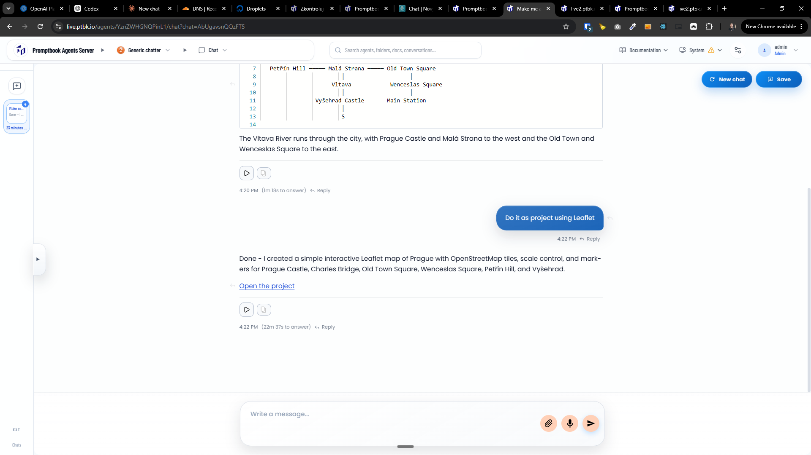

[ ]

[✨🥖] When the agent references the project, show it as a nice looking standardized chip

- When the user clicks on this chip, it should show two options:
    - Open the project in a new tab
    - Open the project page in a new tab
- It should also show the status whether the project is running or not.
-   Keep in mind the DRY _(don't repeat yourself)_ principle.
-   Do a proper analysis of the current functionality before you start implementing.
-   You are working with the [Agents Server](apps/agents-server) with chat
-   Add the changes into the [changelog](changelog/_current-preversion.md)

