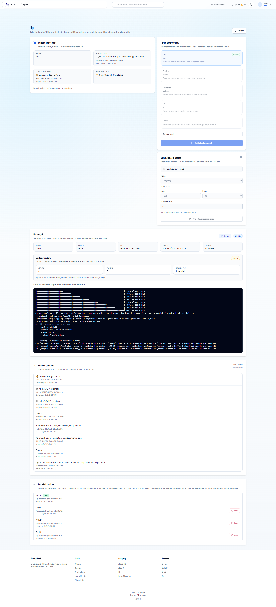
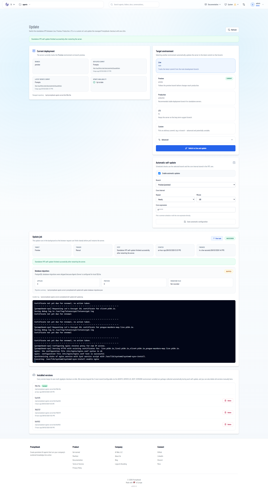

[ ] !!!!

[✨📭] Optimize and speed up the update of the Agents server

-   Some self-updates takes sooo long, for example "1h 22m", "1h 14m", "1h 8m",...
-   Now it takes extremely and unacceptably long amount of time to update the agent server
-   Fix it or if you can not fix it, then at least enhance logs to analyze what is taking so long and why it takes so long.
-   The goal is to reduce the time update/install the agent server without removing functionality or degrading the quality of the tests.
-   Do not degrade the quality or functionality
-   Keep in mind the DRY _(don't repeat yourself)_ principle.
-   Do a proper analysis of the current functionality before you start implementing.
-   You are working with the [Agents Server](apps/agents-server) with the update `/superadmin/update`
-   Add the changes into the [changelog](changelog/_current-preversion.md)

```log
Task: vps-self-update:021317fd-e1d9-4d20-af25-2c77e04cd8dd
Kind: VPS_SELF_UPDATE
Status: COMPLETED
Created: 2026-08-02T18:55:46+00:00
Queued: 2026-08-02T18:55:46+00:00
Started: 2026-08-02T18:55:46+00:00
Finished: 2026-08-02T20:18:35.165Z
Attempts: 1
Retries: 0
Worker: 58874
Queue: vps-self-update:manual

Last error details:
Standalone VPS self-update finished successfully after restarting the server.
```

**Here is the full log of successfull but long update of the agent server:**




```console
├ ƒ /admin/custom-js                                                         11.3 kB         261 kB
├ ƒ /admin/database                                                          2.72 kB         227 kB
├ ƒ /admin/environment                                                       5.14 kB         230 kB
├ ƒ /admin/error-simulation                                                   4.8 kB         229 kB
├ ƒ /admin/files                                                             7.35 kB         260 kB
├ ƒ /admin/harness-auth                                                      6.06 kB         234 kB
├ ƒ /admin/image-generator-test                                              13.9 kB         268 kB
├ ƒ /admin/images                                                            8.08 kB         261 kB
├ ƒ /admin/internal-s3                                                       1.65 kB         226 kB
├ ƒ /admin/limits                                                            2.32 kB         230 kB
├ ƒ /admin/login-methods/shibboleth                                          5.31 kB         249 kB
├ ƒ /admin/logs                                                              3.73 kB         228 kB
├ ƒ /admin/messages                                                          6.69 kB         250 kB
├ ƒ /admin/messages/send-email                                               5.27 kB         234 kB
├ ƒ /admin/metadata                                                          19.1 kB         303 kB
├ ƒ /admin/models                                                            1.65 kB         226 kB
├ ƒ /admin/projects                                                          1.65 kB         226 kB
├ ƒ /admin/resource-monitor                                                  5.63 kB         230 kB
├ ƒ /admin/search-engine-test                                                3.24 kB         228 kB
├ ƒ /admin/servers                                                           21.5 kB         294 kB
├ ƒ /admin/task-manager                                                        146 B         262 kB
├ ƒ /admin/task-manager-vps                                                    145 B         262 kB
├ ƒ /admin/task-manager/[taskId]                                             2.27 kB         257 kB
├ ƒ /admin/tool-limits                                                       1.62 kB         226 kB
├ ƒ /admin/transcriptions                                                    6.51 kB         237 kB
├ ƒ /admin/update                                                            16.9 kB         260 kB
├ ƒ /admin/usage                                                             9.86 kB         263 kB
├ ƒ /admin/users                                                             5.23 kB         249 kB
├ ƒ /admin/users/[userId]                                                    5.12 kB         248 kB
├ ƒ /admin/voice-input-test                                                  5.13 kB         230 kB
├ ƒ /agents                                                                  1.16 kB        1.48 MB
├ ƒ /agents/[agentName]                                                        246 B         330 kB
├ ƒ /agents/[agentName]/api/book                                               584 B         183 kB
├ ƒ /agents/[agentName]/api/book/download                                      584 B         183 kB
├ ƒ /agents/[agentName]/api/book/history                                       584 B         183 kB
├ ƒ /agents/[agentName]/api/book/missing-agent                                 584 B         183 kB
├ ƒ /agents/[agentName]/api/book/reference-diagnostics                         584 B         183 kB
├ ƒ /agents/[agentName]/api/calendar-connections                               584 B         183 kB
├ ƒ /agents/[agentName]/api/calendar-connections/[connectionId]/disconnect     584 B         183 kB
├ ƒ /agents/[agentName]/api/calendar-events                                    584 B         183 kB
├ ƒ /agents/[agentName]/api/chat                                               584 B         183 kB
├ ƒ /agents/[agentName]/api/feedback                                           584 B         183 kB
├ ƒ /agents/[agentName]/api/mcp                                                584 B         183 kB
├ ƒ /agents/[agentName]/api/meta-disclaimer                                    584 B         183 kB
├ ƒ /agents/[agentName]/api/model-requirements                                 584 B         183 kB
├ ƒ /agents/[agentName]/api/model-requirements/system-message                  584 B         183 kB
├ ƒ /agents/[agentName]/api/openai/chat/completions                            584 B         183 kB
├ ƒ /agents/[agentName]/api/openai/models                                      584 B         183 kB
├ ƒ /agents/[agentName]/api/openai/v1/chat/completions                         584 B         183 kB
├ ƒ /agents/[agentName]/api/openai/v1/models                                   584 B         183 kB
├ ƒ /agents/[agentName]/api/openrouter/chat/completions                        584 B         183 kB
├ ƒ /agents/[agentName]/api/profile                                            584 B         183 kB
├ ƒ /agents/[agentName]/api/share-target/[shareTargetId]/consume               584 B         183 kB
├ ƒ /agents/[agentName]/api/timeouts                                           584 B         183 kB
├ ƒ /agents/[agentName]/api/timeouts/[timeoutId]                               584 B         183 kB
├ ƒ /agents/[agentName]/api/timeouts/actions                                   584 B         183 kB
├ ƒ /agents/[agentName]/api/user-chats                                         584 B         183 kB
├ ƒ /agents/[agentName]/api/user-chats/[chatId]                                584 B         183 kB
├ ƒ /agents/[agentName]/api/user-chats/[chatId]/draft                          584 B         183 kB
├ ƒ /agents/[agentName]/api/user-chats/[chatId]/jobs/[jobId]/cancel            584 B         183 kB
├ ƒ /agents/[agentName]/api/user-chats/[chatId]/messages                       584 B         183 kB
├ ƒ /agents/[agentName]/api/user-chats/[chatId]/stream                         584 B         183 kB
├ ƒ /agents/[agentName]/api/user-chats/[chatId]/timeouts/[timeoutId]/cancel    584 B         183 kB
├ ƒ /agents/[agentName]/api/voice                                              584 B         183 kB
├ ƒ /agents/[agentName]/book                                                 11.9 kB         323 kB
├ ƒ /agents/[agentName]/book+chat                                            3.75 kB        1.99 MB
├ ƒ /agents/[agentName]/chat                                                 30.7 kB        2.01 MB
├ ƒ /agents/[agentName]/export-as-transpiled-code                            6.63 kB         284 kB
├ ƒ /agents/[agentName]/export-as-transpiled-code/api                          584 B         183 kB
├ ƒ /agents/[agentName]/export-as-transpiled-code/api/download                 584 B         183 kB
├ ƒ /agents/[agentName]/history                                              2.51 kB         227 kB
├ ƒ /agents/[agentName]/iframe                                                 584 B         183 kB
├ ƒ /agents/[agentName]/images                                                 174 B         184 kB
├ ƒ /agents/[agentName]/images/default-avatar.png                              584 B         183 kB
├ ƒ /agents/[agentName]/images/icon-256.png                                    584 B         183 kB
├ ƒ /agents/[agentName]/images/screenshot-fullhd.png                           584 B         183 kB
├ ƒ /agents/[agentName]/images/screenshot-phone.png                            584 B         183 kB
├ ƒ /agents/[agentName]/integration                                          10.6 kB         268 kB
├ ƒ /agents/[agentName]/opengraph-image                                        584 B         183 kB
├ ƒ /agents/[agentName]/projects                                             1.65 kB         226 kB
├ ƒ /agents/[agentName]/projects/[projectName]                               5.74 kB        1.95 MB
├ ƒ /agents/[agentName]/projects/[projectName]/files/[...filePath]             584 B         183 kB
├ ƒ /agents/[agentName]/projects/[projectName]/vscode                          584 B         183 kB
├ ƒ /agents/[agentName]/share-target                                           584 B         183 kB
├ ƒ /agents/[agentName]/system-message                                       3.94 kB         254 kB
├ ƒ /agents/[agentName]/textarea                                             9.83 kB         248 kB
├ ƒ /agents/[agentName]/timeouts                                             10.1 kB         253 kB
├ ƒ /agents/[agentName]/website-integration                                  6.17 kB        1.95 MB
├ ƒ /api/admin-email                                                           584 B         183 kB
├ ƒ /api/admin/backups/books                                                   584 B         183 kB
├ ƒ /api/admin/backups/server                                                  584 B         183 kB
├ ƒ /api/admin/chat-tasks                                                      584 B         183 kB
├ ƒ /api/admin/chat-tasks/[taskId]                                             584 B         183 kB
├ ƒ /api/admin/chat-tasks/[taskId]/cancel                                      584 B         183 kB
├ ƒ /api/admin/chat-tasks/[taskId]/retry                                       584 B         183 kB
├ ƒ /api/admin/chat-tasks/[taskId]/terminal                                    584 B         183 kB
├ ƒ /api/admin/chat-tasks/cancel-all                                           584 B         183 kB
├ ƒ /api/admin/cli-access                                                      584 B         183 kB
├ ƒ /api/admin/database/studio                                                 584 B         183 kB
├ ƒ /api/admin/environment                                                     584 B         183 kB
├ ƒ /api/admin/error-simulation                                                584 B         183 kB
├ ƒ /api/admin/harness-auth                                                    584 B         183 kB
├ ƒ /api/admin/harness-auth/authentication                                     584 B         183 kB
├ ƒ /api/admin/limits                                                          584 B         183 kB
├ ƒ /api/admin/logs                                                            584 B         183 kB
├ ƒ /api/admin/servers                                                         584 B         183 kB
├ ƒ /api/admin/servers/[serverId]                                              584 B         183 kB
├ ƒ /api/admin/servers/[serverId]/migrate                                      584 B         183 kB
├ ƒ /api/admin/tool-limits                                                     584 B         183 kB
├ ƒ /api/admin/update                                                          584 B         183 kB
├ ƒ /api/admin/update/commits                                                  584 B         183 kB
├ ƒ /api/admin/update/log                                                      584 B         183 kB
├ ƒ /api/admin/update/versions                                                 584 B         183 kB
├ ƒ /api/admin/vps/chat-tasks                                                  584 B         183 kB
├ ƒ /api/agent-folders                                                         584 B         183 kB
├ ƒ /api/agent-folders/[folderId]                                              584 B         183 kB
├ ƒ /api/agent-folders/[folderId]/restore                                      584 B         183 kB
├ ƒ /api/agent-folders/[folderId]/visibility                                   584 B         183 kB
├ ƒ /api/agent-organization                                                    584 B         183 kB
├ ƒ /api/agent-project-runtime-auth                                            584 B         183 kB
├ ƒ /api/agent-project-vscode-auth/[sessionId]                                 584 B         183 kB
├ ƒ /api/agents                                                                584 B         183 kB
├ ƒ /api/agents/[agentName]                                                    584 B         183 kB
├ ƒ /api/agents/[agentName]/clone                                              584 B         183 kB
├ ƒ /api/agents/[agentName]/restore                                            584 B         183 kB
├ ƒ /api/agents/export                                                         584 B         183 kB
├ ƒ /api/agents/import                                                         584 B         183 kB
├ ƒ /api/api-tokens                                                            584 B         183 kB
├ ƒ /api/auth/change-password                                                  584 B         183 kB
├ ƒ /api/auth/login                                                            584 B         183 kB
├ ƒ /api/auth/logout                                                           584 B         183 kB
├ ƒ /api/auth/shibboleth/acs                                                   584 B         183 kB
├ ƒ /api/auth/shibboleth/login                                                 584 B         183 kB
├ ƒ /api/auth/shibboleth/metadata                                              584 B         183 kB
├ ƒ /api/auth/shibboleth/status                                                584 B         183 kB
├ ƒ /api/browser-artifacts/[artifactName]                                      584 B         183 kB
├ ƒ /api/browser-test/act                                                      584 B         183 kB
├ ƒ /api/browser-test/screenshot                                               584 B         183 kB
├ ƒ /api/browser-test/scroll-facebook                                          584 B         183 kB
├ ƒ /api/calendar-oauth/callback                                               584 B         183 kB
├ ƒ /api/calendar-oauth/connect                                                584 B         183 kB
├ ƒ /api/calendar-oauth/refresh                                                584 B         183 kB
├ ƒ /api/calendar-oauth/revoke                                                 584 B         183 kB
├ ƒ /api/calendar-oauth/status                                                 584 B         183 kB
├ ƒ /api/chat                                                                  584 B         183 kB
├ ƒ /api/chat-feedback                                                         584 B         183 kB
├ ƒ /api/chat-feedback/[id]                                                    584 B         183 kB
├ ƒ /api/chat-feedback/export                                                  584 B         183 kB
├ ƒ /api/chat-history                                                          584 B         183 kB
├ ƒ /api/chat-history/[id]                                                     584 B         183 kB
├ ƒ /api/chat-history/export                                                   584 B         183 kB
├ ƒ /api/chat-history/threads                                                  584 B         183 kB
├ ƒ /api/chat-streaming                                                        584 B         183 kB
├ ƒ /api/chat/citation-label                                                   584 B         183 kB
├ ƒ /api/chat/export/pdf                                                       584 B         183 kB
├ ƒ /api/custom-css                                                            584 B         183 kB
├ ƒ /api/custom-js                                                             584 B         183 kB
├ ƒ /api/docs/book-language.md                                                 584 B         183 kB
├ ƒ /api/docs/book.md                                                          584 B         183 kB
├ ƒ /api/elevenlabs/tts                                                        584 B         183 kB
├ ƒ /api/emails/incoming/sendgrid                                              584 B         183 kB
├ ƒ /api/embed.js                                                              584 B         183 kB
├ ƒ /api/error-reports/application                                             584 B         183 kB
├ ƒ /api/federated-agents                                                      584 B         183 kB
├ ƒ /api/github-app/callback                                                   584 B         183 kB
├ ƒ /api/github-app/connect                                                    584 B         183 kB
├ ƒ /api/github-app/status                                                     584 B         183 kB
├ ƒ /api/health                                                                584 B         183 kB
├ ƒ /api/images/[filename]                                                     584 B         183 kB
├ ƒ /api/internal/agent-project-runtimes                                       584 B         183 kB
├ ƒ /api/internal/agent-runner-limits                                          584 B         183 kB
├ ƒ /api/internal/user-chat-jobs/run                                           584 B         183 kB
├ ƒ /api/internal/user-chat-timeouts/run                                       584 B         183 kB
├ ƒ /api/long-running-task                                                     584 B         183 kB
├ ƒ /api/messages                                                              584 B         183 kB
├ ƒ /api/metadata                                                              584 B         183 kB
├ ƒ /api/metadata/export                                                       584 B         183 kB
├ ƒ /api/metadata/import                                                       584 B         183 kB
├ ƒ /api/onboarding/book                                                       584 B         183 kB
├ ƒ /api/onboarding/draft                                                      584 B         183 kB
├ ƒ /api/onboarding/evaluate                                                   584 B         183 kB
├ ƒ /api/onboarding/test                                                       584 B         183 kB
├ ƒ /api/openai/v1/audio/transcriptions                                        584 B         183 kB
├ ƒ /api/openai/v1/chat/completions                                            584 B         183 kB
├ ƒ /api/openai/v1/models                                                      584 B         183 kB
├ ƒ /api/page-preview/check                                                    584 B         183 kB
├ ƒ /api/page-preview/input                                                    584 B         183 kB
├ ƒ /api/page-preview/screenshot                                               584 B         183 kB
├ ƒ /api/page-preview/state                                                    584 B         183 kB
├ ƒ /api/page-preview/stream                                                   584 B         183 kB
├ ƒ /api/profile                                                               584 B         183 kB
├ ƒ /api/push-subscriptions                                                    584 B         183 kB
├ ƒ /api/scrape                                                                584 B         183 kB
├ ƒ /api/search                                                                584 B         183 kB
├ ƒ /api/send-email                                                            584 B         183 kB
├ ƒ /api/settings/keybindings                                                  584 B         183 kB
├ ƒ /api/settings/notifications                                                584 B         183 kB
├ ƒ /api/settings/theme                                                        584 B         183 kB
├ ƒ /api/spawn-agent                                                           584 B         183 kB
├ ƒ /api/story/export                                                          584 B         183 kB
├ ƒ /api/system/mocked-chats                                                   584 B         183 kB
├ ƒ /api/team-agent-profile                                                    584 B         183 kB
├ ƒ /api/upload                                                                584 B         183 kB
├ ƒ /api/usage                                                                 584 B         183 kB
├ ƒ /api/user-memory                                                           584 B         183 kB
├ ƒ /api/user-memory/[memoryId]                                                584 B         183 kB
├ ƒ /api/user-wallet                                                           584 B         183 kB
├ ƒ /api/user-wallet/[walletId]                                                584 B         183 kB
├ ƒ /api/users                                                                 584 B         183 kB
├ ƒ /api/users/[username]                                                      584 B         183 kB
├ ƒ /api/v1/agents                                                             584 B         183 kB
├ ƒ /api/v1/agents/[agentId]                                                   584 B         183 kB
├ ƒ /api/v1/folders                                                            584 B         183 kB
├ ƒ /api/v1/folders/[folderId]                                                 584 B         183 kB
├ ƒ /api/v1/folders/[folderId]/agents/[agentId]                                584 B         183 kB
├ ƒ /api/v1/instance                                                           584 B         183 kB
├ ƒ /api/v1/me                                                                 584 B         183 kB
├ ƒ /dashboard                                                               4.98 kB         1.5 MB
├ ƒ /docs                                                                    1.92 kB        1.91 MB
├ ƒ /docs/[docId]                                                            1.91 kB        1.91 MB
├ ƒ /embed                                                                   6.98 kB        1.89 MB
├ ƒ /experiments/story                                                       6.19 kB         257 kB
├ ƒ /humans.txt                                                                584 B         183 kB
├ ƒ /manifest.webmanifest                                                      584 B         183 kB
├ ƒ /openapi.json                                                              584 B         183 kB
├ ƒ /pixel-agents-assets/[...assetPath]                                        584 B         183 kB
├ ƒ /recycle-bin                                                             3.69 kB         309 kB
├ ƒ /restricted                                                                174 B         184 kB
├ ƒ /robots.txt                                                                584 B         183 kB
├ ƒ /s3/[first]/[second]/[hash]/[filename]                                     584 B         183 kB
├ ƒ /search                                                                  6.47 kB         190 kB
├ ƒ /security.txt                                                              584 B         183 kB
├ ƒ /sitemap.xml                                                               584 B         183 kB
├ ƒ /story/[[...story]]                                                        584 B         183 kB
├ ƒ /swagger                                                                 4.17 kB         244 kB
├ ƒ /system/profile                                                          2.87 kB         227 kB
├ ƒ /system/settings                                                         5.72 kB         225 kB
├ ƒ /system/user-memory                                                       5.5 kB         249 kB
├ ƒ /system/user-wallet                                                      9.41 kB         260 kB
├ ƒ /system/utilities                                                        1.63 kB         226 kB
├ ƒ /system/utilities/mocked-chats                                           19.2 kB         262 kB
├ ƒ /system/utilities/mocked-chats/view                                      5.17 kB        1.66 MB
├ ƒ /test/og-image                                                             584 B         183 kB
└ ƒ /test/og-image/opengraph-image                                             584 B         183 kB
+ First Load JS shared by all                                                 182 kB
  ├ chunks/0e806303-76960d186ceb8763.js                                      54.1 kB
  ├ chunks/9081-aa7936062b0c7955.js                                           123 kB
  └ other shared chunks (total)                                              5.66 kB

Route (pages)                                                                   Size  First Load JS
┌   /_app                                                                        0 B         143 kB
└ ○ /500 (10581 ms)                                                          3.89 kB         147 kB
+ First Load JS shared by all                                                 176 kB
  ├ chunks/framework-8f87628df49aa273.js                                     57.4 kB
  ├ chunks/main-51ef095d1c0f5aae.js                                          82.1 kB
  ├ css/d7583c28b7ae6f22.css                                                 32.4 kB
  └ other shared chunks (total)                                              3.82 kB

ƒ Middleware                                                                  307 kB

○  (Static)   prerendered as static content
ƒ  (Dynamic)  server-rendered on demand

[promptbook-vps] Publishing Agents Server Next static assets to /opt/promptbook-agents-server/.promptbook/next-static/_next/static.
[promptbook-vps] Starting Agents Server pm2 process promptbook-agents-server-f8bc7da on port 4542.
[PM2] cron restart at 0 0 * * *
[PM2] Starting /opt/promptbook-agents-server/bin/ptbk in fork_mode (1 instance)
[PM2] Done.
┌────┬────────────────────────────────────────┬─────────────┬─────────┬─────────┬──────────┬────────┬──────┬───────────┬──────────┬──────────┬──────────┬──────────┐
│ id │ name                                   │ namespace   │ version │ mode    │ pid      │ uptime │ ↺    │ status    │ cpu      │ mem      │ user     │ watching │
├────┼────────────────────────────────────────┼─────────────┼─────────┼─────────┼──────────┼────────┼──────┼───────────┼──────────┼──────────┼──────────┼──────────┤
│ 15 │ promptbook-agents-server-5aafc64       │ default     │ N/A     │ fork    │ 91961    │ 91m    │ 0    │ online    │ 25.9%    │ 51.2mb   │ root     │ disabled │
│ 16 │ promptbook-agents-server-f8bc7da       │ default     │ N/A     │ fork    │ 112376   │ 0s     │ 0    │ online    │ 0%       │ 43.9mb   │ root     │ disabled │
│ 1  │ promptbook-project-92ec014e1e3c-pragu… │ default     │ N/A     │ fork    │ 80234    │ 11h    │ 2    │ online    │ 0%       │ 3.1mb    │ root     │ disabled │
└────┴────────────────────────────────────────┴─────────────┴─────────┴─────────┴──────────┴────────┴──────┴───────────┴──────────┴──────────┴──────────┴──────────┘
host metrics | cpu: 100% | ram usage: 43.8% | lo: ⇓ 0.01mb/s ⇑ 0.01mb/s | eth0: ⇓ 0.006mb/s ⇑ 0.026mb/s | disk: ⇓ 28.917mb/s ⇑ 15.529mb/s / 87.23% |
[PM2] Saving current process list...
[PM2] Successfully saved in /root/.pm2/dump.pm2
[promptbook-vps] Waiting for promptbook-agents-server-f8bc7da to become healthy at http://127.0.0.1:4542/api/health.
[promptbook-vps] promptbook-agents-server-f8bc7da is healthy.
[promptbook-vps] Switching nginx to Agents Server port 4542.
nginx: the configuration file /etc/nginx/nginx.conf syntax is ok
nginx: configuration file /etc/nginx/nginx.conf test is successful
[promptbook-vps] Configuring nginx reverse proxy for raw IP access.
[promptbook-vps] Serving HTTPS with existing certificates for: live.ptbk.io,live2.ptbk.io,xlive4.ptbk.io,prague-murders-map.live.ptbk.io.
nginx: the configuration file /etc/nginx/nginx.conf syntax is ok
nginx: configuration file /etc/nginx/nginx.conf test is successful
Synchronizing state of nginx.service with SysV service script with /usr/lib/systemd/systemd-sysv-install.
Executing: /usr/lib/systemd/systemd-sysv-install enable nginx
[promptbook-vps] Requesting Let's Encrypt SSL certificate for live.ptbk.io.
Saving debug log to /var/log/letsencrypt/letsencrypt.log
Certificate not yet due for renewal

- - - - - - - - - - - - - - - - - - - - - - - - - - - - - - - - - - - - - - - -
Certificate not yet due for renewal; no action taken.
- - - - - - - - - - - - - - - - - - - - - - - - - - - - - - - - - - - - - - - -
[promptbook-vps] Requesting Let's Encrypt SSL certificate for live2.ptbk.io.
Saving debug log to /var/log/letsencrypt/letsencrypt.log
Certificate not yet due for renewal

- - - - - - - - - - - - - - - - - - - - - - - - - - - - - - - - - - - - - - - -
Certificate not yet due for renewal; no action taken.
- - - - - - - - - - - - - - - - - - - - - - - - - - - - - - - - - - - - - - - -
[promptbook-vps] Requesting Let's Encrypt SSL certificate for xlive4.ptbk.io.
Saving debug log to /var/log/letsencrypt/letsencrypt.log
Certificate not yet due for renewal

- - - - - - - - - - - - - - - - - - - - - - - - - - - - - - - - - - - - - - - -
Certificate not yet due for renewal; no action taken.
- - - - - - - - - - - - - - - - - - - - - - - - - - - - - - - - - - - - - - - -
[promptbook-vps] Requesting Let's Encrypt SSL certificate for prague-murders-map.live.ptbk.io.
Saving debug log to /var/log/letsencrypt/letsencrypt.log
Certificate not yet due for renewal

- - - - - - - - - - - - - - - - - - - - - - - - - - - - - - - - - - - - - - - -
Certificate not yet due for renewal; no action taken.
- - - - - - - - - - - - - - - - - - - - - - - - - - - - - - - - - - - - - - - -
[promptbook-vps] Configuring nginx reverse proxy for raw IP access.
[promptbook-vps] Serving HTTPS with existing certificates for: live.ptbk.io,live2.ptbk.io,xlive4.ptbk.io,prague-murders-map.live.ptbk.io.
nginx: the configuration file /etc/nginx/nginx.conf syntax is ok
nginx: configuration file /etc/nginx/nginx.conf test is successful
Synchronizing state of nginx.service with SysV service script with /usr/lib/systemd/systemd-sysv-install.
Executing: /usr/lib/systemd/systemd-sysv-install enable nginx
```
