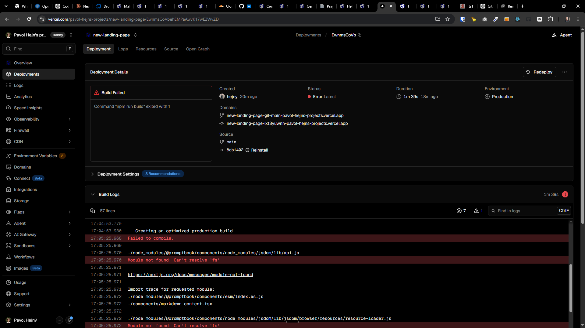

[ ] !!!

[✨♚] The `ptbk` NPM dependency is not working properly when

-   The `ptbk` and `@promptbook/*` packages are published from this repository
-   This is the example consuming repository: You can look at project `C:\Users\me\work\promptbook-experiments-and-landing-pages\aldaron\package.json` where the `ptbk` dependency is installed
-   You should fix the root cause of the problem here
-   Keep in mind the DRY _(don't repeat yourself)_ principle.
-   Do a proper analysis of the current functionality before you start implementing.
-   Add the changes into the [changelog](changelog/_current-preversion.md)



```
17:03:51.484 Running build in Washington, D.C., USA (East) – iad1
17:03:51.484 Build machine configuration: 2 cores, 8 GB
17:03:51.630 Cloning github.com/webgptorg/aldaron (Branch: main, Commit: 8cb1402)
17:03:54.036 Cloning completed: 2.405s
17:03:54.767 Restored build cache from previous deployment (DF78MTtkj1xZ7o3ooiJEfsiU4Jwm)
17:03:55.080 Running "vercel build"
17:03:55.103 Vercel CLI 58.1.0
17:03:55.370 Installing dependencies...
17:03:59.285 npm warn deprecated prebuild-install@7.1.3: No longer maintained. Please contact the author of the relevant native addon; alternatives are available.
17:04:52.702
17:04:52.703 added 126 packages, removed 99 packages, and changed 80 packages in 57s
17:04:52.703
17:04:52.703 302 packages are looking for funding
17:04:52.703   run `npm fund` for details
17:04:52.779 Detected Next.js version: 15.2.6
17:04:52.802 Running "npm run build"
17:04:52.935
17:04:52.935 > promptbook-landing-page@0.1.0 build
17:04:52.936 > next build
17:04:52.936
17:04:53.769    ▲ Next.js 15.2.6
17:04:53.770
17:04:53.930    Creating an optimized production build ...
17:05:25.968 Failed to compile.
17:05:25.969
17:05:25.970 ./node_modules/@promptbook/components/node_modules/jsdom/lib/api.js
17:05:25.970 Module not found: Can't resolve 'fs'
17:05:25.971
17:05:25.971 https://nextjs.org/docs/messages/module-not-found
17:05:25.971
17:05:25.971 Import trace for requested module:
17:05:25.972 ./node_modules/@promptbook/components/esm/index.es.js
17:05:25.972 ./components/markdown-content.tsx
17:05:25.972
17:05:25.972 ./node_modules/@promptbook/components/node_modules/jsdom/lib/jsdom/browser/resources/resource-loader.js
17:05:25.972 Module not found: Can't resolve 'fs'
17:05:25.972
17:05:25.972 https://nextjs.org/docs/messages/module-not-found
17:05:25.972
17:05:25.972 Import trace for requested module:
17:05:25.972 ./node_modules/@promptbook/components/node_modules/jsdom/lib/api.js
17:05:25.972 ./node_modules/@promptbook/components/esm/index.es.js
17:05:25.972 ./components/markdown-content.tsx
17:05:25.972
17:05:25.972 ./node_modules/@promptbook/components/node_modules/jsdom/lib/jsdom/living/xhr/XMLHttpRequest-impl.js
17:05:25.973 Module not found: Can't resolve 'child_process'
17:05:25.973
17:05:25.973 https://nextjs.org/docs/messages/module-not-found
17:05:25.973
17:05:25.973 Import trace for requested module:
17:05:25.973 ./node_modules/@promptbook/components/node_modules/jsdom/lib/jsdom/living/generated/XMLHttpRequest.js
17:05:25.973 ./node_modules/@promptbook/components/node_modules/jsdom/lib/jsdom/living/interfaces.js
17:05:25.975 ./node_modules/@promptbook/components/node_modules/jsdom/lib/jsdom/browser/Window.js
17:05:25.975 ./node_modules/@promptbook/components/node_modules/jsdom/lib/api.js
17:05:25.976 ./node_modules/@promptbook/components/esm/index.es.js
17:05:25.976 ./components/markdown-content.tsx
17:05:25.977
17:05:25.977 ./node_modules/@promptbook/components/node_modules/jsdom/lib/jsdom/living/xhr/xhr-utils.js
17:05:25.977 Module not found: Can't resolve 'fs'
17:05:25.977
17:05:25.978 https://nextjs.org/docs/messages/module-not-found
17:05:25.978
17:05:25.978 Import trace for requested module:
17:05:25.982 ./node_modules/@promptbook/components/node_modules/jsdom/lib/jsdom/living/xhr/XMLHttpRequest-impl.js
17:05:25.983 ./node_modules/@promptbook/components/node_modules/jsdom/lib/jsdom/living/generated/XMLHttpRequest.js
17:05:25.983 ./node_modules/@promptbook/components/node_modules/jsdom/lib/jsdom/living/interfaces.js
17:05:25.984 ./node_modules/@promptbook/components/node_modules/jsdom/lib/jsdom/browser/Window.js
17:05:25.984 ./node_modules/@promptbook/components/node_modules/jsdom/lib/api.js
17:05:25.984 ./node_modules/@promptbook/components/esm/index.es.js
17:05:25.985 ./components/markdown-content.tsx
17:05:25.985
17:05:25.985 ./node_modules/agent-base/dist/index.js
17:05:25.986 Module not found: Can't resolve 'net'
17:05:25.986
17:05:25.986 https://nextjs.org/docs/messages/module-not-found
17:05:25.986
17:05:25.986 Import trace for requested module:
17:05:25.986 ./node_modules/http-proxy-agent/dist/index.js
17:05:25.987 ./node_modules/@promptbook/components/node_modules/jsdom/lib/jsdom/living/helpers/agent-factory.js
17:05:25.992 ./node_modules/@promptbook/components/node_modules/jsdom/lib/jsdom/browser/resources/resource-loader.js
17:05:25.993 ./node_modules/@promptbook/components/node_modules/jsdom/lib/api.js
17:05:25.993 ./node_modules/@promptbook/components/esm/index.es.js
17:05:25.993 ./components/markdown-content.tsx
17:05:25.996
17:05:25.997
17:05:25.997 > Build failed because of webpack errors
17:05:26.104 Error: Command "npm run build" exited with 1
```
