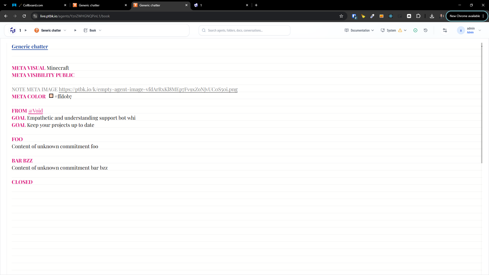
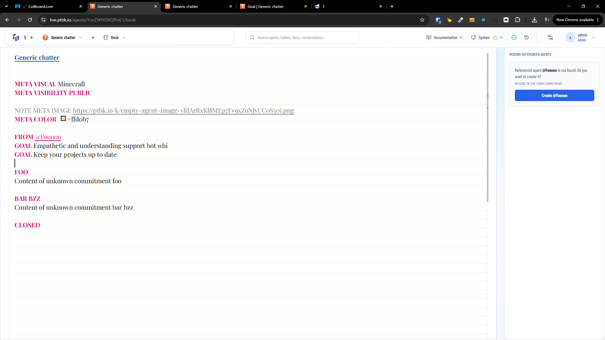
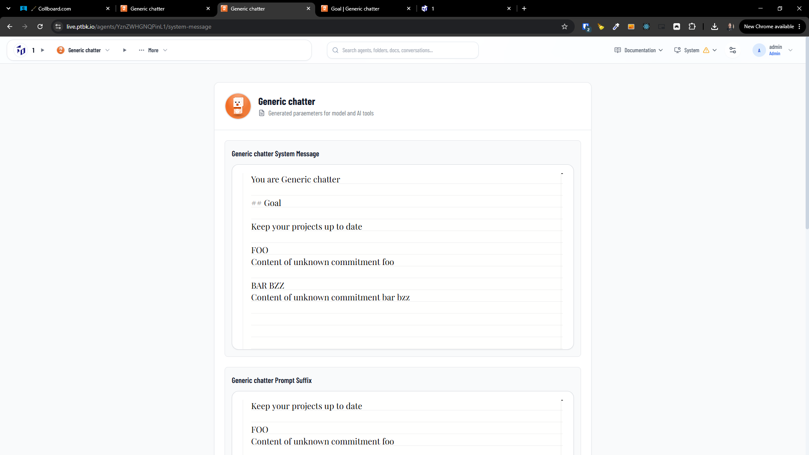

[x] by OpenAI Codex `gpt-5.6-terra` thinking `max` (ChatGPT account) - Implementation ~$0.9473 an hour; Testing 27 minutes

[✨📃] Handle the unknown commitments

```book
Generic chatter

GOAL Empathetic and understanding support bot whi
GOAL Keep your projects up to date

FOO
Content of unknown commitment foo

BAR BZZ
Content of unknown commitment bar bzz

CLOSED

```

-   Commitments are in uppercase and starts on the new line _(look how BookEditor does the syntax parsing / highlighting - there is the correct way)_
-   When the commitment is unknown, the book editor highlights it correctly, but the parsing is not correct - the unknown commitment is just handled as continuation of the previous commitment. This is a bug in the parsing of the books.
-   Keep the behavior of the book editor, but fix the parsing of the books so that unknown commitments are handled correctly.
-   Only update to the book editor is that the unknown commitments should be red underlined simmilarly to wrongly referenced agents
-   When creating a system message the unknown commitments should be handled as extra context at the end of the system message
-   Keep in mind the DRY _(don't repeat yourself)_ principle.
-   You are working with the [Agents Server](apps/agents-server)
-   Do a proper analysis of the current functionality before you start implementing.
-   Add the changes into the [changelog](changelog/_current-preversion.md)





