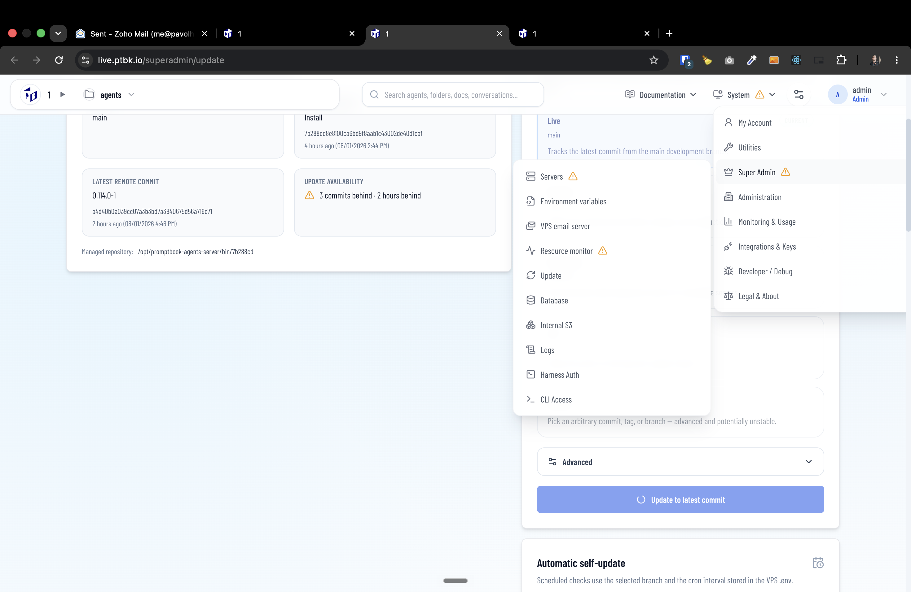

[x] by Claude Code `opus` thinking `max` - Implementation $7.01 13 minutes; Testing 21 minutes

[✨🥓] When the self-update is running, show some icon alongside the menu item "Update". 

-   This is a similar pattern to showing the warnings alongside the menu items. 
-  The icon should be a small spinning arrows
-   Keep in mind the DRY _(don't repeat yourself)_ principle.
-   Do a proper analysis of the current functionality before you start implementing.
-   You are working with the [Agents Server](apps/agents-server)
-   Add the changes into the [changelog](changelog/_current-preversion.md)

