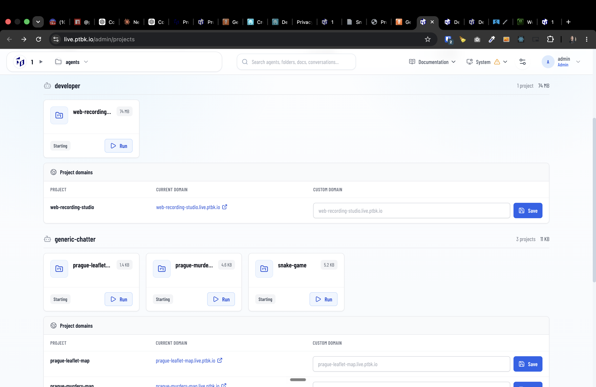
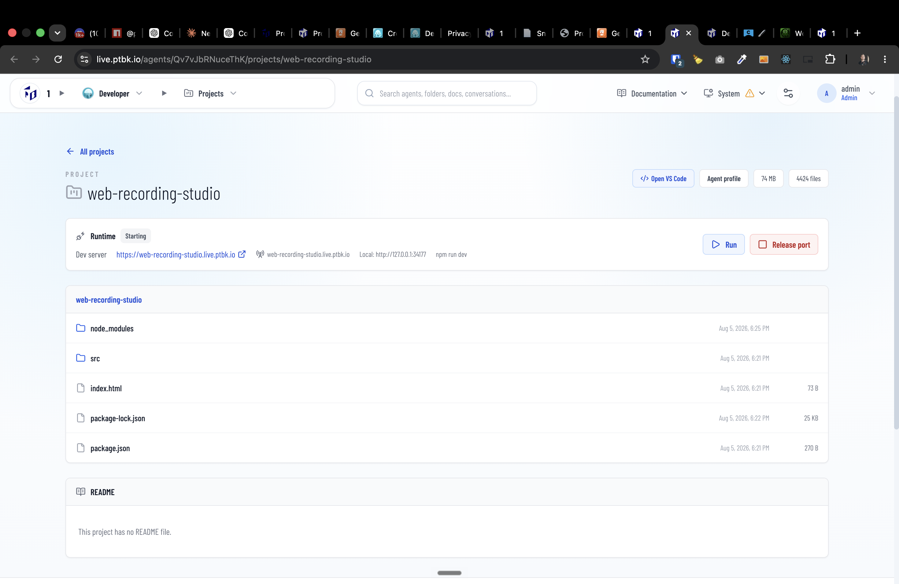

[ ]

[✨🍕] Enhance the runtime management of the projects.

-   On the project page, there should be an available terminal with raw console with the runtime of the project.
-   Also allow downloading the entire log.
-   When the project is running, show the runtime log in the terminal and allow to scroll through it.
-   When the error occurs, allow to see the error in the terminal and scroll through it, also allow to download the error log.
-   When Run / Stop button pressed show the spinner and disable the button until the task is finished
-   ALso when some error happen duriong the run @@@
-   On `/admin/projects` should be button to run/stop all the project at once
-   Keep in mind the DRY _(don't repeat yourself)_ principle.
-   Do a proper analysis of the current functionality before you start implementing.
-   You are working with the [Agents Server](apps/agents-server)
-   Add the changes into the [changelog](changelog/_current-preversion.md)

---

@@@When developing projects, agents should have access to the terminal and runtime of the project.
