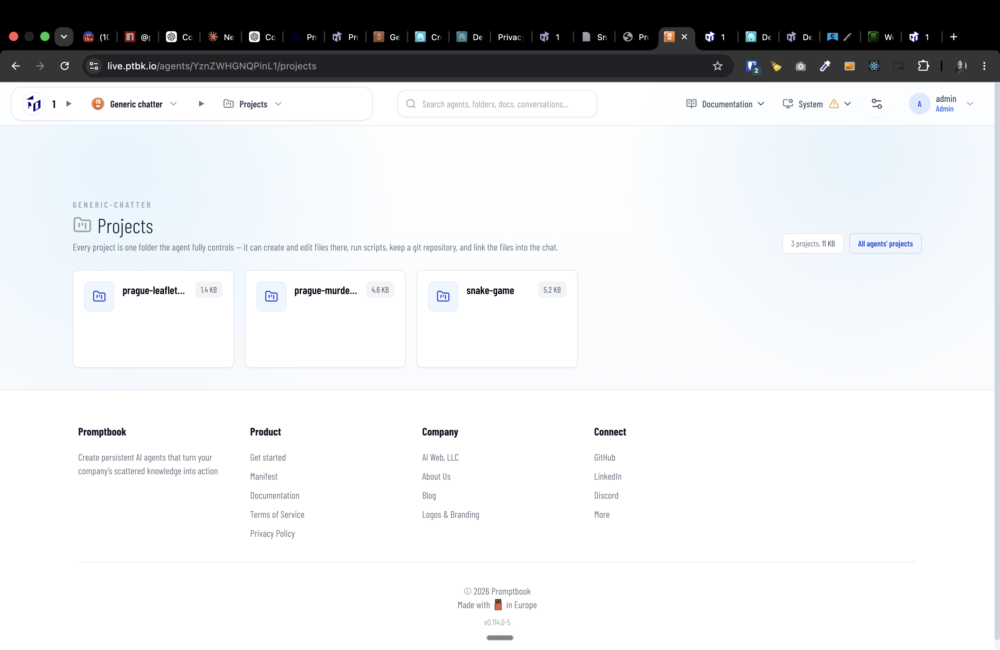
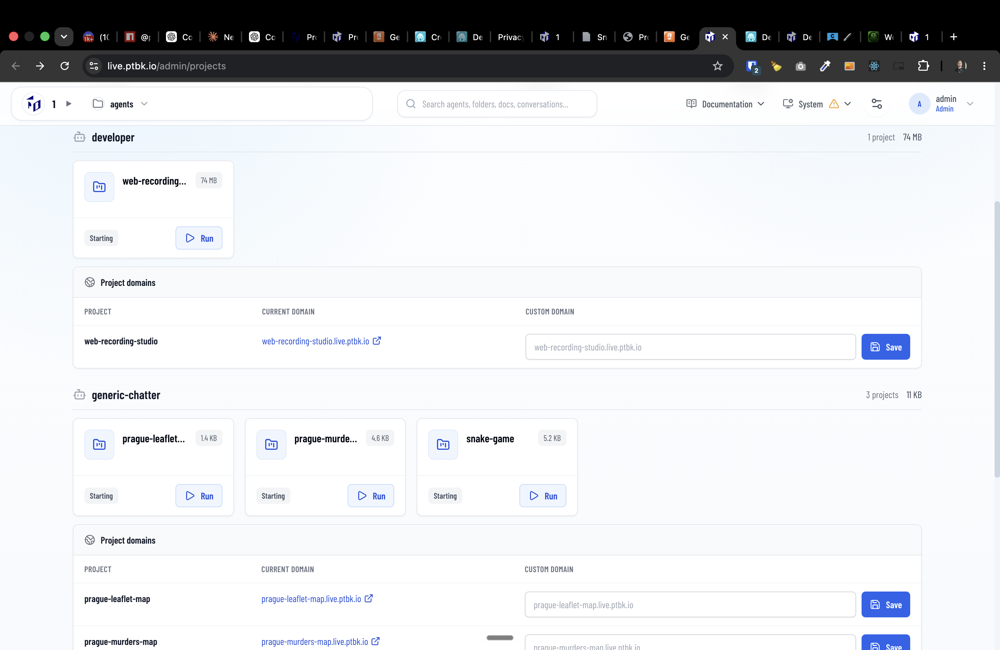

[ ]

[✨🍆] When showing a project card, show it with the nice title and icon.

-   The icon should be a favicon or some ad-hoc icon from letters of the project name. For example, for project `https://prague-murders-map.live.ptbk.io/` the icon should be `PMM` or `P` or `M` or `MM` or `PM` or something like that.
-   The title should be the heading of the README.md file or the title of the index.html
-   Keep in mind the DRY _(don't repeat yourself)_ principle.
-   Do a proper analysis of the current functionality before you start implementing.
-   You are working with the [Agents Server](apps/agents-server)
-   Add the changes into the [changelog](changelog/_current-preversion.md)

