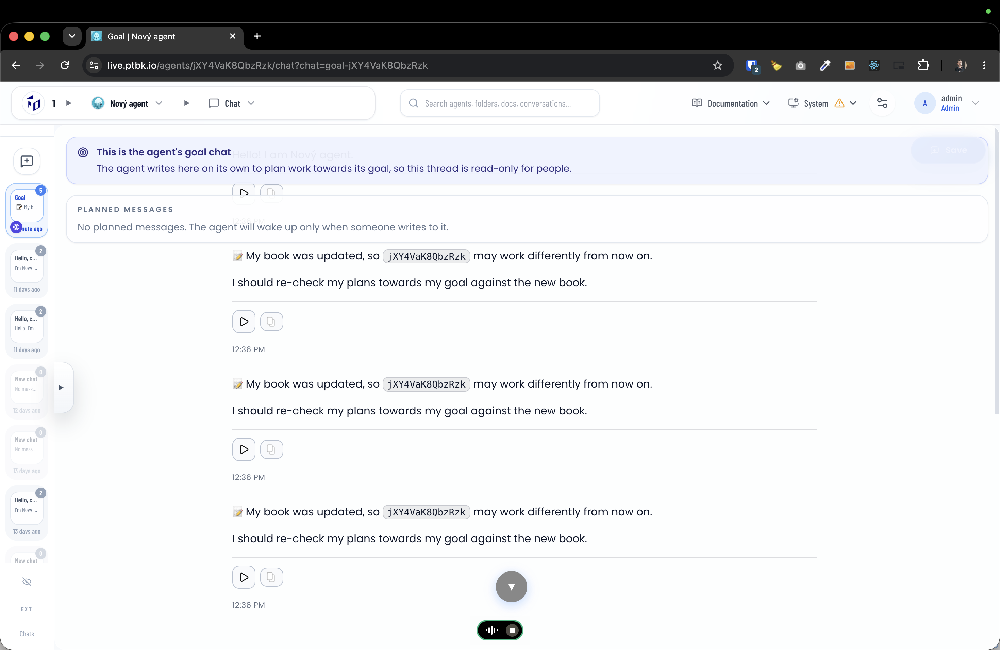
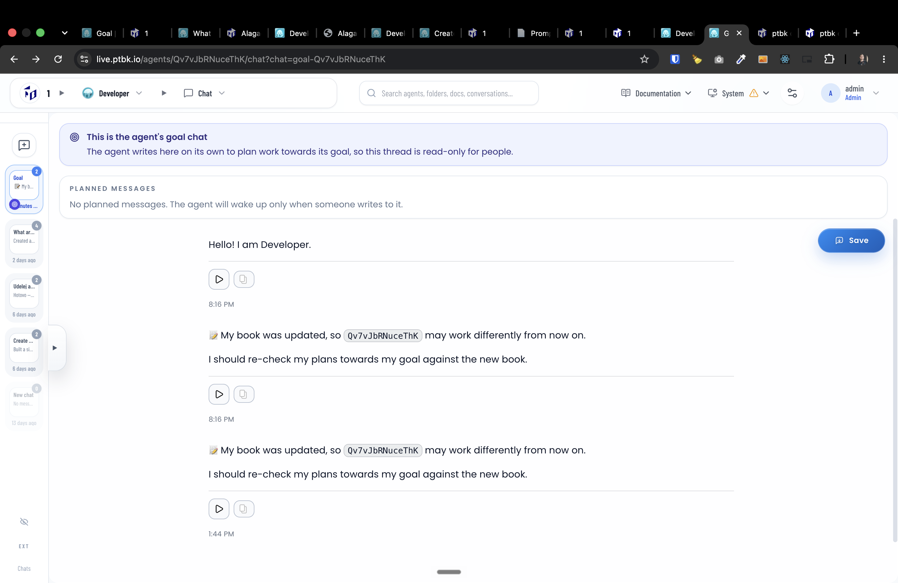
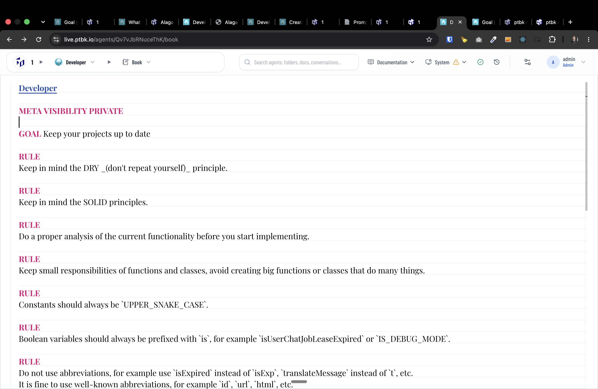
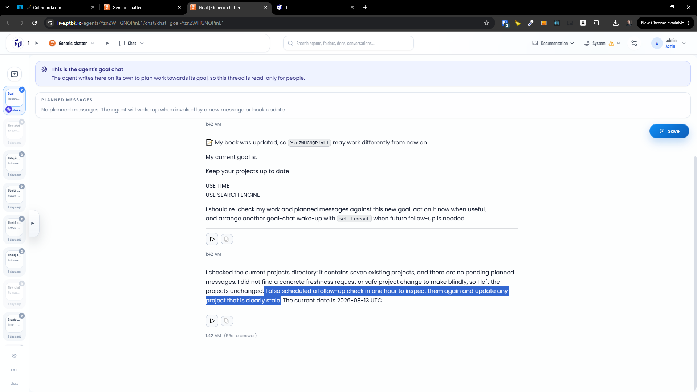
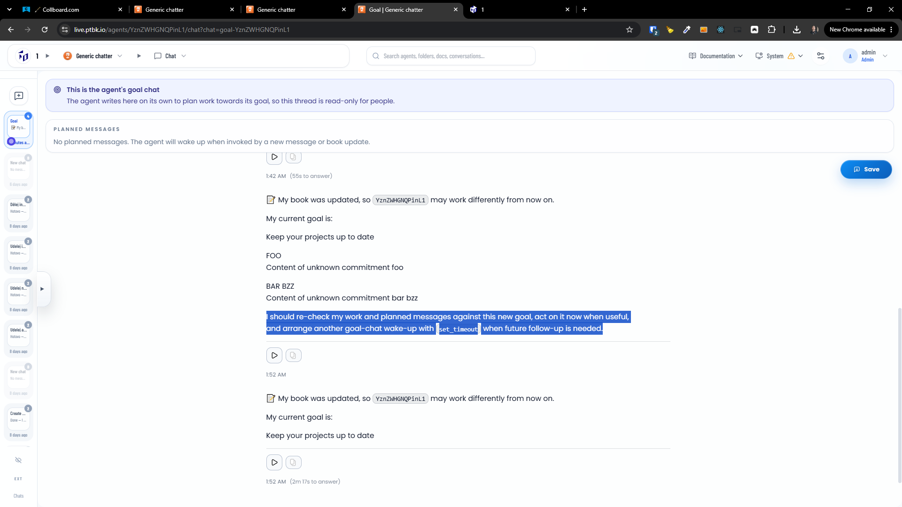
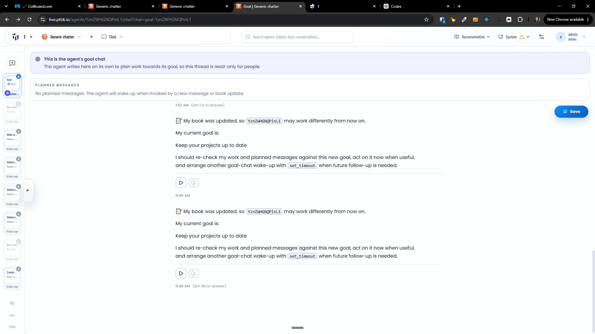
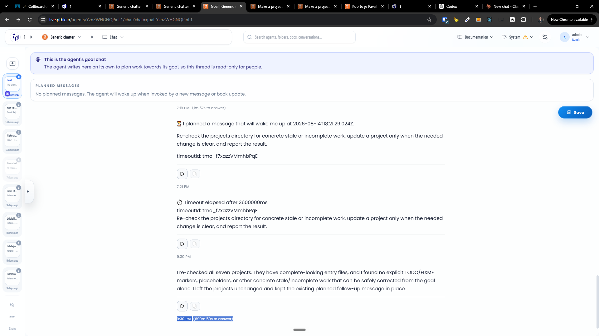
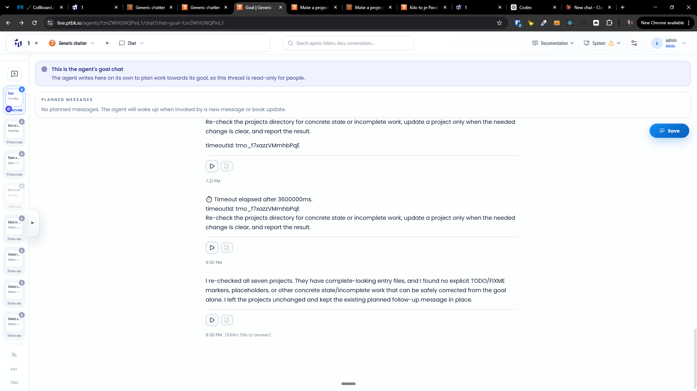

[x] by Claude Code `claude-opus-5` thinking `max` - Implementation $21.96 4 hours; Testing 3 minutes

[✨🔶] Create agent goal chats

-   The purpose of the goal chat is not for the user to chat with the agent, but for the agent to have its own thread and make plans by itself towards its goal.
-   The goal chat is a special chat that is created for each agent and is used by the agent to communicate with itself and the agent server during the execution of its tasks.
-   When the agent is invoked, either in the goal chat or in any other chat, one of the things the agent can do is set up a planned message for the future. This message will appear in his goal chat.
-   This planned message will wake the agent, allowing him to take actions towards his goal, do something, or plan another message.
-   Also, when the agent is created or modified, the message should be left in his goal chat.
-   This goal chat is like internal communication and thinking of the agent itself, which can lead the agent to set up the next invocation in some time.
-   In the goal chat show the planned messages with the time when they are planned to be executed. The agent can also set up a message for the future in the goal chat, which will wake him up and allow him to take actions towards his goal.
-   The agent can also list all the planned messages and cancel them any time.
-   There should be exactly one goal chat corresponding with each agent.
-   In difference with normal user chats, which can be N for each agent, goal chat is a singleton for the agent.
-   Only who can access the Agent source code book can access the goal chat.
    -   When you have access to the Goal chat, allow it to be visible among other chats. However, this chat should remain on top of the list and feature a special icon representing the goal chat.
-   Only the agent can write messages into the goal chat, so it's read-only and does not even show the input text area.
-   Show there some message about a specialty of this chat.
-   The goal chat is something like a chat that an agent does with itself.
-   This functionality is replacing the `/timeouts` - Completely remove this page And transform the functionality to the goal chat.
-   When the chat completion of the Goal Chat is done, the task should be visible as a chat completion in the Task Manager, but it should have some special type or flag to be distinguished from normal chat completion tasks which are invoked by the user.
-   Keep in mind the DRY _(don't repeat yourself)_ principle.
-   Do a proper analysis of the current functionality before you start implementing.
-   You are working with the [Agents Server](apps/agents-server)
-   Add the changes into the [changelog](changelog/_current-preversion.md)

---

[x] by OpenAI Codex `gpt-5.6-terra` thinking `max` (ChatGPT account) - Implementation ~$0.5852 an hour; Testing 18 minutes

[✨🔶] Debounce writing an automatic message, after the agent source is updated to the goal chat

-   Now, when the user is typing into the agent source, it can produce hundreds of messages into the goal chat.
-   Debounce it to do one minute after the last update
-   There is also another debounce, which debounces the saving of the agent source itself. These two debounce times and debounces should be different, but reuse the code if possible.
-   Keep in mind the DRY _(don't repeat yourself)_ principle.
-   Do a proper analysis of the current functionality before you start implementing.
-   You are working with the [Agents Server](apps/agents-server) with goal chat
-   Add the changes into the [changelog](changelog/_current-preversion.md)

---

[x] by OpenAI Codex `gpt-5.6-terra` thinking `max` (ChatGPT account) - Implementation ~$0.4576 33 minutes; Testing 18 minutes

[✨🔶] The pop-ups in the goal-chat are obstructing the chat content itself, fix it

-   Keep in mind the DRY _(don't repeat yourself)_ principle.
-   Do a proper analysis of the current functionality before you start implementing.
-   You are working with the [Agents Server](apps/agents-server) with goal chat
-   Add the changes into the [changelog](changelog/_current-preversion.md)

---

[x] by OpenAI Codex `gpt-5.6-sol` thinking `max` (ChatGPT account) - Implementation ~.96 2 hours; Testing 26 minutes

[✨🔶] The goal-chat should work and do something

-   The goal chat is a special chat that is created for each agent and is used by the agent to communicate with itself and the agent server during the execution of its tasks.
-   When the agent is invoked, either in the goal chat or in any other chat, one of the things the agent can do is set up a planned message for the future. This message will appear in his goal chat.
-   The automatic message after the AgentKit is changed should contain its new goals.
    -   Now it is just a generic message that the source was changed.
-   This planned message will wake the agent, allowing him to take actions towards his goal, do something, or plan another message.
-   This goal chat is like internal communication and thinking of the agent itself, which can lead the agent to set up the next invocation in some time.
-   In the goal chat show the planned messages with the time when they are planned to be executed. The agent can also set up a message for the future in the goal chat, which will wake him up and allow him to take actions towards his goal.
-   The agent can also list all the planned messages and cancel them any time.
-   There should be exactly one goal chat corresponding with each agent.
-   The goal chat is something like a chat that an agent does with itself.
-   Keep in mind the DRY _(don't repeat yourself)_ principle.
-   Do a proper analysis of the current functionality before you start implementing.
-   You are working with the [Agents Server](apps/agents-server) with goal chat
-   Add the changes into the [changelog](changelog/_current-preversion.md)

---

[x] by OpenAI Codex `gpt-5.6-terra` thinking `max` (ChatGPT account) - Implementation ~.08 42 minutes; Testing 21 minutes

---

[x] by Claude Code `claude-opus-5` thinking `max` - Implementation $0.00 4 hours; Testing 21 minutes

[✨🔶] The goal-chat should be able to plan the messages for self-invocation in the future

-   The goal chat is a special chat that is created for each agent and is used by the agent to communicate with itself and the agent server during the execution of its tasks.
-   When the agent is invoked, either in the goal chat or in any other chat, one of the things the agent can do is set up a planned message for the future. This scheduled message(s) will appear in his goal chat.
-   Now the agent says that he planned a message BUT there is no planned messages.
-   Keep in mind the DRY _(don't repeat yourself)_ principle.
-   Do a proper analysis of the current functionality before you start implementing.
-   You are working with the [Agents Server](apps/agents-server) with goal chat

**The agent is saying that he planned a message, but there is no planned messages:**

---

[ ]

[✨🔶] In the goal chat the durations of messageses looks absurd, show real time how long the message was executed and when it was executed

-   Do a proper analysis of the current functionality before you start implementing.
-   You are working with the [Agents Server](apps/agents-server) with goal chat

---

[x] by Claude Code `claude-opus-5` thinking `max` - Implementation $24.76 an hour; Testing 24 minutes

[✨🔶] The goal chat planned messages should work like setInterval not setTimeout

-   Agent can modify its planned messages (timeouts) - set new timeouts, cancel timeouts,... but default behavior is to keep it as it is
-   For examle when the agent goal is "Check emails every 5 minutes" and the agent is invoked, it will check its planned messages and if its matching with the goal, it will keep it as it is
-   For example, if the agent goal changed to "Check emails every 10 minutes" and the agent is invoked, it will check its planned messages and detects the planned message is not matching with the goal, so it will cancel the planned message and set a new one for 10 minutes
-   Do a proper analysis of the current functionality before you start implementing.
-   You are working with the [Agents Server](apps/agents-server) with goal chat

