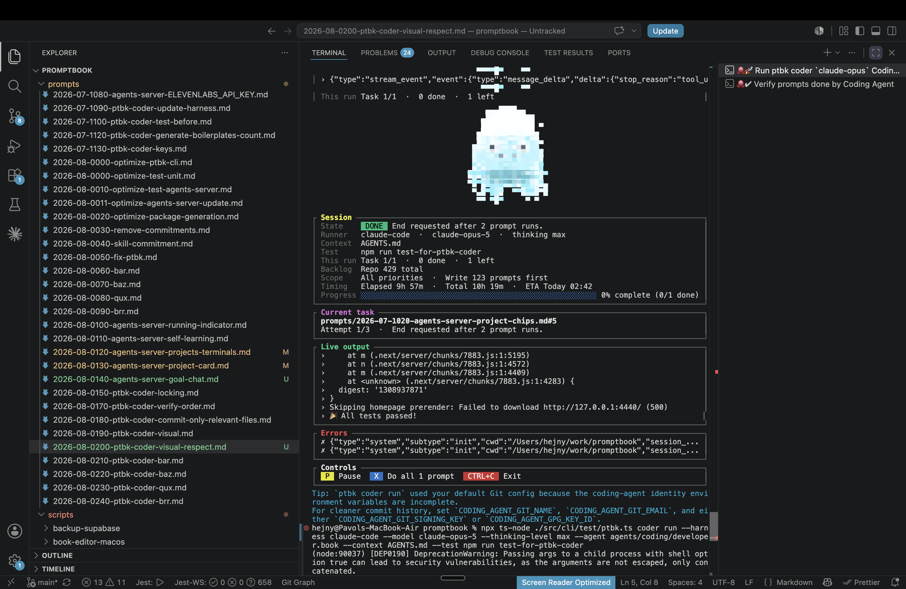

[^] (2 attempts) by OpenAI Codex `gpt-5.6-terra` thinking `max` (ChatGPT account) - Implementation ~.46 an hour; Testing 20 minutes; Fixing in progress

[✨🧵] Take the visual from the agent book

In the used agent `agents/coding/developer.book` there is `META VISUAL ascii-octopus` but the visual used in promptbook coder terminal CLI is always the default one. The visual should be taken from the agent book and used in the promptbook coder terminal CLI.

```console
hejny@Pavols-MacBook-Air promptbook % npx ts-node ./src/cli/test/ptbk.ts coder run --harness claude-code --model claude-opus-5 --thinking-level max --agent agents/coding/developer.book --context AGENTS.md --test npm run test-for-ptbk-coder
(node:90037) [DEP0190] DeprecationWarning: Passing args to a child process with shell option true can lead to security vulnerabilities, as the arguments are not escaped, only concatenated.
(Use `node --trace-deprecation ...` to show where the warning was created)
**Claude Code** is outdated.

Installed version: `2.1.222`
Newest version: `2.1.223`
Update Claude Code to 2.1.223 now? [y/N] n
Skipped, run `npm install -g @anthropic-ai/claude-code@latest` to do it manually.

                                         ▄▄▄▄                       
                                       ▄▀▀▀▀▀▀▀▀▄▄                  
                                   ▄  ▀▀▀▀▀▀▀▀▀▀▀▀▄                 
                                   ▀ ▄▀▀▀▀▀▀▀▀▀▀▀▀  ▀               
                                   ▀ ▀▀▀▀▀▀▀▀▀▀▀▀▀▀ ▄               
                                     ▀▀▀▀▀▀▀▀▀▀▀▀▀▀                 
                                     ▀▀▀▀▀▀▀▀▀▀▀▀▀▀▀▄               
                                    ▄▀▀▀▀▀▀▀▀▀▀▀▀▀▀▀▀               
                                   ▀▀▀▀▀▀▀▀▀▀▀▀▀▀▀▀▀▀▀              
                                   ▀▀▀▀▀▀▀▀▀▀▀▀▀▀▀▀▀▀▀              
                                   ▀▄▀  ▀▀▄▀▀ ▀▀▀▀▀▀▀               
                                    ▀   ▀▀▀▀   ▀▀  ▀                

┌ Session ──────────────────────────────────────────────────────────────────────────────┐
│ State     LOADING  Checking the working tree...                                       │
│ Runner   claude-code  ·  claude-opus-5  ·  thinking max                               │
│ Context  AGENTS.md                                                                    │
│ Test     npm run test-for-ptbk-coder                                                  │
│ This run Task 1/1  ·  0 done  ·  1 left                                               │
│ Backlog  Repo 417 total                                                               │
│ Scope    All priorities  ·  Write 127 prompts first                                   │
│ Timing   Elapsed 1s  ·  Total 5h 19m  ·  ETA Today 09:07                              │
│ Progress ░░░░░░░░░░░░░░░░░░░░░░░░░░░░░░░░░░░░░░░░░░░░░░░░░░░░░ 0% complete (0/1 done) │
└───────────────────────────────────────────────────────────────────────────────────────┘
┌ Queue ────────────────────────────────────────────────────────────────────────────────┐
│ Checking the working tree...                                                          │
└───────────────────────────────────────────────────────────────────────────────────────┘
┌ Live output ──────────────────────────────────────────────────────────────────────────┐
│ No live agent output yet.                                                             │
│                                                                                       │
│                                                                                       │
│                                                                                       │
│                                                                                       │
│                                                                                       │
│                                                                                       │
│                                                                                       │
└───────────────────────────────────────────────────────────────────────────────────────┘
┌ Controls ─────────────────────────────────────────────────────────────────────────────┐
│  P  Pause   X  End with this prompt   CTRL+C  Exit                                    │
└───────────────────────────────────────────────────────────────────────────────────────┘
```



-   Keep in mind the DRY _(don't repeat yourself)_ principle.
-   Do a proper analysis of the current functionality of `ptbk coder` and related functionality before you start implementing.
-   You are working with [`ptbk coder`](src/cli/cli-commands/coder/run.ts)
-   Update the [`ptbk coder` landing website](apps/coder-landing) and use there the `ascii-octopus` visual
-   Add the changes into the [changelog](changelog/_current-preversion.md)


