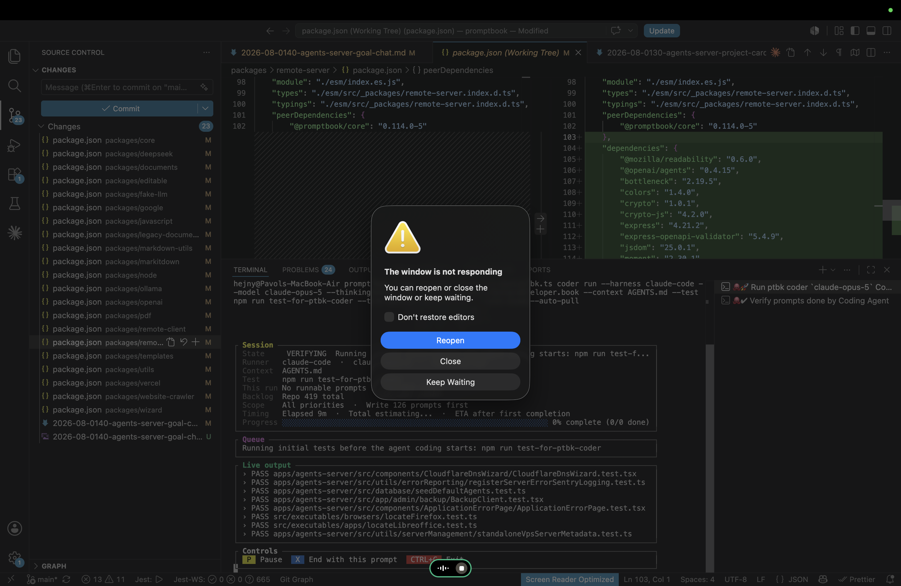

[ ]

[✨🦥] Promptbook coder can cause unacceptable lag

```bash
ptbk coder run --harness github-copilot --model gpt-5.4 --thinking-level xhigh --agent agents/coding/developer.book --context AGENTS.md
```

-   This happens when the Promptbook coder is running for a long time and the terminal is not focused
-   After the terminal is refocused, the VSCode which is running the terminal freezes for some time.
-   It doesn't crash. It just freezes for some time, and then it works normally.
-   No data is lost, or nothing fails.
-   This happens mostly on the MacBook.
-   Try to analyze if there is, for example, some problem with animation rendering of the agent or something which causes this strange behavior, and fix it.
-   Keep in mind the DRY _(don't repeat yourself)_ principle.
-   Do a proper analysis of the current functionality of `ptbk coder` and related functionality before you start implementing.
-   You are working with [`ptbk coder`](src/cli/cli-commands/coder/run.ts)
-   Add the changes into the [changelog](changelog/_current-preversion.md)


