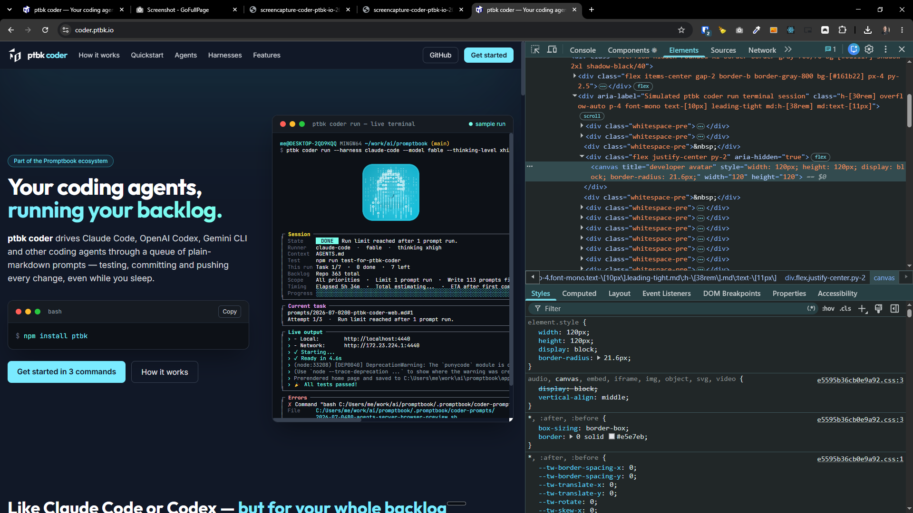

[x] by OpenAI Codex `gpt-5.6-terra` thinking `max` (ChatGPT account) - Implementation ~$0.5567 31 minutes; Testing 18 minutes

[✨♣︎] Visual of the agent on the Promptbook Coder landing website should be the same as the visual in the terminal.

-   Keep in mind the DRY _(don't repeat yourself)_ principle - It should be generated from the same code both in the CLI and the landing website.
-   Do a proper analysis of the current functionality of `ptbk coder`, its landing website and related functionality before you start implementing.
-   You are working with [`ptbk coder`](src/cli/cli-commands/coder/run.ts)
-   Update the [`ptbk coder` landing website](apps/coder-landing)
-   Add the changes into the [changelog](changelog/_current-preversion.md)

