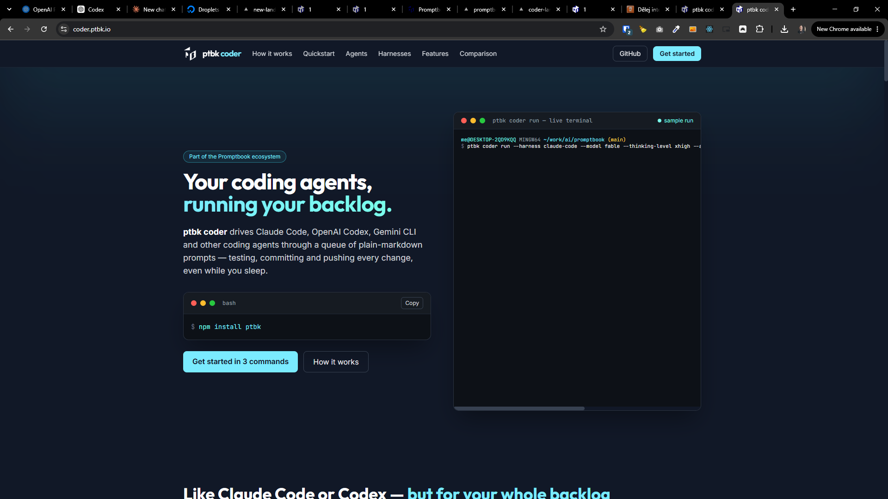
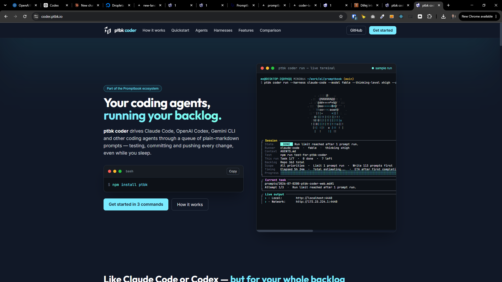
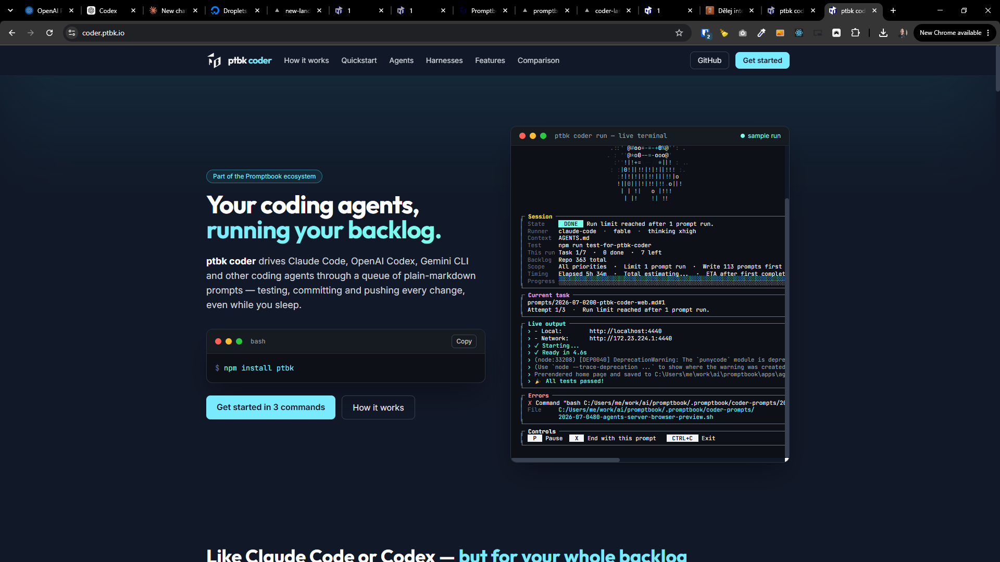

[x] by Claude Code `claude-opus-5` thinking `max` - Implementation $0.00 5 hours; Testing 23 minutes

[✨😡] The terminal on `https://coder.ptbk.io` should have better scrolling

-   There should be no horizontal scrolling, the terminal should have right width
-   After the terminal is fully loaded the octopus agent visual should be fully visible and not cut off
-   You are working with [`ptbk coder` landing website](apps/coder-landing)
-   Add the changes into the [changelog](changelog/_current-preversion.md)

