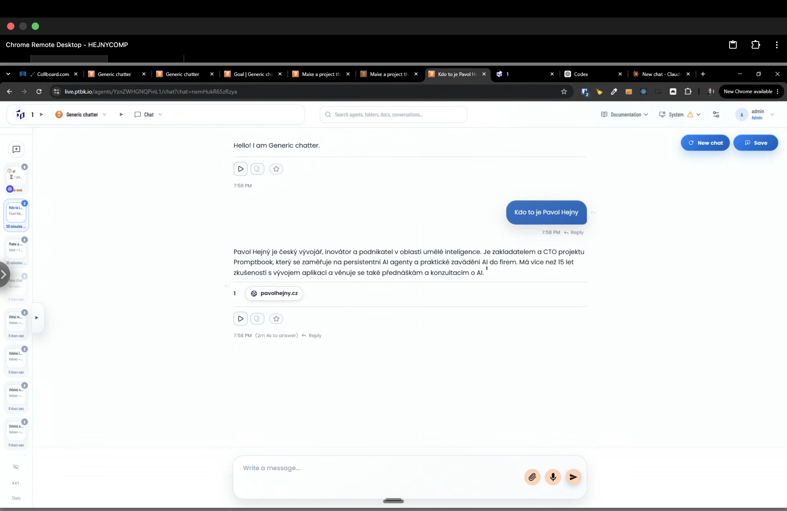
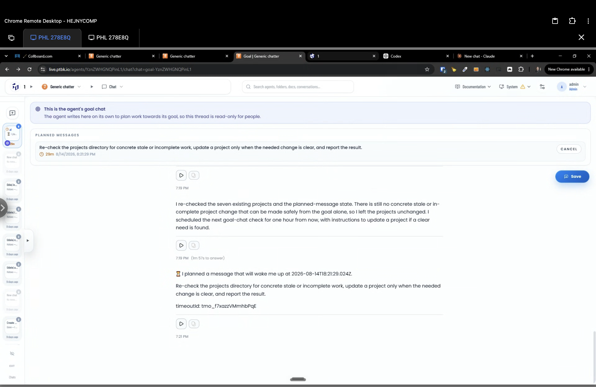

[x] by Claude Code `claude-opus-5` thinking `max` - Implementation $6.25 an hour; Testing 24 minutes

[✨📣] When the agent touches a project or plans the timeout, show this information as a chip under the message.

-   This pattern is already working for the knowledge.
-   There should be a chip for planning the timeouts.
-   Also, when the project is touched, either viewed or edited, during the chat session, the chip showing this project should be under the message.
-   This is relevant for both normal chats and goal chat.
-   For the external chats, like email, this should also work, but you cannot place the chip in the email. The chip will be viewed only when viewing this external chat from the agent server user interface, but do not render these chips into the outbound email.
-   Keep in mind the DRY _(don't repeat yourself)_ principle.
-   Do a proper analysis of the current functionality before you start implementing.
    -   Look how the knowledge is referenced under the messages - 
-   You are working with the [Agents Server](apps/agents-server)
-   Add the changes into the [changelog](changelog/_current-preversion.md)

