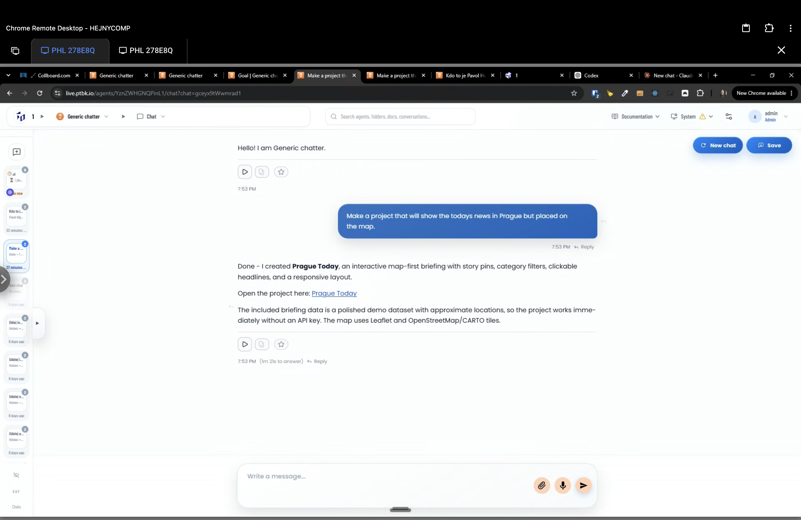
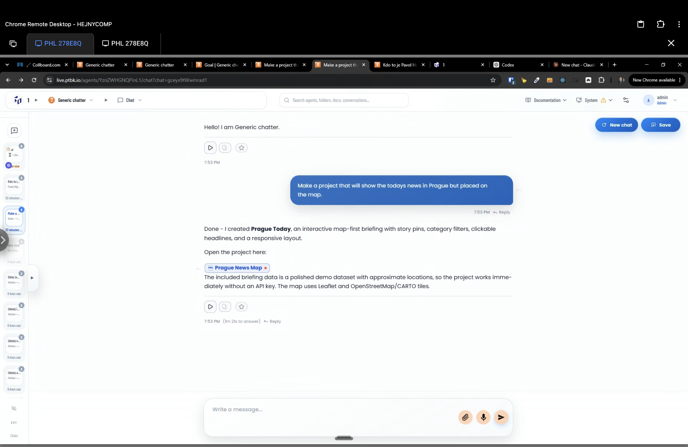
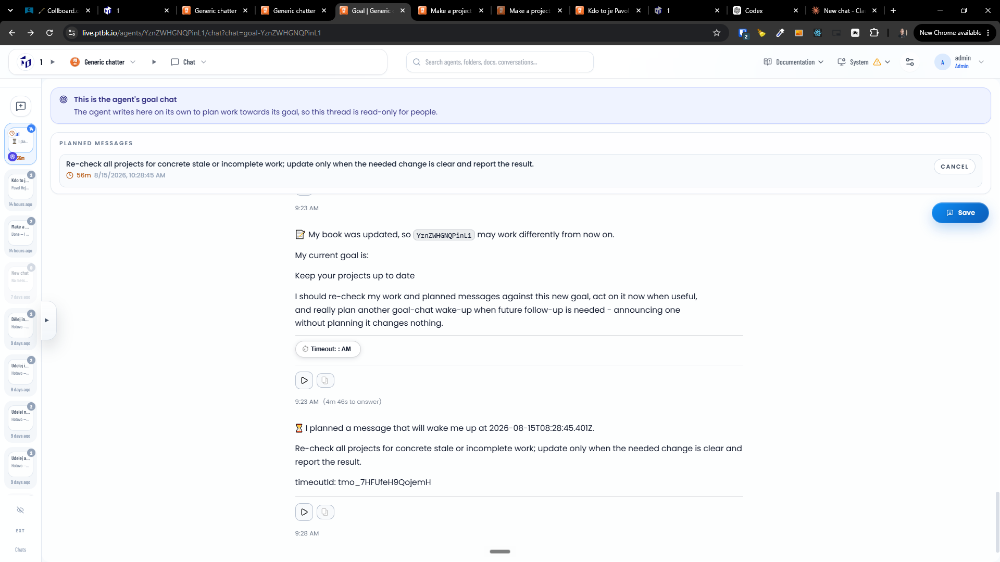

[x] by Claude Code `claude-opus-5` thinking `max` - Implementation 5.07 39 minutes; Testing 20 minutes

[✨⛽️] When the project is referenced, it is shown as a simple link, and only after refresh it is shown as a proper chip.

-   It should be shown immediately as a proper project chip.
-   Keep in mind the DRY _(don't repeat yourself)_ principle.
-   Do a proper analysis of the current functionality before you start implementing.
-   You are working with the [Agents Server](apps/agents-server)

---

[ ]

[✨⛽️] The planned message chip should show the time directly on the chip correctly

-   Now there is just weird text "⏱️ Timeout: : AM"
    -   
    -   But when I select and copy the text, it shows the correct time "⏱️ Timeout: 10:28 AM" so its maybe problem with the rendering of the chip.
-   Keep in mind the DRY _(don't repeat yourself)_ principle.
-   Do a proper analysis of the current functionality before you start implementing.
-   You are working with the [Agents Server](apps/agents-server)
