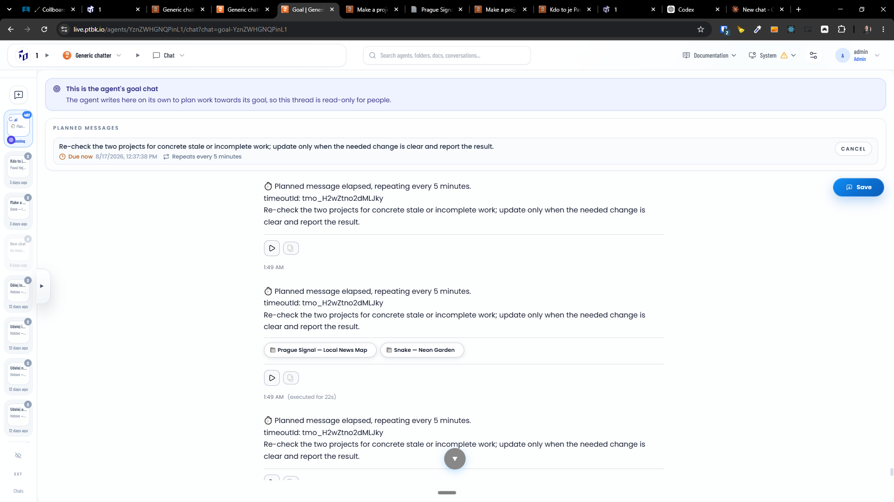
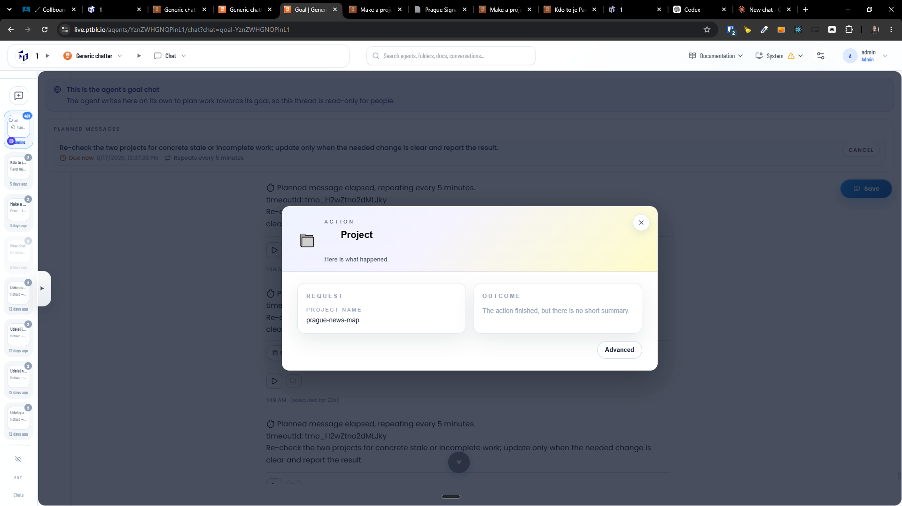

[x] (2 attempts) by Claude Code `claude-opus-5` thinking `max` - Implementation $0.00 3 hours; Testing 12 hours; Fixing $3.78 9 minutes; Testing 13 minutes

[✨🙀] When the agent touches a project, there is a chip under the message, but when the user clicks on this chip, the pop-up isn't very useful. Show there more useful information.

-   Show there the status of the project, whether the project is running, link to the project to a new tab, etc. Re-use the information and components from the project page.
-   Also show which changes were done during this message.
-   Every project should be a Git repository, and every modification of the project should be automatically committed to this project. Show the diff of what was done exactly during this message in the card
-   Keep in mind the DRY _(don't repeat yourself)_ principle.
-   Do a proper analysis of the current functionality before you start implementing.
-   You are working with the [Agents Server](apps/agents-server)
-   Add the changes into the [changelog](changelog/_current-preversion.md)

