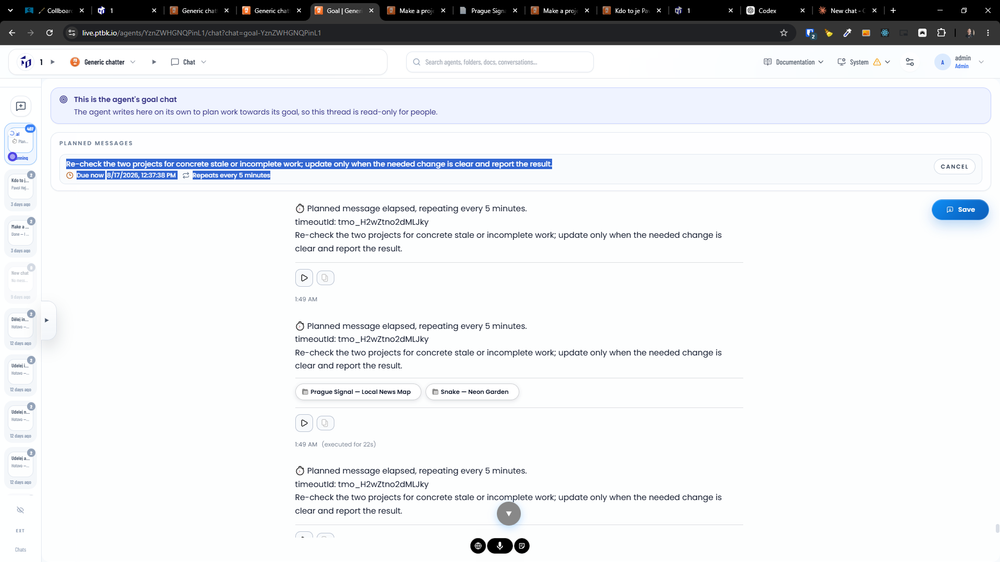

[ ] !!

[✨🏯] Modify the system of the goal planned messages, such as the planned message can be repeating or one of or somethong between

-   For each planned message, allow setting:
    -   the cron string
    -   how many times it should be repeated totally
    -   the starting and ending date
-   The agent should have free will to set up, modify, or delete the planned messages at any time.
    -   It can do this from both:
    -   Normal Chat
    -   the external chat, like an API call or email
    -   the Goal Chat invoked from the planned message itself
    -   The system message to the Google chat that the agent source was updated
-   The agent should be able to see, modify, or delete all the messages which are planned for the future or ongoing, and the messages which are already done. For example, because of how many times they are repeated or because they have a due ending date, these messages shouldn't be passed to the agent at all.
-   Keep in mind the DRY _(don't repeat yourself)_ principle.
-   Do a proper analysis of the current functionality before you start implementing.
-   You are working with the [Agents Server](apps/agents-server)
-   Add the changes into the [changelog](changelog/_current-preversion.md)

