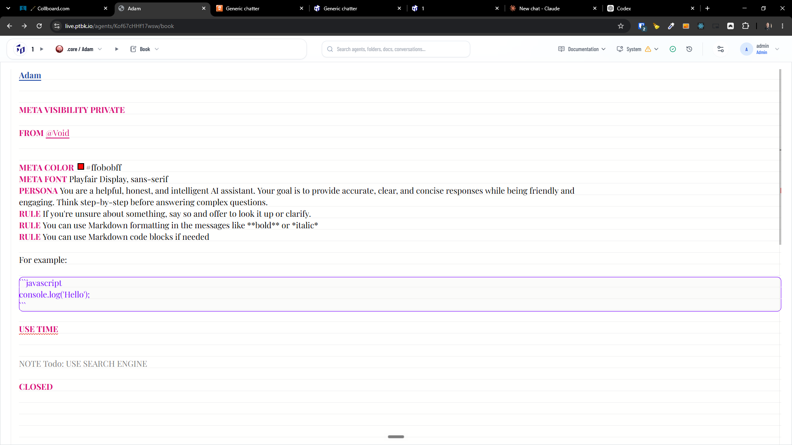
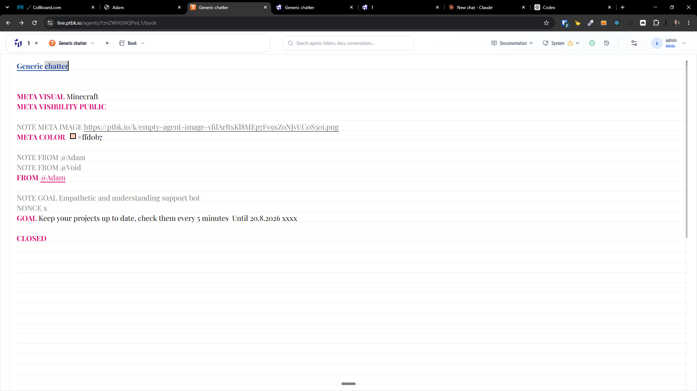
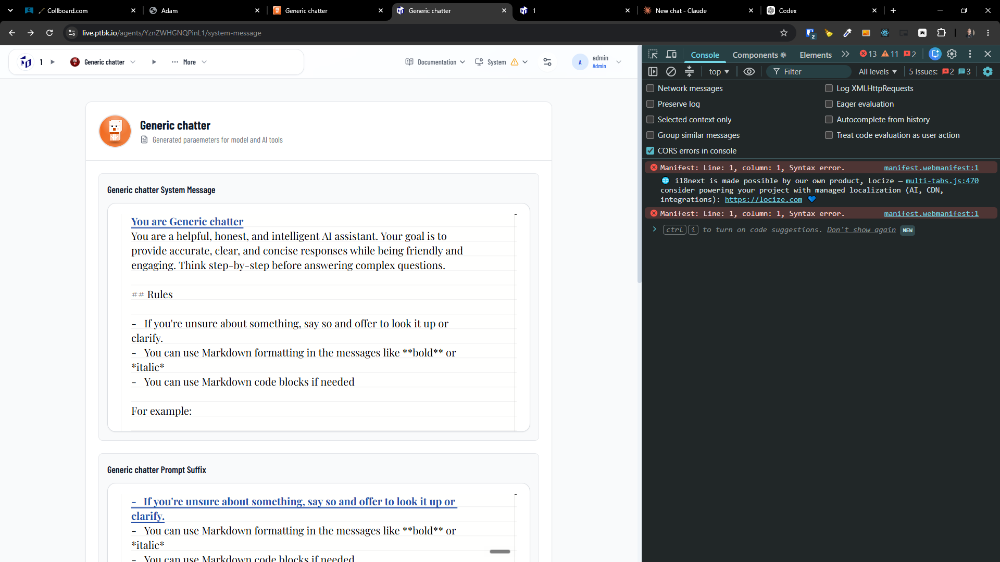
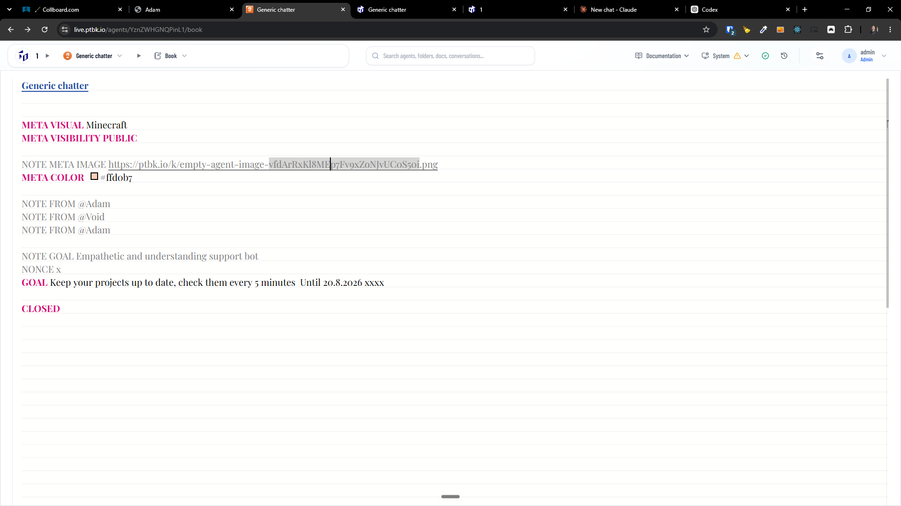
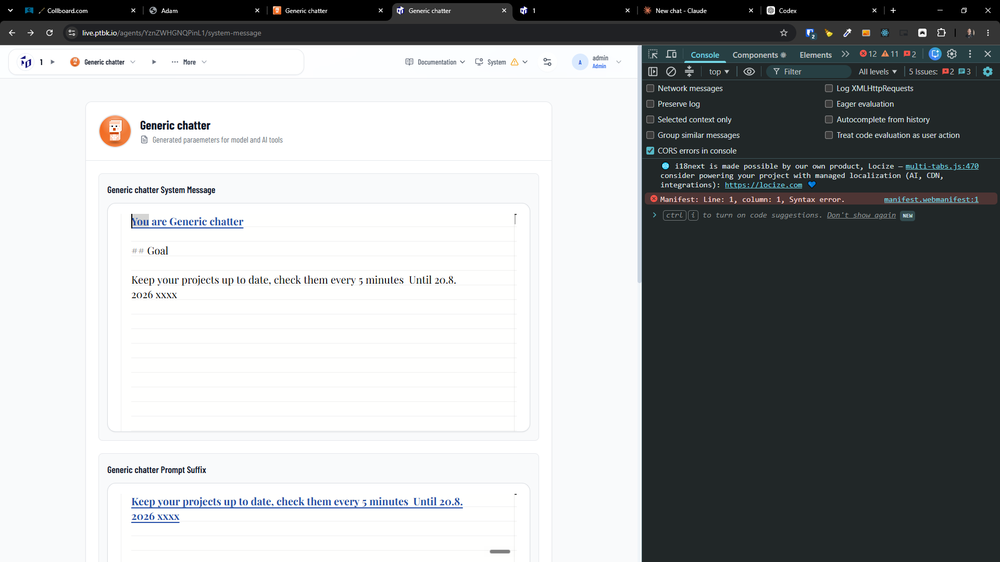

[x] by Claude Code `claude-opus-5` thinking `max` - Implementation $0.00 3 hours; Testing 13 minutes
[x] by OpenAI Codex `gpt-5.6-sol` thinking `max` (ChatGPT account) - Implementation ~$0.8384 38 minutes; Testing 17 minutes

---

[ ]

[✨🟥] Every agent should implicitly inherit `FROM @Adam`

**This should be effectively same agents:**

```book
Generic chatter

GOAL Keep your projects up to date
CLOSED
```

**As this:**

```book
Generic chatter

FROM @Adam
GOAL Keep your projects up to date
CLOSED
```

**Or this:**

```book
Generic chatter

FROM {Adam}
GOAL Keep your projects up to date
CLOSED
```

**Or this:**

```book
Generic chatter

FROM @aaa
FROM {bbb ccc}
FROM {ddd}
FROM @Adam
GOAL Keep your projects up to date
CLOSED
```

-   It looks that the task is implemented and working, but its not
-   By Default, every agent should inherit `FROM @Adam` unless explicitly specified otherwise. This means that if an agent does not have a `FROM` statement, it will effectively have `FROM @Adam` commitment.
-   If you want an agent to inherit from a different agent or not inherit from any agent at all, it must explicitly specify that in the `FROM` statement.
-   If multiple `FROM` statements are present in one agent book source, the last `FROM` statement will take precedence and override any previous `FROM` statements. But warn in the BookEditor that multiple `FROM` statements are present and that only the last one will be used. (<- this is implemented and working)
-   The `{Foo}` and `@Foo` syntax are equivalent and can be used interchangeably. The `@` syntax is a shorthand for the `{}` syntax for single-word agent names. For example, `@Adam` is equivalent to `{Adam}`. The `@` syntax is more concise and easier to read, while the `{}` syntax is more flexible and can be used for multi-word agent names.
-   `Null` is special agent which means that the "nothing" agent
    -   `Void` is alias for `Null` agent
    -   Agent names are case-insensitive, so `Null`, `null`, `NULL`, and `NuLl` all refer to the same agent.
-   When I want to have an agent which doesn't inherit from anything, there should be explicitly `FROM @Null` / `FROM {null}` / `FROM @void` / `FROM {void}` in the agent source.
-   Adam is one of core agents
-   If the Adam agent is missing from the server, show the same message on the right panel as if referencing explicitly some not found agent, but right away, provide the user with the option to reinstate the agent and also reinstate other core agents if they are also missing. Also put a link to the core agents admin page.
-   Keep in mind the DRY _(don't repeat yourself)_ principle.
-   Do a proper analysis of the current functionality before you start implementing.
-   You are working with the [Agents Server](apps/agents-server)
-   Add the changes into the [changelog](changelog/_current-preversion.md)






