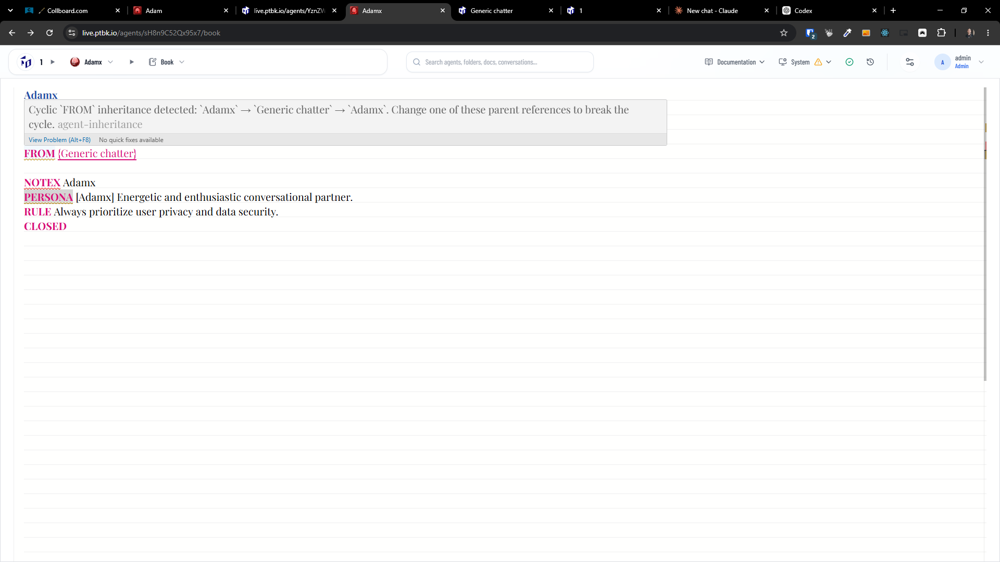
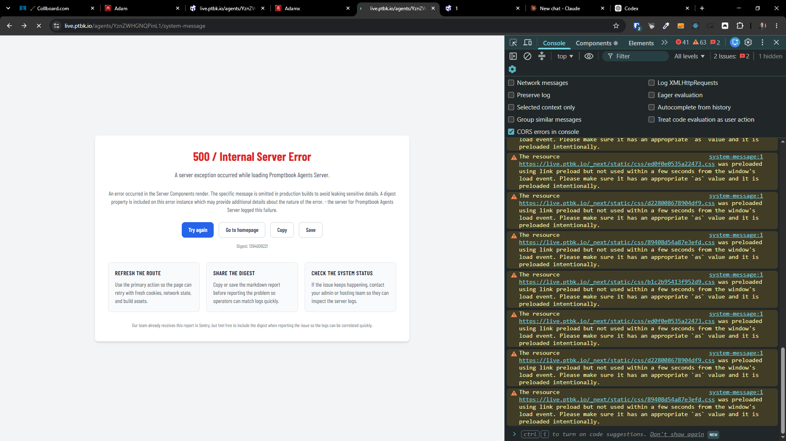

[x] by Claude Code `claude-opus-5` thinking `max` - Implementation $0.00 3 hours; Testing 13 minutes
[x] by OpenAI Codex `gpt-5.6-sol` thinking `max` (ChatGPT account) - Implementation ~$0.8384 38 minutes; Testing 17 minutes
[x] by Claude Code `claude-opus-5` thinking `max` - Implementation 8.54 9 hours; Testing 17 minutes

---

[x] by OpenAI Codex `gpt-5.6-terra` thinking `max` (ChatGPT account) - Implementation ~.17 37 minutes; Testing 13 minutes

[✨🟥] Every agent should implicitly inherit `FROM @Adam`

**This should be effectively same agents:**

```book
Generic chatter

GOAL Keep your projects up to date
CLOSED
```

**As this:**

```book
Generic chatter

FROM @Adam
GOAL Keep your projects up to date
CLOSED
```

**Or this:**

```book
Generic chatter

FROM {Adam}
GOAL Keep your projects up to date
CLOSED
```

**Or this:**

```book
Generic chatter

FROM @aaa
FROM {bbb ccc}
FROM {ddd}
FROM @Adam
GOAL Keep your projects up to date
CLOSED
```

-   It looks that the task is implemented and working, but its not
-   By Default, every agent should inherit `FROM @Adam` unless explicitly specified otherwise. This means that if an agent does not have a `FROM` statement, it will effectively have `FROM @Adam` commitment.
-   If you want an agent to inherit from a different agent or not inherit from any agent at all, it must explicitly specify that in the `FROM` statement.
-   If multiple `FROM` statements are present in one agent book source, the last `FROM` statement will take precedence and override any previous `FROM` statements. But warn in the BookEditor that multiple `FROM` statements are present and that only the last one will be used.
-   The `{Foo}` and `@Foo` syntax are equivalent and can be used interchangeably. The `@` syntax is a shorthand for the `{}` syntax for single-word agent names. For example, `@Adam` is equivalent to `{Adam}`. The `@` syntax is more concise and easier to read, while the `{}` syntax is more flexible and can be used for multi-word agent names.
-   `Null` is special agent which means that the "nothing" agent
    -   `Void` is alias for `Null` agent
    -   Agent names are case-insensitive, so `Null`, `null`, `NULL`, and `NuLl` all refer to the same agent.
-   When I want to have an agent which doesn't inherit from anything, there should be explicitly `FROM @Null` / `FROM {null}` / `FROM @void` / `FROM {void}` in the agent source.
-   When there is `FROM {Some agent}` it should use the `Some agent` as the base agent not the `Adam` agent, but if there is no `FROM` statement, it should use the `Adam` agent as the base agent.
    -   This is not working correctly, because when I create an agent with `FROM {Some agent}` it still inherits from `Adam` agent and also from `Some agent`, which is not correct. It should only inherit from `Some agent` and not from `Adam` agent.
-   You should be able to do the inheritance chain, for example, if `Agent A` inherits from `Agent B`, and `Agent B` inherits from `Agent C`, then `Agent A` should inherit from both `Agent B` and `Agent C` and also `Adam` if `Agent A` does not have its own `FROM` statement.
-   The `Adam` agent inherits `FROM @Null`
-   If there is a cycle in the inheritance chain, it should be detected and a warning should be shown in the BookEditor that there is a cycle in the inheritance chain and that it should be fixed. For example, if `Agent A` inherits from `Agent B`, and `Agent B` inherits from `Agent A`, then there is a cycle in the inheritance chain and it should be fixed.
-   Similar warning should be shown if `Adam` agent has different `FROM` statement than `FROM @Null`, because this is not allowed and should be fixed.
-   Adam is one of core agents
-   If the Adam agent is missing from the server, show the same message on the right panel as if referencing explicitly some not found agent, but right away, provide the user with the option to reinstate the agent and also reinstate other core agents if they are also missing. Also put a link to the core agents admin page.
-   Keep in mind the DRY _(don't repeat yourself)_ principle.
-   Do a proper analysis of the current functionality before you start implementing.
-   You are working with the [Agents Server](apps/agents-server)
-   Add the changes into the [changelog](changelog/_current-preversion.md)

---

[ ]

[✨🟥] Cyclic `FROM` dependency should not fail the app

-   @@@@@@@@
-   In the book editor there is correct warning "Cyclic `FROM` inheritance detected: `Adamx` → `Generic chatter` → `Adamx`. Change one of these parent references to break the cycle.agent-inheritance"
-   Keep in mind the DRY _(don't repeat yourself)_ principle.
-   Do a proper analysis of the current functionality before you start implementing.
-   You are working with the [Agents Server](apps/agents-server)
-   Add the changes into the [changelog](changelog/_current-preversion.md)




```log
15|promptbook-agents-server-06d70c7  | 2026-08-22T15:56:52: [next] Resolution chain:
15|promptbook-agents-server-06d70c7  | 2026-08-22T15:56:52: [next] - `https://live.ptbk.io/agents/YznZWHGNQPinL1`
15|promptbook-agents-server-06d70c7  | 2026-08-22T15:56:52: [next] - `https://live.ptbk.io/agents/generic-chatter`
15|promptbook-agents-server-06d70c7  | 2026-08-22T15:56:52: [next] - `https://live.ptbk.io/agents/sH8n9C52Qx95x7`
15|promptbook-agents-server-06d70c7  | 2026-08-22T15:56:52: [next] - `https://live.ptbk.io/agents/adamx`
15|promptbook-agents-server-06d70c7  | 2026-08-22T15:56:52: [next] - `https://live.ptbk.io/agents/YznZWHGNQPinL1`
15|promptbook-agents-server-06d70c7  | 2026-08-22T15:56:52: [next]     at <unknown> (.next/server/chunks/8264.js:26:409)
15|promptbook-agents-server-06d70c7  | 2026-08-22T15:56:52: [next]     at s (.next/server/chunks/8264.js:31:17)
15|promptbook-agents-server-06d70c7  | 2026-08-22T15:56:52: [next]     at t (.next/server/chunks/8264.js:37:137)
15|promptbook-agents-server-06d70c7  | 2026-08-22T15:56:52: [next]     at async x (.next/server/chunks/8264.js:43:1914)
15|promptbook-agents-server-06d70c7  | 2026-08-22T15:56:52: [next]     at async s (.next/server/chunks/8264.js:31:73)
15|promptbook-agents-server-06d70c7  | 2026-08-22T15:56:52: [next]     at async t (.next/server/chunks/8264.js:37:131)
15|promptbook-agents-server-06d70c7  | 2026-08-22T15:56:52: [next]     at async x (.next/server/chunks/8264.js:43:1914)
15|promptbook-agents-server-06d70c7  | 2026-08-22T15:56:52: [next]     at async k (.next/server/chunks/8264.js:1:911)
15|promptbook-agents-server-06d70c7  | 2026-08-22T15:56:52: [next]     at async i (.next/server/chunks/4637.js:33:4409) {
15|promptbook-agents-server-06d70c7  | 2026-08-22T15:56:52: [next]   digest: '1407701731'
15|promptbook-agents-server-06d70c7  | 2026-08-22T15:56:52: [next] }
15|promptbook-agents-server-06d70c7  | 2026-08-22T15:56:52: [next] Failed to generate metadata for agent YznZWHGNQPinL1 Error [ParseError]: Cyclic `FROM` reference detected while resolving agent source.
15|promptbook-agents-server-06d70c7  | 2026-08-22T15:56:52: [next] Resolution chain:
15|promptbook-agents-server-06d70c7  | 2026-08-22T15:56:52: [next] - `https://live.ptbk.io/agents/YznZWHGNQPinL1`
15|promptbook-agents-server-06d70c7  | 2026-08-22T15:56:52: [next] - `https://live.ptbk.io/agents/generic-chatter`
15|promptbook-agents-server-06d70c7  | 2026-08-22T15:56:52: [next] - `https://live.ptbk.io/agents/sH8n9C52Qx95x7`
15|promptbook-agents-server-06d70c7  | 2026-08-22T15:56:52: [next] - `https://live.ptbk.io/agents/adamx`
15|promptbook-agents-server-06d70c7  | 2026-08-22T15:56:52: [next] - `https://live.ptbk.io/agents/YznZWHGNQPinL1`
15|promptbook-agents-server-06d70c7  | 2026-08-22T15:56:52: [next]     at <unknown> (.next/server/chunks/8264.js:26:409)
15|promptbook-agents-server-06d70c7  | 2026-08-22T15:56:52: [next]     at s (.next/server/chunks/8264.js:31:17)
15|promptbook-agents-server-06d70c7  | 2026-08-22T15:56:52: [next]     at t (.next/server/chunks/8264.js:37:137)
15|promptbook-agents-server-06d70c7  | 2026-08-22T15:56:52: [next]     at async x (.next/server/chunks/8264.js:43:1914)
15|promptbook-agents-server-06d70c7  | 2026-08-22T15:56:52: [next]     at async s (.next/server/chunks/8264.js:31:73)
15|promptbook-agents-server-06d70c7  | 2026-08-22T15:56:52: [next]     at async t (.next/server/chunks/8264.js:37:131)
15|promptbook-agents-server-06d70c7  | 2026-08-22T15:56:52: [next]     at async x (.next/server/chunks/8264.js:43:1914)
15|promptbook-agents-server-06d70c7  | 2026-08-22T15:56:52: [next]     at async k (.next/server/chunks/8264.js:1:911)
15|promptbook-agents-server-06d70c7  | 2026-08-22T15:56:52: [next]     at async i (.next/server/chunks/4637.js:33:4409)
15|promptbook-agents-server-06d70c7  | 2026-08-22T15:56:52: [next]     at async (.next/server/chunks/4670.js:18:14844)
```
