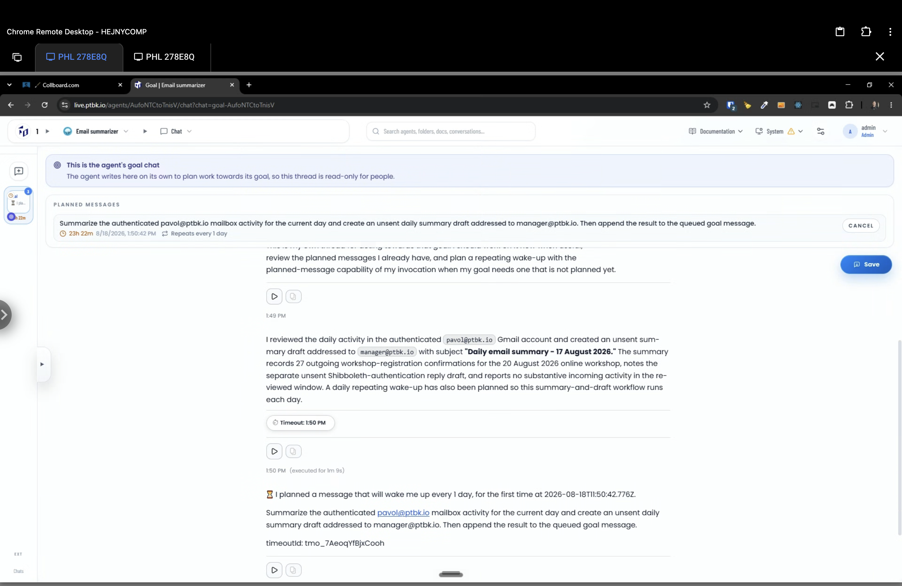

[ ] !!!!!!

[✨🫓] When the agent touches any external sources, the chip should be shown under the message.

-   For example, I have here an agent which touches the Gmail and creates a concept, but there is no information under the message that this action was done.
-   When the agent makes things internally, the message can be without any chip.
-   But always, when any external source, website, service, or anything external outside of the agent is touched, either by viewing or editing, there should be this information available in the chip under the message.
-   This is a universal pattern which should be applied to all the actions across the agent server
-   For example, when the agent is looking for external knowledge, there is already a very nice chip which shows this external knowledge under a message
-   Keep in mind the DRY _(don't repeat yourself)_ principle.
-   Do a proper analysis of the current functionality before you start implementing.
-   You are working with the [Agents Server](apps/agents-server)
-   Add the changes into the [changelog](changelog/_current-preversion.md)

