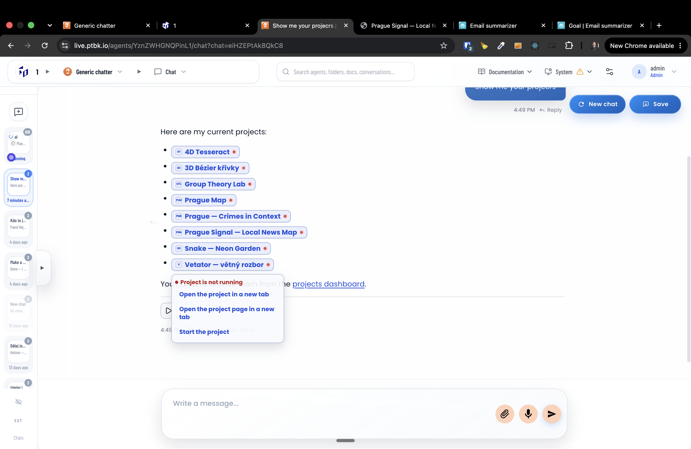

[ ]

[✨🙉] the default state of the agent project should be running

-   The project should be by default in the running state.
-   The server is restarted. The project should run automatically.
-   The project can be manually stopped or crashed, but by default all the projects should be started.
-   Keep in mind the DRY _(don't repeat yourself)_ principle.
-   Do a proper analysis of the current functionality before you start implementing.
-   You are working with the [Agents Server](apps/agents-server)
-   Add the changes into the [changelog](changelog/_current-preversion.md)

