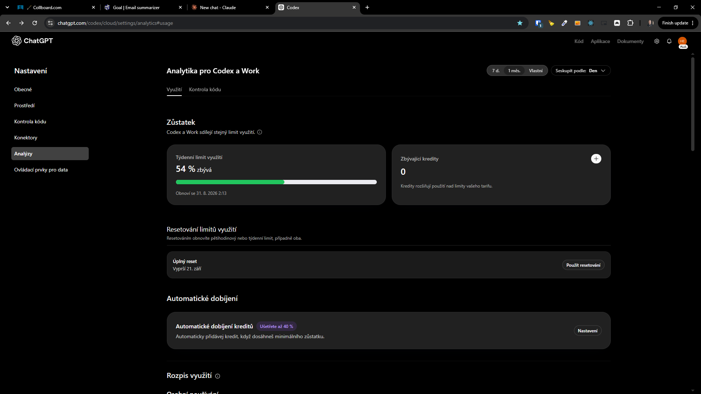
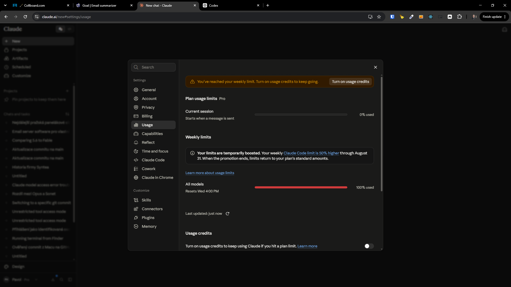

[x] by OpenAI Codex `gpt-5.6-terra` thinking `max` (ChatGPT account) - Implementation ~$0.9141 33 minutes; Testing 17 minutes

[✨🐎] Show the usage of `ptbk coder`

```bash
ptbk coder run --harness openai-codex --model gpt-5.4 --thinking-level xhigh --agent agents/coding/developer.book --context AGENTS.md
```

-   In the terminal UI, show the usage of the subscription which is remaining
-   When there are more usage limits (for example 1 week limit and 5 hour limit), show the usage of all limits
-   This should work in future for all harnesses but for now it is only implemented for `openai-codex` and `claude-code` harnesses.
-   Keep in mind the DRY _(don't repeat yourself)_ principle.
-   Do a proper analysis of the current functionality of `ptbk coder` and related functionality before you start implementing.
-   You are working with [`ptbk coder`](src/cli/cli-commands/coder/run.ts)
-   Update the [`ptbk coder` landing website](apps/coder-landing)
-   Add the changes into the [changelog](changelog/_current-preversion.md)




