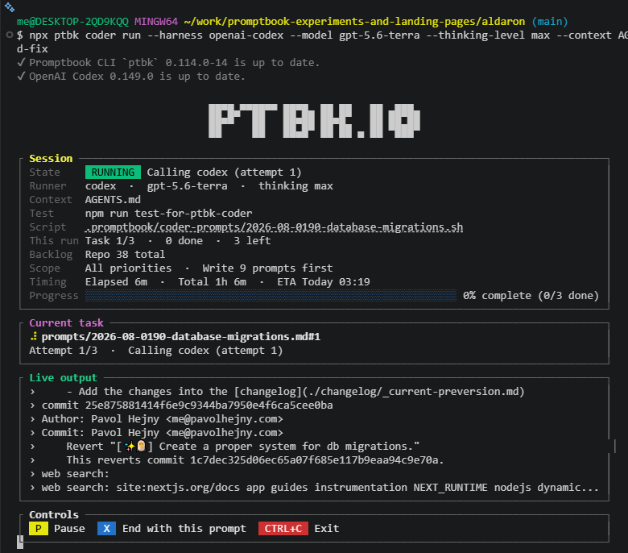

[x] by Claude Code `claude-opus-5` thinking `max` - Implementation $6.35 13 minutes; Testing 13 minutes

[✨😝] Before the agent avatar is loaded, do not show ASCII "PTBK.IO" text in terminal

```bash
ptbk coder run --harness github-copilot --model gpt-5.4 --thinking-level xhigh --agent agents/coding/developer.book --context AGENTS.md
```

-   Keep in mind the DRY _(don't repeat yourself)_ principle.
-   Do a proper analysis of the current functionality of `ptbk coder` and related functionality before you start implementing.
-   You are working with [`ptbk coder`](src/cli/cli-commands/coder/run.ts)
-   Add the changes into the [changelog](changelog/_current-preversion.md)



