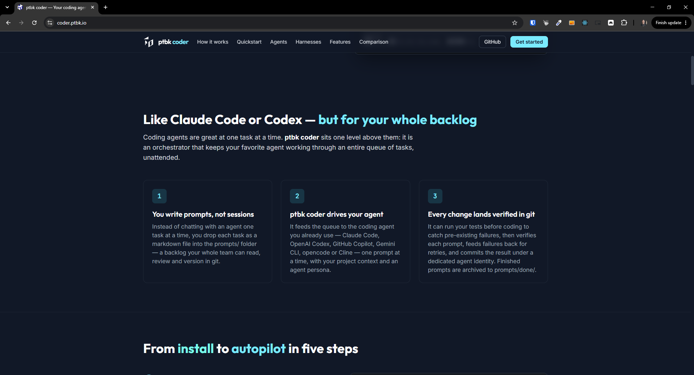

[ ]

[✨✤] Update the `ptbk coder` landing website and more emphasize:

1. No babysitting - Coder allows you to run the agent, and the agent will be working on every PRD automatically. It will do the implementation, testing and quality checks, and you can let him work, not answer questions or babysit every 10 minutes.
2. No dependency on vendor, define your agent as `.book` and ptbk coder will run on any harness/model. Switch claude code and openai codex in 1 second, and you can even run your own local model. You are not dependent on any vendor, and you can switch between them easily.
3. Done PRDs always in sync with code out of the box - the system of the PRD markdown files and their checks ensures that the job marked as done is always automatically in sync with the job actually completed.
   This has benefits; for example, when you revert or go back, you always undo both the actual work and the mark that the work was done.

<- Formulate the above into a nice landing page with graphics, icons and great copy (do not 1:1 copy the above, but use it as a base for the copy). The landing page should be visually appealing and clearly communicate the benefits of using `ptbk coder`.

-   Do this instead of 
    -   Use some nice graphics and icons to illustrate the benefits of `ptbk coder` and its features.
    -   center the icons in the center of the boxes
-   Mainly theese 3 benefits should be also reflected in comparison table
-   Keep in mind the DRY _(don't repeat yourself)_ principle.
-   Do a proper analysis of the current functionality of `ptbk coder` and related functionality before you start implementing.
-   You are working with the [`ptbk coder` landing website](apps/coder-landing)
-   Add the changes into the [changelog](changelog/_current-preversion.md)
