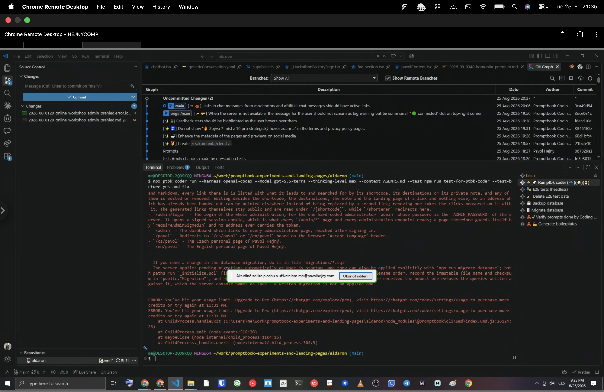

[ ]

[✨👞] foo

```bash
ptbk coder run --harness openai-codex --model gpt-5.4 --thinking-level xhigh --agent agents/coding/developer.book --context AGENTS.md
```


```console
ERROR: You've hit your usage limit. Upgrade to Pro (https://chatgpt.com/explore/pro), visit https://chatgpt.com/codex/settings/usage to purchase more credits or try again at 11:31 PM.
ERROR: You've hit your usage limit. Upgrade to Pro (https://chatgpt.com/explore/pro), visit https://chatgpt.com/codex/settings/usage to purchase more credits or try again at 11:31 PM.
    at ChildProcess.handleExit (C:\Users\me\work\promptbook-experiments-and-landing-pages\aldaron\node_modules\@promptbook\cli\umd\index.umd.js:26124:23)
    at ChildProcess.emit (node:events:518:28)
    at maybeClose (node:internal/child_process:1104:16)
    at ChildProcess._handle.onexit (node:internal/child_process:304:5)

me@DESKTOP-2QD9KQQ MINGW64 ~/work/promptbook-experiments-and-landing-pages/aldaron (main)
$ 
```

-   @@@
-   Keep in mind the DRY _(don't repeat yourself)_ principle.
-   Do a proper analysis of the current functionality of `ptbk coder` and related functionality before you start implementing.
-   Also look and update [the dev scripts in `terminals.json`](.vscode/terminals.json)
-   You are working with [`ptbk coder`](src/cli/cli-commands/coder/run.ts)
-   Update the [`ptbk coder` landing website](apps/coder-landing)
-   Add the changes into the [changelog](changelog/_current-preversion.md)

