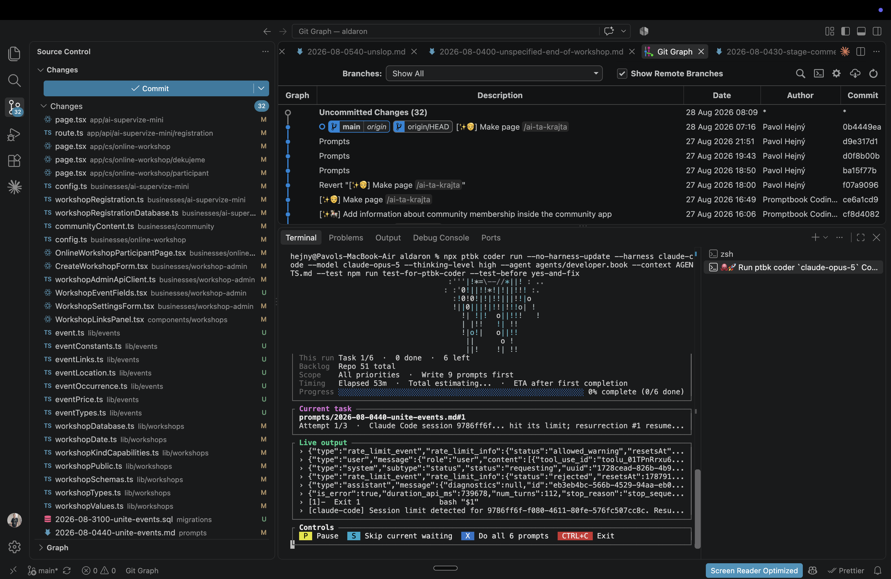

[x] by Claude Code `claude-opus-5` thinking `max` - Implementation 6.38 32 minutes; Testing 15 minutes

[✨🏹] Controls in promptbook coder are not very reactive, fix it.

```console
ptbk coder run --harness github-copilot --model gpt-5.4 --thinking-level xhigh --agent agents/coding/developer.book --context AGENTS.md

...


│ Scope    All priorities  ·  Write 9 prompts first                                        │
│ Timing   Elapsed 2h 55m  ·  Total estimating...  ·  ETA after first completion           │
│ Progress ░░░░░░░░░░░░░░░░░░░░░░░░░░░░░░░░░░░░░░░░░░░░░░░░░░░░░░░░ 0% complete (0/6 done) │
└──────────────────────────────────────────────────────────────────────────────────────────┘
┌ Current task ────────────────────────────────────────────────────────────────────────────┐
│ prompts/2026-08-0440-unite-events.md#1                                                   │
│ Attempt 1/3  ·  Claude Code session 9786ff6f... hit its limit; resurrection #1 resume... │
└──────────────────────────────────────────────────────────────────────────────────────────┘
┌ Live output ─────────────────────────────────────────────────────────────────────────────┐
│ › {"type":"rate_limit_event","rate_limit_info":{"status":"allowed_warning","resetsAt"... │
│ › {"type":"user","message":{"role":"user","content":[{"tool_use_id":"toolu_01TPnRrxu6... │
│ › {"type":"system","subtype":"status","status":"requesting","uuid":"1728cead-826b-4b9... │
│ › {"type":"rate_limit_event","rate_limit_info":{"status":"rejected","resetsAt":178791... │
│ › {"type":"assistant","message":{"diagnostics":null,"id":"eb3eb4bc-566b-4529-94aa-eb0... │
│ › {"is_error":true,"duration_api_ms":739678,"num_turns":112,"stop_reason":"stop_seque... │
│ › [1]-  Exit 1                  bash "$1"                                                │
│ › [claude-code] Session limit detected for 9786ff6f-f080-4611-80fe-576fc507cc8c. Resu... │
└──────────────────────────────────────────────────────────────────────────────────────────┘
┌ Controls ────────────────────────────────────────────────────────────────────────────────┐
│  P  Pause   S  Skip current waiting   X  Do all 6 prompts   CTRL+C  Exit                 │
└──────────────────────────────────────────────────────────────────────────────────────────┘
```

-   For example, when I click the skip current waiting, it does not do any feedback that the skip was pressed and something happened.
-   There should be some more obvious feedback and re render when I press some of the controls.
-   Keep in mind the DRY _(don't repeat yourself)_ principle.
-   Do a proper analysis of the current functionality of `ptbk coder` and related functionality before you start implementing.
-   You are working with [`ptbk coder`](src/cli/cli-commands/coder/run.ts)
-   Update the [`ptbk coder` landing website](apps/coder-landing)
-   Add the changes into the [changelog](changelog/_current-preversion.md)



