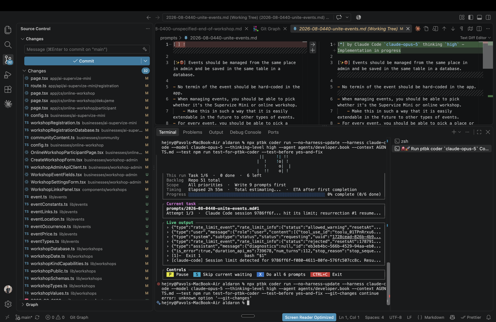
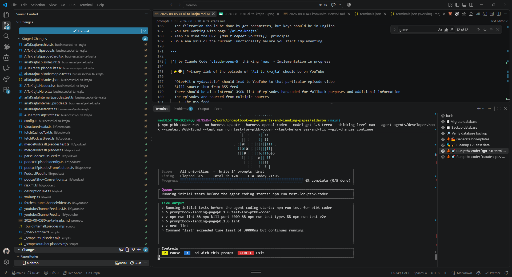

[x] by Claude Code `claude-opus-5` thinking `max` - Implementation $26.45 an hour; Testing 12 minutes

[✨🛼] Allow to pick what happen with dirty working dir in coder

```bash
npx ptbk coder run --no-harness-update --harness claude-code --model claude-opus-5 --thinking-level high --agent agents/developer.book --context AGENTS.md --test npm run test-for-ptbk-coder --test-before yes-and-fix --git-changes continue
```

It expects to discover exactly one prompt file in state such as:

```markdown
[^] by Claude Code `claude-opus-5` thinking `high` - Implementation in progress
```

And this will continue the interrupted work.

-   When the continue option does not find any changes or finds multiple prompts with `[^]` fail.
-   It can happen that one harness started a work and another harness finished it.
    -   Record this information correctly in `[^]`, `[x]` and `[!]`
-   There should be effectively new option `--git-changes` that can be set to `fail`, `ignore` or `continue`
-   By default it should be set to `fail` and if there are any git changes, the command should fail with an error message that there are git changes and that the user should either commit them or use `--git-changes ignore` or `--git-changes continue`
-   Also change the deprecated option `--ignore-git-changes` to `--git-changes ignore`
    -   Do not keep the backward compatibility with `--ignore-git-changes` just change the usege to `--git-changes ignore` and remove the `--ignore-git-changes` option from the code and the help
-   Keep in mind the DRY _(don't repeat yourself)_ principle.
-   Do a proper analysis of the current functionality of `ptbk coder` and related functionality before you start implementing.
-   Also look and update [the dev scripts in `terminals.json`](.vscode/terminals.json)
-   You are working with [`ptbk coder`](src/cli/cli-commands/coder/run.ts)
-   Update the [`ptbk coder` landing website](apps/coder-landing)
-   Add the changes into the [changelog](changelog/_current-preversion.md)



---

[x] by OpenAI Codex `gpt-5.6-terra` thinking `max` - Implementation ~$0.8153 36 minutes; Testing 10 minutes

[✨🛼] Build report progresively as time goes on when using `--git-changes continue`

**1. Do not do:**

```markdown
[^] by OpenAI Codex `gpt-5.6-terra` thinking `max`, started by Claude Code `claude-opus-5` thinking `max` - Implementation in progress
```

**1. Do instead:**

```markdown
[^] by Claude Code `claude-opus-5` thinking `max`, interrupted, continued by OpenAI Codex `gpt-5.6-terra` thinking `max` - Implementation in progress
```

**2. Do not do:**

```markdown
[x] by OpenAI Codex `gpt-5.6-terra` thinking `max` (ChatGPT account), started by Claude Code `claude-opus-5` thinking `max` - Implementation ~$0.3108 9 minutes; Testing 6 minutes
```

**2. Do instead:**

```markdown
[x] by Claude Code `claude-opus-5` thinking `max` (ChatGPT account), interrupted, continued by OpenAI Codex `gpt-5.6-terra` thinking `max` (ChatGPT account)
```

-   Every part of the report should be built progressively as time goes on
-   Keep in mind the DRY _(don't repeat yourself)_ principle.
-   Do a proper analysis of the current functionality of `ptbk coder` and related functionality before you start implementing.
-   You are working with [`ptbk coder`](src/cli/cli-commands/coder/run.ts)

---

[ ]

[✨🛼] When `--git-changes continue` is used do not allow to use `--test-before yes-and-fix`

-   This combination does not make sense and should be disallowed.
-   `--test-before yes-and-fix` is useful to test the code before anything is done, but when `--git-changes continue` is used, it means that the code has already been modified and the test was already run, and also the code in in mid of being modified, so it does not make sense to run the test before anything is done.
-   Keep in mind the DRY _(don't repeat yourself)_ principle.
-   Do a proper analysis of the current functionality of `ptbk coder` and related functionality before you start implementing.
-   You are working with [`ptbk coder`](src/cli/cli-commands/coder/run.ts)



