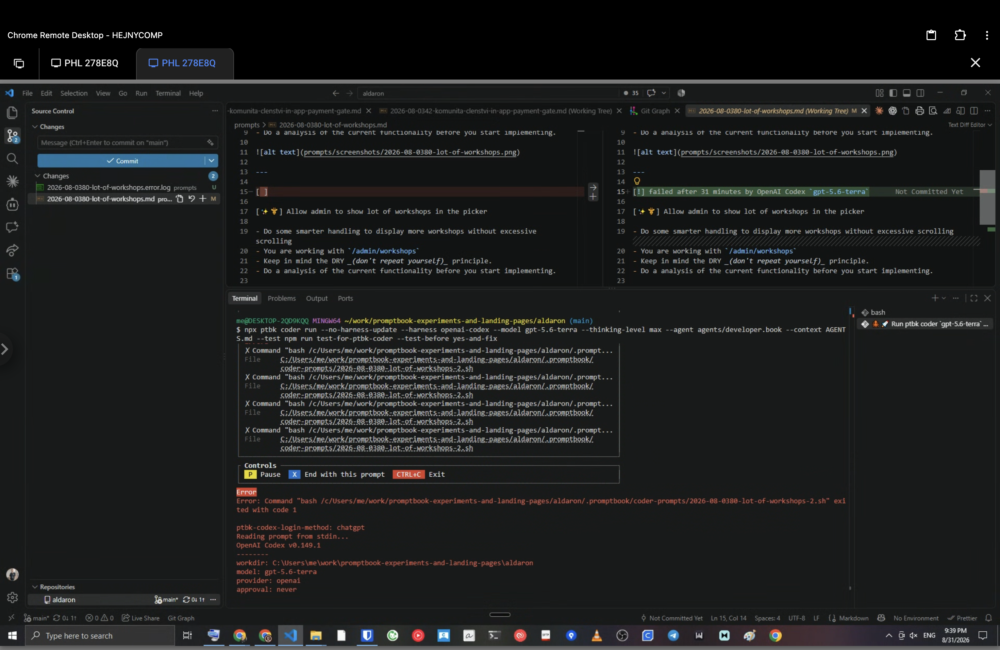
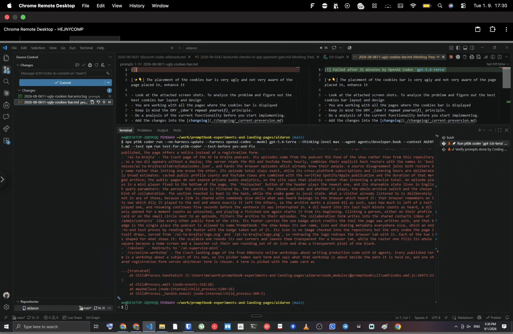
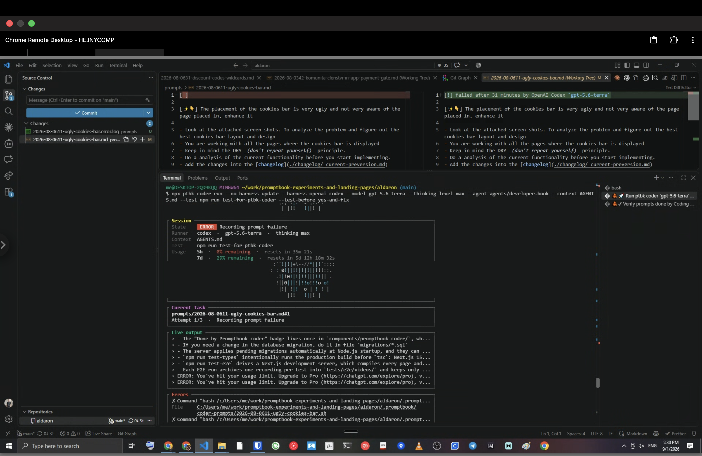
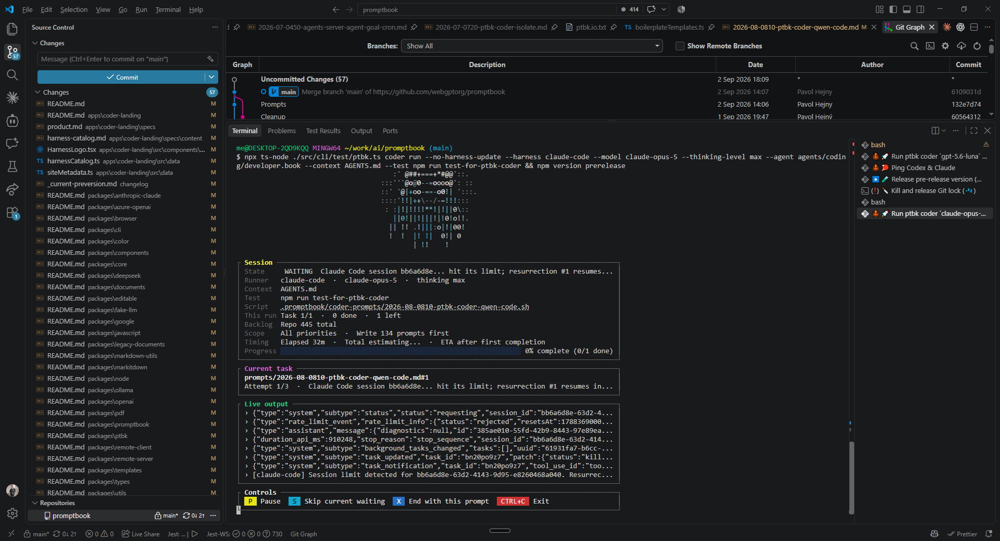
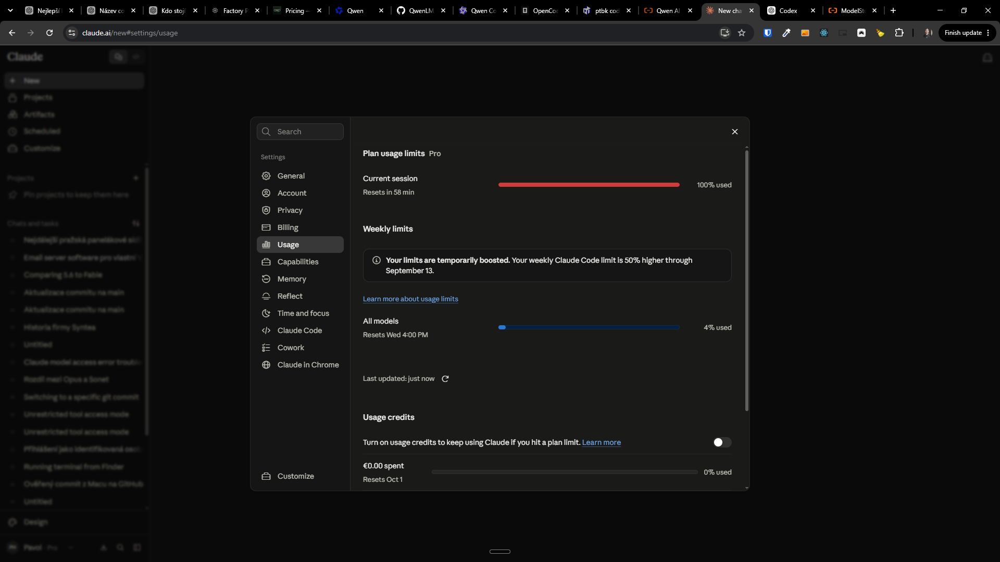

[ ]

[✨🆓] bar

```bash
@@@

npm install ptbk

ptbk coder init

ptbk coder run --harness github-copilot --model gpt-5.4 --thinking-level xhigh --agent agents/coding/developer.book --context AGENTS.md
```

-   @@@@@@
-   Keep in mind the DRY _(don't repeat yourself)_ principle.
-   Do a proper analysis of the current functionality of `ptbk coder` and related functionality before you start implementing.
-   Also look and update [the dev scripts in `terminals.json`](.vscode/terminals.json)
-   You are working with [`ptbk coder`](src/cli/cli-commands/coder/run.ts)
-   Update the [`ptbk coder` landing website](apps/coder-landing)
-   Add the changes into the [changelog](changelog/_current-preversion.md)






