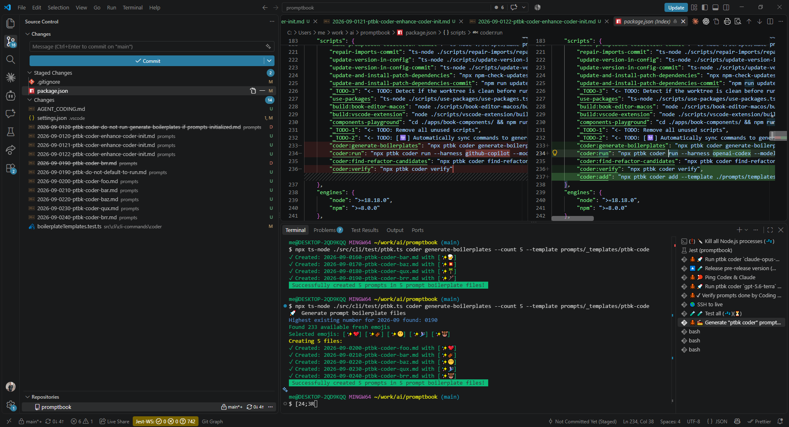
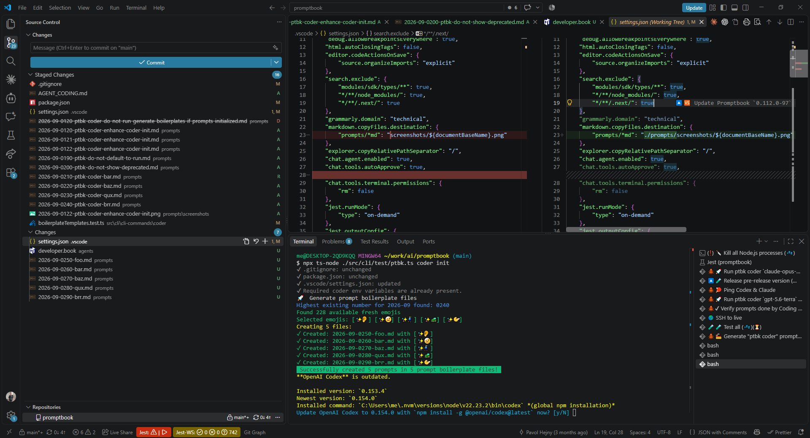

[ ] !

[✨🤲] When running `ptbk coder init` do override scripts in `package.json` and `settings.json`

```bash
ptbk coder init
```

-   If there is existing script in `package.json`, it should not be overridden by the new scripts added during `ptbk coder init`
-   The creation of `coder:add` references `developer.book` agent. But if the `coder:add` already exists and it is not overridden, the `developer.book` agent should not be created as well.
-   Only create new scripts and settings if they do not already exist.
-   If theese references external some agents / files, theese should be auto-created _(like creation of `developer.book` agent)_ but when they already exist, they should not be overridden and the referenced agents / files should not be created because they are not referenced by the new scripts or settings.
-   Only add non-existing scripts to `package.json`
-   Same pattern applies to `settings.json` as well.
-   Keep in mind the DRY _(don't repeat yourself)_ principle.
-   Do a proper analysis of the current functionality of `ptbk coder` and related functionality before you start implementing.
-   You are working with [`ptbk coder`](src/cli/cli-commands/coder/run.ts)
-   Update the [`ptbk coder` landing website](apps/coder-landing) if necessary.
-   Add the changes into the [changelog](changelog/_current-preversion.md)



