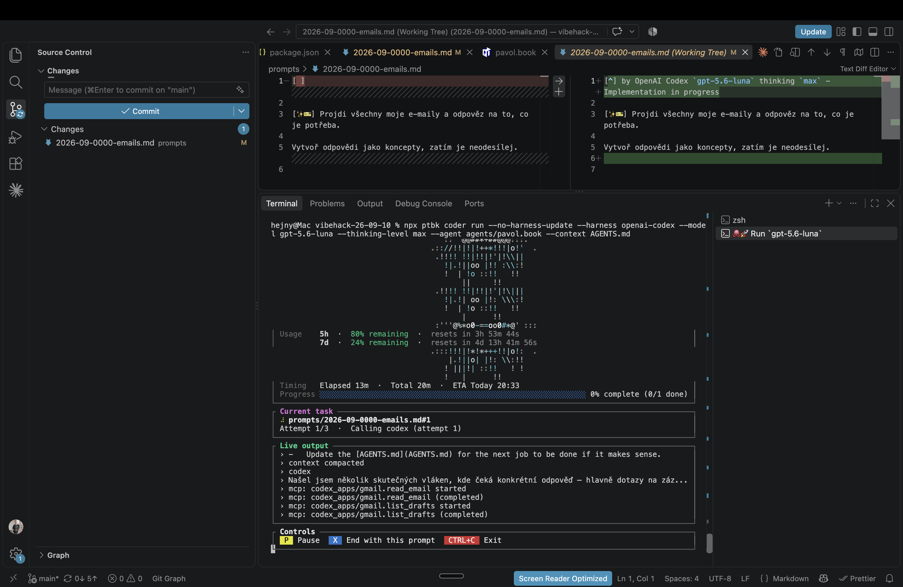

[ ]

[✨😶] The Promptbook Coder avatar can be sometimes broken, fix it

```console
hejny@Mac vibehack-26-09-10 % npx ptbk coder run --no-harness-update --harness openai-codex --model gpt-5.6-luna --thinking-level max --agent agents/pavol.book --context AGENTS.md
(node:45649) [DEP0190] DeprecationWarning: Passing args to a child process with shell option true can lead to security vulnerabilities, as the arguments are not escaped, only concatenated.
(Use `node --trace-deprecation ...` to show where the warning was created)
✔ Promptbook CLI `ptbk` 0.114.0-33 is up to date.
✔ Promptbook CLI `ptbk` 0.114.0-33 is up to date.
✔ OpenAI Codex 0.154.0 is installed. Skipped checking for updates.

                                            .  :  :  :..
                                       :::: :@*@%@@ ::::
                                       ::''@@%#*+##@@::::.
                                    :::  '@@%++==+##%@' :::
                                       :::'@%%#**##@@'':::::
                                    :::  '@%#+===+##@@'':::
                                     ::''@%#oo-==oo0%@`' :::
                                    ::::'@|ooo---ooo|!''' :
                                     :::'|!!=\\--/+|!!|'':
                                    .:::!!!|!|!|++!!!|o!:
                                     .:!!!|!!|!!|!@o!|0|
                                       :|!!||o| :!: !!.!!
                                        !|| !|  .!!   ! !
                                        ! | !|  .!!   ! !
                                       !|  |      !!
                                       !   ||     !!
                                     :'''@%*o0-==oo0#*@' :::
│ Usage    5h  ·  80% remaining  ·  resets in 3h 53m 22s                                       │
│          7d  ·  24% remaining  ·  resets in 4d 13h 41m 34s                                   │
                                    .:::!!!|!*!*+++!!|o!:  .
                                        |.!||o| |!: \\:!!
                                       ! |||!| ::!!   ! !
                                       !   |      !!
│ Timing   Elapsed 13m  ·  Total 20m  ·  ETA Today 20:34                                       │
│ Progress ░░░░░░░░░░░░░░░░░░░░░░░░░░░░░░░░░░░░░░░░░░░░░░░░░░░░░░░░░░░░ 0% complete (0/1 done) │
└──────────────────────────────────────────────────────────────────────────────────────────────┘
┌ Current task ────────────────────────────────────────────────────────────────────────────────┐
│ ⠼ prompts/2026-09-0000-emails.md#1                                                           │
│ Attempt 1/3  ·  Calling codex (attempt 1)                                                    │
└──────────────────────────────────────────────────────────────────────────────────────────────┘
┌ Live output ─────────────────────────────────────────────────────────────────────────────────┐
│ › -   Update the [AGENTS.md](AGENTS.md) for the next job to be done if it makes sense.       │
│ › context compacted                                                                          │
│ › codex                                                                                      │
│ › Našel jsem několik skutečných vláken, kde čeká konkrétní odpověď — hlavně dotazy na záz... │
│ › mcp: codex_apps/gmail.read_email started                                                   │
│ › mcp: codex_apps/gmail.read_email (completed)                                               │
│ › mcp: codex_apps/gmail.list_drafts started                                                  │
│ › mcp: codex_apps/gmail.list_drafts (completed)                                              │
└──────────────────────────────────────────────────────────────────────────────────────────────┘
┌ Controls ────────────────────────────────────────────────────────────────────────────────────┐
│  P  Pause   X  End with this prompt   CTRL+C  Exit                                           │
└──────────────────────────────────────────────────────────────────────────────────────────────┘
```

-   Sometimes it happened that the octopus avatar mixes with the UI.
    -   See, the embedded, comes all, and screenshots.
-   Keep in mind the DRY _(don't repeat yourself)_ principle.
-   Do a proper analysis of the current functionality of `ptbk coder` and related functionality before you start implementing.
-   Also look and update [the dev scripts in `terminals.json`](.vscode/terminals.json)
-   You are working with [`ptbk coder`](src/cli/cli-commands/coder/run.ts)
-   Add the changes into the [changelog](changelog/_current-preversion.md)



