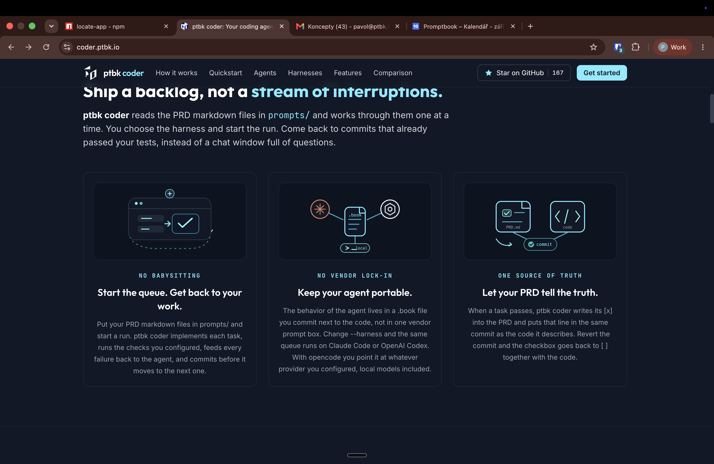

[x] by OpenAI Codex `gpt-6-astra` thinking `max` (ChatGPT account) - Implementation ~$0.2316 12 minutes; Testing 3 minutes

[✨🎿] Enhance the pictures of 3. benefits on Promptbook coder website 

-   The images look very shitty and not appealing. Enhance them to look much better. 
-   I mean images in "Ship a backlog, not a stream of interruptions."
-   You are working with [`ptbk coder` landing website](apps/coder-landing) if there are any changes that affect the landing page.
-   The page must look great on all screen sizes, including mobile, tablet, and desktop.

