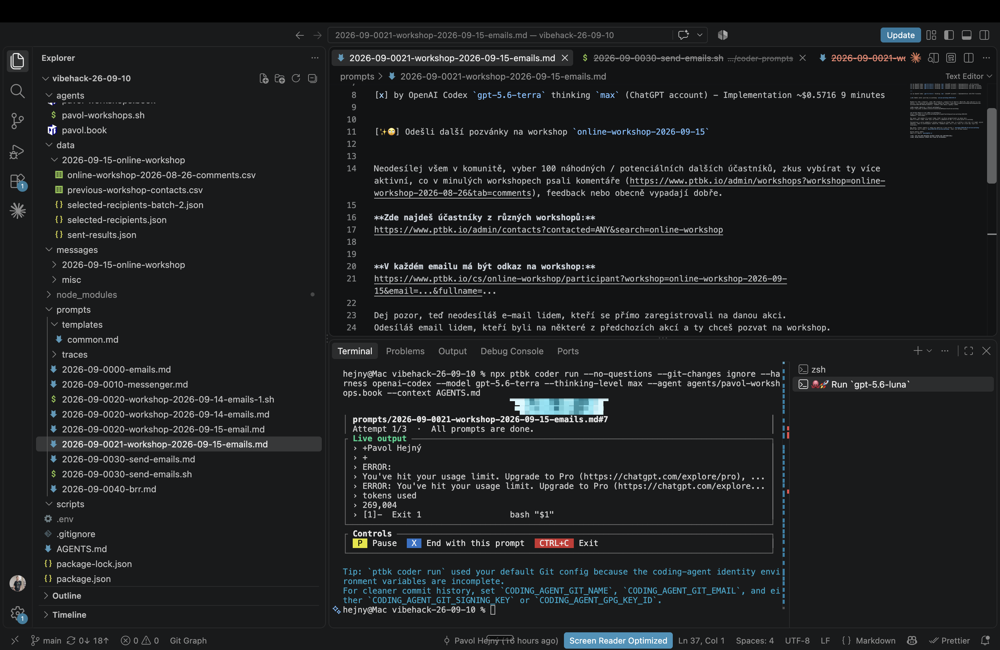

[-]

[✨🤖] qux

```console
│ prompts/2026-09-0021-workshop-2026-09-15-emails.md#7                                 │
│ Attempt 1/3  ·  All prompts are done.                                                │
┌ Live output ─────────────────────────────────────────────────────────────────────────┐
│ › +Pavol Hejný                                                                       │
│ › +                                                                                  │
│ › ERROR:                                                                             │
│ › You've hit your usage limit. Upgrade to Pro (https://chatgpt.com/explore/pro), ... │
│ › ERROR: You've hit your usage limit. Upgrade to Pro (https://chatgpt.com/explore... │
│ › tokens used                                                                        │
│ › 269,004                                                                            │
│ › [1]-  Exit 1                  bash "$1"                                            │
└──────────────────────────────────────────────────────────────────────────────────────┘
┌ Controls ────────────────────────────────────────────────────────────────────────────┐
│  P  Pause   X  End with this prompt   CTRL+C  Exit                                   │
└──────────────────────────────────────────────────────────────────────────────────────┘

Tip: `ptbk coder run` used your default Git config because the coding-agent identity environment variables are incomplete.
For cleaner commit history, set `CODING_AGENT_GIT_NAME`, `CODING_AGENT_GIT_EMAIL`, and either `CODING_AGENT_GIT_SIGNING_KEY` or `CODING_AGENT_GPG_KEY_ID`.
hejny@Mac vibehack-26-09-10 %
```

```markdown
[x] by OpenAI Codex `gpt-5.6-terra` thinking `max` (ChatGPT account) - Implementation ~$0.5716 9 minutes
```

-   @@@@@@@@
-   Keep in mind the DRY _(don't repeat yourself)_ principle.
-   Do a proper analysis of the current functionality of `ptbk coder` and related functionality before you start implementing.
-   Also look and update [the dev scripts in `terminals.json`](.vscode/terminals.json)
-   You are working with [`ptbk coder`](src/cli/cli-commands/coder/run.ts)
-   Update the [`ptbk coder` landing website](apps/coder-landing) if there are any changes that affect the landing page.
-   Add the changes into the [changelog](changelog/_current-preversion.md)


