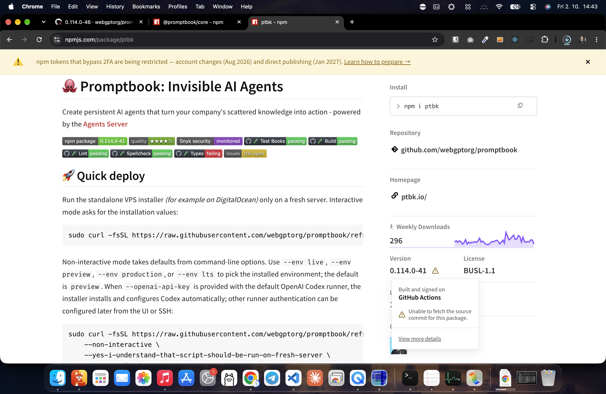

[ ]

[✨🥞] Fix the `npm run prerelease`

-   The final state should be https://www.npmjs.com/package/ptbk, https://www.npmjs.com/package/@promptbook/core published and working
-   It is failing at Github Actions
    -   https://github.com/webgptorg/promptbook/actions/runs/36987927419/job/110777100283
-   Also fix "Unable to fetch the source commit for this package."
    -   
-   Keep in mind the DRY _(don't repeat yourself)_ principle.
-   Do a proper analysis of the current functionality before you start implementing.
-   Open the browser if its needed to fix the issue, I will log-in and provide any necessary credentials.
-   You can do the commits as needed.
-   You can release pre-releases as needed.
