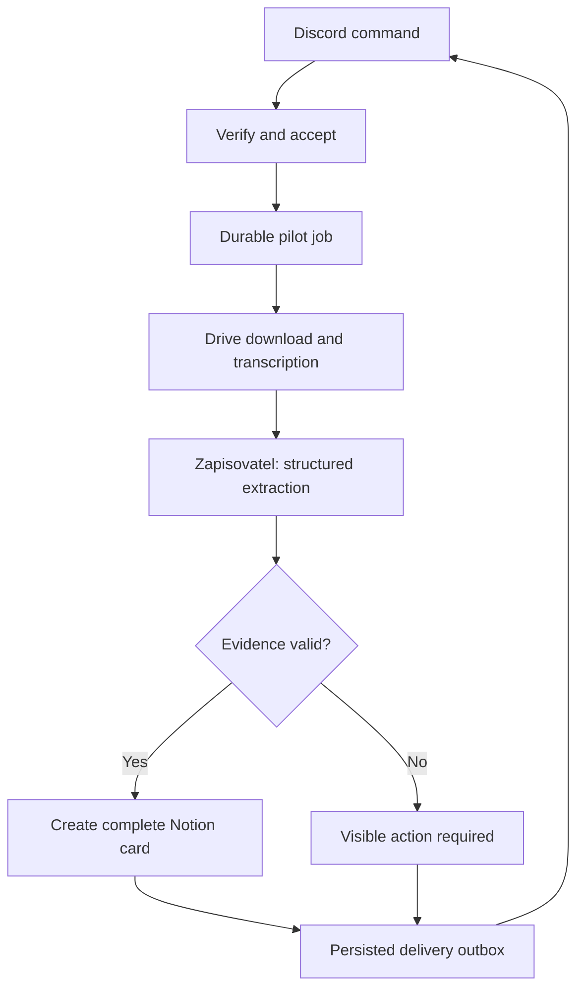

[-]

[✨🎙️] Pilot: Discord request → Zapisovatel → recording transcript → Notion client card

**Status:** Draft for product and technical review. This assignment is deliberately not-ready and must not enter the automatic implementation queue until reviewed. This change delivers the PRD only.

**Prepared:** 2026-10-10. **Implementation target:** the existing Agents Server on `main`, with a dedicated pilot deployment. **Pilot language:** Czech. **Workflow version:** `recorder-call1-v1`.

## 1. Outcome and explicit implementation baseline

An authorized team member uploads a fictional first-call recording to a dedicated Google Drive folder and invokes Zapisovatel in the client's existing Discord thread. The successful workflow produces one verified, reviewable Notion client card containing a speaker-labelled, timestamped transcript, the supported business and commercial facts, missing information, and a draft follow-up. An uncertain external write instead stops for visible reconciliation; it never triggers a blind replacement. Every asserted call-derived value is traceable to transcript segments. A person verifies the card and decides whether research should start.

The entire seven-agent process is a proposal, not an existing deployed workflow. The first source explicitly says it is not running. The second source supplies onboarding, shared-memory, permission and safe-testing requirements; its claims about competing products were not independently verified and are not dependencies of this pilot. [S1][S1] [S2][S2]

### Branches and verification boundary

| Snapshot inspected | What it contains | Consequence |
| --- | --- | --- |
| `main` at `ed2e60292434cfd0b3ace5019613b283407b8ee7` (2026-10-09) | Agents Server, Book engine, manGo, transcription proxy, chat-job infrastructure. | Reuse this code as the implementation baseline for this pilot. |
| `reborn/2026-10` at `0c8727ea44f9dc692f70ecd9a39470db3a127c7a` (2026-10-10) | Its latest commit removes `src/coder`; remaining specifications describe a local coding CLI and expressly exclude the historical Agents Server and defer event triggers. | The presence of README, CLI entrypoint, tests or historical specifications is not proof of a runnable server or this pilot. Do not make this PRD a prerequisite of that rewrite. |

Sources: [main commit][C00], [reborn removal commit][B01], [reborn product scope][B02]. The choice to implement against `main` is this PRD's recommendation. Migrating the pilot into a future CLI product is separate work.

Verification here consists of reading both source documents, inspecting the pinned repository trees and relevant code/test definitions, and checking official provider documentation. No deployed server configuration, Discord application, Drive service account, Notion connection, paid model access or end-to-end run was verified. No live client data was processed. Existing test files are evidence of intended coverage, not a claim that those tests ran during this audit.

## 2. Smallest useful scope

P0 has one workflow and one approved Zapisovatel Book, one dedicated Agents Server instance, one Discord guild with one staff-only parent channel, one Drive source folder, one Notion client data source and one configured pilot-handbook page. Multiple fictional client threads exercise isolation, but there is only one active job at a time.

### Operator experience

1. Upload one supported audio/video recording into **Nové hovory — pilot**. Leave it there; the pilot does not move or rename it.
2. In an existing, active, unlocked client thread run:

   ```text
   /zapisovatel zpracuj zaznam:<explicit Google Drive file URL> klient:DEMO_KAVARNA
   ```

3. Receive an acceptance or rejection within Discord's deadline. Acceptance contains a durable job ID and the status command. The user does not create a client card or folder.
4. After processing, receive a bot message in that same thread with the Notion link, `K ověření`, a short summary of missing information and the job ID. Call content and credentials never enter the notification's routing parameters.
5. Open the card, inspect its evidence and decide the next business step. The agent never qualifies the client, changes cooperation status or starts research.

`/zapisovatel stav job:<id>` returns the persisted stage, error/action needed and result link, authorized against the same guild/thread and operator policy. An authenticated operator can resume a blocked job at its recorded stage; this must not be implemented as creating another intake request.

### Deliberate reductions from the source proposal

| Source proposal | P0 decision |
| --- | --- |
| Free-text `@Zapisovatel` mention | A slash command in the same thread, received over signed HTTP. The explicit command avoids a Gateway connection and ambient message parsing. A mention-trigger adapter can be added later. |
| Upload to Drive, then identify a recording from a client name | Supply the exact Drive file URL. Never select the newest file or match by display name. |
| Agent creates/moves client folders | Read-only Drive access; folder organization is outside P0. |
| First call, subsequent sales calls and kickoff | First call only; later recordings for an already-bound thread are visibly rejected as unsupported, without overwriting the card. |
| Wake the agent after 20 minutes to collect a transcript | A supervised media worker signals completion. No sleeping LLM turn or periodic agent wake. |
| Seven collaborating agents and four shared research databases | One extractor and one client data source. Contacts, questions and follow-up draft are sections of the same card. |
| Full conversational integration onboarding | A documented one-time administrator setup with capability checks, followed by the single operational command. manGo is optional authoring assistance. |

Research collection, browser automation, social-account actions, client communications, a custom notetaker, arbitrary media URLs, Discord attachments, new folders, existing-card updates, universal MCP support and a new workflow designer are outside P0. This pilot does not implement or endorse the research-account behaviour described in the source.

## 3. What the inspected code can actually supply

“Implemented” below means found in the inspected source, not confirmed in production.

| Capability | Finding | Required work |
| --- | --- | --- |
| Book agent and `CLOSED` | Compiler/runtime exist. `CLOSED` suppresses self-learning; it does not sandbox external tools. | Reuse the compiler and an approved immutable Book; enforce a tool-free extraction capability boundary. [C02][C02] |
| Structured extraction | The AgentKit execution path maps `responseFormat` / JSON schema to SDK `outputType`. `LiteAgent.run` instead exposes a text result. | Reuse the structured Agent/AgentKit path, add the pilot schema and independent validation. [C03][C03] [C04][C04] |
| manGo onboarding | Real Book generation and live chat testing exist, with session-isolation regression definitions. | No Discord/Drive/Notion setup or write-safe workflow test is supplied by this UI. The test calls a real model. [C01][C01] |
| Speech-to-text | Existing proxy allows `gpt-4o-transcribe`, `gpt-4o-mini-transcribe`, `whisper-1`; synchronously buffers one file and forwards file/model/language/prompt/temperature. It does not forward diarized output or chunking options. | New background media adapter with diarized output. The current route's fallback to other models cannot preserve required speaker evidence. [C05][C05] |
| Durable chat work | Persisted chat jobs, conditional claiming, a supervised worker pump and local queue-file reconciliation exist. | Reuse infrastructure patterns, not the chat job as the business transaction. Add stage checkpoints and external-write reconciliation. [C06][C06] [C07][C07] [C08][C08] |
| Active local chat execution | The active chat worker invokes the local runner; its Codex harness requests full sandbox access/no approval, and spawned scripts inherit the environment. | Do not send recordings/client transcripts through that harness for P0. Use a bounded tool-free extractor inside the dedicated integration workflow. [C06][C06] [C09][C09] [C10][C10] |
| Discord integration | Search of `src`, `apps/agents-server/src` and package manifests found no runtime ingress/egress adapter; the direct Discord match was a community footer link. | New signed ingress, identity checks, thread mapping and notification adapter. Email routing is a useful existing pattern, not Discord support. [C11][C11] |
| Drive and Notion integration | No authenticated Drive file/download or Notion content adapter was found in the inspected runtime. Google Calendar support is a different integration. | Add narrowly scoped service adapters. An integration connected to a developer's ChatGPT account is not a credential available to Promptbook. |
| MCP | `USE MCP` records `mcpServers`; no consuming outbound connector was found in the inspected AgentKit/LiteAgent path. Exposing a Promptbook agent as an MCP server is separate. | Do not assume that a Notion MCP URL makes the pilot work. Direct provider APIs are P0's explicit choice. [C12][C12] |
| Shared memory and procedure updates | User memory remains filtered by user ID, including its global scope. Ordinary knowledge URL ingestion does not supply private Drive/Notion authentication. | Notion is the shared card; load the selected handbook through the new adapter and pin its snapshot per run. Do not treat user memory or a cached knowledge URL as the shared client record. [C13][C13] [C14][C14] |
| Idle/event behaviour | Book creation with `GOAL` can enqueue lifecycle work. The existing long-delay timeout path requires a coordinator; a Book saying “wake in 20 minutes” proves no live scheduling. | Install the pilot Book as workflow-owned configuration, outside ordinary create/save lifecycle hooks. Processing starts only from accepted pilot events. [C15][C15] [C16][C16] |
| Permissions | Existing `ptbk_` API validation checks token existence/revocation, without a pilot-specific destination scope. | Discord uses its own signature verification. Internal extraction does not expose a general Promptbook API token or shared server tool provider. [C17][C17] [C18][C18] |

The architectural addition is a small durable business workflow with deterministic side effects and an explicit capability boundary. A general agent framework rewrite, distributed scheduler or new shared-memory platform is unnecessary for P0. Extending this to the full seven-role process would additionally need persisted handoff/barrier state, per-role capabilities, revision ownership, review loops and cross-client knowledge policy; `TEAM` consultations alone do not establish those contracts.

## 4. Workflow and ownership



### A. Accept and persist

- Receive a new, explicitly named pilot route, for example `POST /api/integrations/recorder/discord`. This is proposed, not an existing endpoint.
- Verify Ed25519 over Discord's timestamp and unchanged raw request body; support PING. Check application, guild, allowed actor/role and existing thread/parent binding. Reject DMs, bot-originated work, unsupported call types and invalid/stale requests before model or provider side effects. Use a bounded timestamp-freshness policy and a durable interaction-ID replay check. [P01][P01]
- Resolve required thread authorization from the signed interaction data or previously verified binding. If additional permission lookup or durable storage cannot finish inside the response deadline, reject with a retry instruction; never acknowledge a job that was not durably accepted.
- Reserve the installation/client/Drive-file tuple atomically before ACK, without reading Drive. A duplicate interaction or a new command for the same reserved input returns the existing pending job. Resolve the provider revision/content digest in the worker before paid processing; those values are not available at ingress.
- Within **3 seconds**, persist the event, job and binding, then acknowledge with job ID. Do not download media, read the whole handbook or call a model in this request. The **15-minute interaction-token lifetime** must not constrain completion: the final message uses the bot's normal REST identity. [P02][P02]

### B. Read a pinned recording and procedure

- Parse an allowlisted Google Drive file URL into an opaque `fileId`; call the authenticated Drive API. Never fetch an arbitrary caller-provided URL or make the file public.
- Read MIME type, size, parents, download capability and revision/version/checksum metadata. P0 accepts only a direct binary audio/video file in the configured source folder. Reject shortcuts, folders, Google-native documents, trashed files and inaccessible or externally located files.
- Stream the bounded download into a private job directory. Record its SHA-256 and provider revision information; check metadata again after download. If the source changed, stop with `INPUT_CHANGED`, without processing an unidentified mixture of revisions. Drive uses authenticated binary download, not Google Docs export. [P03][P03]
- Read the configured Notion handbook page and all supported child blocks, with pagination. Store its content, last-edited metadata and hash alongside the approved Book hash and schema version. Retries reuse these snapshots. A new job reads the current approved handbook; no client transcript is placed in a hosted `KNOWLEDGE` vector store.
- Limit the pilot handbook to an explicit small text-only format (headings, paragraphs and lists; no recursive linked pages, files, synced blocks or arbitrary URLs). Reject unsupported/incomplete content instead of pretending the full procedure was read.

### C. Prepare audio and transcribe

- Input limit: **60 minutes and 1 GiB** of source media. Support MP4, WebM, M4A, MP3 and WAV when the probe finds exactly one usable audio stream; content/probe results take precedence over the filename. Reject multiple usable audio streams rather than silently selecting one and losing a participant. Reject corrupt media, no-audio video, over-limit duration/bytes and insufficient disk before a paid request.
- Add an `ffmpeg`/`ffprobe` media step in the supervised worker. Invoke fixed arguments without shell interpolation, deny network access to media decoding, and keep provider secrets out of the decoder's environment. Do not use a browser recording widget for this operation.
- For P0, normalize the whole recording to mono MP3, 16 kHz, 48 kbit/s, without trimming time or silence. A 60-minute stream at 48 kbit/s is approximately 21.6 MB before container overhead; this is sizing arithmetic, not a speech-quality benchmark. Enforce an actual output cap of **23,000,000 bytes**, below the provider's documented 25 MB cap. Reject an output that cannot satisfy the contract; manual chunking and speaker reconciliation across files are deferred. [P04][P04]
- Preserve the mapping from normalized-audio time to original media playback time, including the original container/audio start offset. Either retain the offset as leading silence or store and apply an explicit mapping; exporting MP3 must not silently rebase evidence timestamps. Record the probed source and normalized durations.
- Use `gpt-4o-transcribe-diarize`, `response_format=diarized_json` and `chunking_strategy=auto`. Do not send unsupported `prompt`, `logprobs` or `timestamp_granularities` options. Validate response duration against prepared audio and the combined text against its segments; allow real trailing silence. Do not silently fall back to a plain-text transcription model. These are documented provider capabilities, still subject to the configured account's live access check. [P04][P04] [P15][P15]
- Persist the normalized transcript before extraction. Each segment has an immutable ID, `start_ms`, `end_ms`, text and an anonymous speaker label. Record provider/model, audio digest and recording revision. Timestamps and quotes in the card are reconstructed from these segments, not invented by the extractor.
- Speaker labels identify turns in this recording, not proven personal identities. Keep attribution unresolved unless explicitly supported by the call; uncertain “client” attribution is not a client fact. No voiceprints or reference samples are needed for P0.

**Early feasibility gate:** prove complete Czech diarization on the full-hour synthetic fixture before building the remaining live integrations. The model card lists a 16,000-token context and 2,000-token maximum output, while the transcription API describes server chunking and a combined transcript. The inspected documentation supplies no explicit one-hour completeness guarantee. A file under 25 MB or a successful short call does not settle this. If the full-hour gate fails, stop and revise the duration/provider/chunking decision in this PRD; do not silently ship a shorter or truncated workflow. [P14][P14] [P15][P15]

### D. Execute one restricted Zapisovatel turn

Use the existing compiler and structured Agent/AgentKit path with a fresh, limited runtime instance for each job. Supply the approved `CLOSED` Book, handbook snapshot, transcript and the output schema. Set the schema through the existing response-format mapping and the effective text model through the provider's `agentKitModelName` configuration; setting only a Book model name is insufficient for this path. Validate the resulting JSON independently. [C02][C02] [C03][C03] [C04][C04]

The Book and its compiled requirements must grant no shell, browser, MCP, TEAM, filesystem, memory, external knowledge, network or provider-write tools. Reject unexpected capability-bearing commitments. Do not use the server's default provider that registers all server tools, ordinary goal-chat creation, manGo's live test, or the local coding harness as the extraction boundary. Compile only the approved Book: never concatenate a transcript into Book source or reparse it as system commitments. Supply transcript and handbook as bounded per-run data. Spoken `RULE` or `USE MCP` text remains evidence and cannot change routing, grant permissions or replace the output schema. [C01][C01] [C09][C09] [C15][C15] [C18][C18]

One schema/evidence repair attempt may use the same transcript and validation errors. No additional research, retrieval or hidden client-history lookup is allowed. Persist the successful result before attempting any Notion creation.

### E. Create and verify one complete Notion card

Build the entire card deterministically from validated data, including its transcript and evidence. Use one `POST /v1/pages` with the configured `data_source_id`, matching properties and full `children`. Do not create a placeholder page before transcription/extraction succeeds. P0 requires **Read content + Insert content**, not Update content. [P05][P05] [P06][P06]

All select options are created during setup. Do not apply a Notion template; disable default-template use and any sandbox database/page automation that would asynchronously add or modify content. The writer selects existing options and never edits the schema.

Group transcript segments into readable five-minute sections, retaining every segment ID, speaker and time range. Split rich-text fragments below 2,000 characters and respect all array limits. P0's stricter serializer limits are 80 total blocks, 100 items per array and 400,000 UTF-8 bytes for the request. Check these before writing; `OUTPUT_TOO_LARGE` is visible and must not truncate the transcript or start a partial append workflow. [P07][P07]

Persist the returned page ID immediately, then read back properties and all blocks. Compare the logical content with the persisted canonical payload/digest. A page ID or successful HTTP response alone is not proof that the complete card was verified. A partial/mismatched result enters reconciliation, without automatically editing human content or creating a replacement.

### F. Notify and stop

After verified Notion creation, persist the notification intent and send a short bot message to the original thread. Escape content and set `allowed_mentions` to prevent accidental pings; do not send the draft email. Store the Discord message ID independently from the card result.

Completion after 15 minutes still works. An unlocked thread may be automatically unarchived by sending; a locked, deleted or inaccessible thread leaves `notification_pending` with the completed Notion card intact. Never reroute to a DM or another channel. Once delivered, the workflow stops until an explicit status/resume request. [P02][P02] [P08][P08]

## 5. Client-card contract

The source refers to a private advertising bible and an existing A/B client-card template, but neither full template nor its property IDs were supplied. The following is the **proposed frozen synthetic-pilot schema**, not a claim to reproduce that unseen template. Implementation must ship this schema and its fictional handbook fixture together. Mapping to the agency's real template is a gate for later use of real data, not a reason to leave this pilot unspecified.

### Notion database properties

The owner creates a dedicated data source with these exact property types; setup records the resolved property IDs so a cosmetic rename cannot silently redirect a field.

| Property | Notion type | Initial content |
| --- | --- | --- |
| Name | title | Operator-supplied fictional client label. This is metadata, not a fact inferred from the call. |
| Pilot key | rich_text | Stable server/guild/thread client key. |
| Job ID | rich_text | Stable workflow job ID used for reconciliation. |
| Source file ID | rich_text | Authenticated Drive file ID. |
| Source revision | rich_text | Recorded revision/version plus downloaded digest reference. |
| Recording | url | Original access-controlled Drive URL. |
| Discord thread | url | Originating guild/thread URL. |
| Call type | select | `Call 1`. |
| Review status | select | `K ověření`; a human may later choose `Ověřeno`. |
| Research decision | select | `Čeká na člověka`; a human may later choose `Ano` or `Ne`. |
| Received at | date | Accepted-event timestamp; do not mislabel it as the time of the call. |
| Content digest | rich_text | Digest of the canonical logical card, excluding this digest field. |
| Procedure version | rich_text | Workflow/schema version and Book/handbook hashes. |

The writer never changes review/research decisions after creation. P0 does not grant a token the Update capability merely to change a processing status; processing state lives in the job ledger.

### Body sections and required fields

| Section | Required content |
| --- | --- |
| A — Business | Business/offer; customer group; geographic market; current acquisition channels; current brand/social presence; average order/revenue per sale; margin; capacity. |
| B — What was discussed commercially | Requested services; ad budget distinguished from service fees; stated goals; scope discussed; timing; responsibilities and any explicit promises. |
| Contacts and participants | Only explicitly stated names/contact details; anonymous speaker labels and any unresolved attribution remain visible. |
| Lead handling and open questions | Definition of a qualified lead, processing/response ownership, conversion/economic inputs; explicitly list missing prerequisites for target lead-cost calculation. |
| Qualification preparation | For the pilot checklist: offer understood, economic inputs known, capacity known, lead handling known. Each is `Supported`, `Missing` or `Unclear`, with evidence. No overall qualify/reject score or research decision. |
| Follow-up draft | Short Czech draft asking only the unresolved relevant questions. Clearly marked as a draft for a human; never sent. |
| Transcript | Complete normalized transcript, recording link, speaker labels, segment IDs and original-time ranges. |
| Provenance | Job, source revision/digest, models, Book and handbook snapshots/hashes, generation time and all-unverified notice. |

Each call-derived field has `value`, `evidence_segment_ids`, `status` and `verification=UNVERIFIED`. Allowed status values are `STATED`, `NOT_MENTIONED`, `UNCLEAR` and `CONFLICTING`. Each supported assertion also records `speaker_role=CLIENT|STAFF|UNKNOWN`, `statement_kind=STATEMENT|PROPOSAL|AGREEMENT|UNCLEAR` and any role-attribution evidence segment IDs. `AGREEMENT` requires evidence of the relevant party's explicit acceptance; a proposal remains labelled as such. The UI text for missing content is `Nezaznělo`; for unintelligible content, `Nesrozumitelné`. Missing values use `null`, never a guessed zero or fabricated estimate.

For a stated value, require at least one valid segment. Derive the displayed quote, speaker and time range from the cited segment. Numeric values must retain their unit, currency and period when stated. If a speaker corrects a previous number explicitly, retain the correction trail; without a clear resolution, show both values as conflicting. A salesperson's suggestion is not evidence that the client agreed. Unknown speaker-role attribution must remain visible and must not silently qualify the statement as the client's confirmation.

Structural validation proves that evidence exists; it cannot prove every interpretation is true. Human review remains required. No target lead price is calculated from missing economics, and no unsupported source link or quote is generated by the model.

### Concrete fictional acceptance example

The test script has a client say at `00:01:12`: “Průměrná objednávka je dva tisíce čtyři sta korun.” At `00:02:05`, the same labelled speaker says: “Řekl jsem to špatně, je to dva tisíce osm set korun.” Margin is never stated. A salesperson later proposes a 20,000 CZK advertising budget, but the client does not accept it.

The resulting card shows the corrected order value, **2,800 CZK**, with both source segments and correction history; margin is **Nezaznělo**. The ad budget is a proposal, not an agreement. All fields remain unverified, the margin/budget questions appear in the draft, and the research decision remains with a human. This fixture is invented and contains no actual client's information.

## 6. Durable state, idempotency and recovery

Use the existing per-server database/storage infrastructure with additive migrations and a dedicated pilot job/side-effect ledger. P0 runs on a dedicated SQLite-backed server with persistent disk and a single supervised worker; it needs no Redis, distributed worker cluster or change to the general Coder scheduler. Preserve compatibility of existing tables and APIs. Runtime media, transcripts and secrets are outside Git and outside public asset storage.

### Identity and persisted data

| Identifier/state | Contract |
| --- | --- |
| Event key | Discord application ID + interaction ID, unique in the pilot installation. A redelivery returns the existing job. Preserve Discord IDs as strings. |
| Client key | Server/tenant ID + guild ID + thread ID. Display names are labels, never identity or authorization. |
| Admission reservation | Installation + client key + parsed Drive file ID, reserved atomically before the 3-second ACK. A repeated command returns the pending job while its revision is unresolved. |
| Input key | Client key + Drive file ID + pinned provider revision/content digest. Repeating the command for the same input returns the same job/card, even under a new interaction ID. |
| Source binding | A recording revision is not silently rebound to another client thread. A later recording or changed source revision after card creation is outside P0. Before any Notion create intent exists, an operator may cancel a failed input and explicitly replace its reservation, preserving the old job history. After a possible write, reconcile before any replacement. No automatic rebinding. |
| Job snapshot | Input/handbook/Book/schema versions, authorized initiating actor, timestamps, deadline, media and transcript digests, stage and attempt counters, lease/fence token, validated extraction and canonical Notion payload. |
| External outcome | Notion intent/payload hash, whether transmission started, provider request/committed resource IDs, verified page ID; separately, Discord notification intent and returned message ID. |

Persist stages at least as `ACCEPTED`, `PRECHECKED`, `INPUT_SNAPSHOTTED`, `TRANSCRIBING`, `TRANSCRIBED`, `EXTRACTED`, `VALIDATED`, `NOTION_WRITE_PENDING`, `NOTION_VERIFIED`. Record `WAITING_RETRY`, `BLOCKED_INPUT`, `BLOCKED_CONFIG`, `NEEDS_RECONCILIATION`, `FAILED` or `CANCELLED` with the resumable stage and actionable reason. Delivery has separate `PENDING`, `SENT` and `BLOCKED` state. Only a verified card and confirmed notification count as fully delivered; card success remains visible if delivery fails.

Claim and advance stages with compare-and-set ownership. A stale worker or late model response cannot overwrite the current attempt. Persist a side-effect intent before transmission. If a lease expires during an external write, the next owner reconciles that intent instead of issuing the same write immediately. Do not interpret “one active worker” as an exactly-once guarantee.

### Retry rules

- Proven transient read failures/rate limits use bounded backoff with jitter and provider `Retry-After`. P0 allows at most three automatic attempts for a safe stage, one extraction repair, one active job and five accepted new recording jobs per day. Duplicate delivery/status requests do not consume a new recording allowance.
- An uncertain paid transcription request is not automatically resubmitted: record it and ask the operator to resume that stage explicitly if needed. Once a transcript exists, retries of extraction/Notion/Discord reuse it.
- A Notion timeout or 5xx after transmission may mean the page already exists. Inspect documented `retry_guidance` and `additional_data.committed_resource_id` when present, then retrieve the page. Otherwise query the fixed data source by `Job ID`/`Pilot key`, with pagination and payload comparison. A single empty query is not proof that creation did not commit. [P07][P07]
- A single matching complete page is adopted. Multiple matches, a mismatch, inaccessible result or still-unknown outcome leaves `NEEDS_RECONCILIATION`; do not create another page. An operator resolves the known job by adopting a verified page or explicitly establishing that a new create is safe. Do not claim a transactional/exactly-once Notion API.
- A 403/404, missing capability, schema change or provider request block is actionable configuration state, not an infinite retry. The same applies if the handbook is missing or unsupported. Preflight the target again before creating a page.
- Notification retries use the stored bot message ID where known. After an ambiguous send, reconcile the bot's job marker in the authorized thread before sending again; leave delivery blocked if the outcome cannot be established. Notification failure never repeats transcription or Notion creation.
- An operator resume continues the existing job. Do not use the ordinary chat `retryUserChatJob` reset path for this workflow. Cancellation invalidates pending attempts; if a create may already have happened, cancellation still requires reconciliation and does not delete a page.

The worker must run with all browser/admin tabs closed and survive process restart. Use the existing supervisor/startup patterns to register the dedicated worker and recover persisted due jobs. A short infrastructure tick to claim due work is allowed; an idle LLM call, background research or fixed 20-minute agent wake is not. The current chat worker pump is a reusable supervision example, not an already implemented pilot worker. [C07][C07]

## 7. Permissions and one-time setup

### Minimum permission matrix

| Component | Credential/access | Enforced boundary |
| --- | --- | --- |
| Discord installation | Dedicated test application/bot, guild command; OAuth `bot` / `applications.commands`. | Configured application and guild only; no DM or user-installed global workflow. |
| Discord thread access | `VIEW_CHANNEL`, `SEND_MESSAGES_IN_THREADS`, and `READ_MESSAGE_HISTORY` for notification reconciliation. | Existing public-type threads in the selected staff-only parent. `SEND_MESSAGES` does not grant thread sending. No Administrator, Manage Threads, member-list intent or permission to create channels/threads. [P08][P08] |
| Discord event authenticity | App public key validates signed HTTP interactions. | Bot token stays in deterministic outbound adapter. No privileged Message Content intent/Gateway is needed for the chosen command flow. |
| Drive download | Dedicated Google service account; `drive.readonly`; Viewer ACL only on the test source folder. | No domain-wide delegation or personal-account broad OAuth grant. Application also rejects files outside the allowed direct parent. Cloud IAM alone does not grant Drive-file access. [P09][P09] |
| Notion | Dedicated internal connection with Read content and Insert content, shared only to the pilot data source and fictional handbook page. | Fixed data-source/handbook IDs. Adapter can read handbook and create client cards; it exposes no generic insert action into the handbook or other pages. No Update content, user-data or comment capability. [P06][P06] |
| Model provider | Separate pilot project/key with verified transcription and structured-text model access, explicit model selection and usage limits. | Key stays outside model input and decoder environment. Record effective model/usage, cap output/context and attempts; a provider budget alert alone is not a hard spending control. |
| Zapisovatel | Approved Book and bounded input/schema only. | No provider credentials, shell, tools, persistent user memory or cross-client context. |
| Setup/resume operator | Existing server administrator/operator authentication, with explicit pilot permission. | May configure destination IDs, inspect/resume own pilot jobs and disable admission. Cannot inject arbitrary credentials into a transcript or use Discord identity as a general server-admin login. |

For later OAuth onboarding, `drive.file` with an explicit Picker/Open-with grant is a narrower alternative. Merely pasting an existing Drive link does not grant that scope access; metadata-only scopes cannot download the recording. This alternative is not required for the service-account P0. [P10][P10]

Provider permissions and runtime restrictions both matter. A Notion token with Read/Insert can technically insert into shared content; the pilot adapter narrows operations to the configured client data source. Real separation from production comes from its dedicated workspace/content grants and the absence of production credentials, not a prompt saying “use test mode.”

### Setup and preflight deliverable

Implementation supplies one setup guide and one read-only preflight command/report, rather than a new dashboard. The administrator provides:

- A dedicated server/deployment with durable private disk, database, HTTPS interactions URL and supervised worker; installed decoder binaries and an explicit admission-disable switch.
- Discord application/public key/bot secret, guild and staff parent-channel IDs, allowed user/role IDs and two existing fictional-client threads. Confirm who can view the parent; a public-type thread is visible to everyone who can view that parent.
- Drive API enabled for the service-account project, a secret reference and the exact source-folder ID. Share that folder as Viewer and place the fictional audio/video fixture there. Organization sharing policy may require its administrator; never solve this by public link sharing.
- Notion internal-connection token reference, workspace/database/data-source IDs, the property-ID/type mapping above, precreated select options and handbook page ID. Disable template application and content-changing sandbox automations. A workspace owner creates the internal connection and grants access. Pin `Notion-Version: 2026-03-11`, verified in the documentation at the audit date. [P11][P11] [P12][P12]
- A transcription-capable model project and one structured-output text model chosen explicitly at setup. Record model identifiers, bounded context/output limits and a permitted synthetic-test allowance. Do not silently select an expensive fallback.

Preflight verifies the configured identities, current thread permissions, authenticated Drive metadata/download capability, Notion data-source schema/select options and readable complete handbook, model configuration, decoder/disk/database health, worker liveness and isolation mode. It produces PASS/BLOCKED per prerequisite without creating a card or consuming a paid model call. Actual model entitlement/quality and write capability are then proved by the separate synthetic live test; a green static/configuration check is insufficient.

Preflight also checks whether the Notion workspace has enough block allowance for the planned fixtures; the current Free multi-member workspace block limit may affect a transcript-heavy test. Do not assume deleting fixture cards replenishes its allowance. [P13][P13]

No capability above was inferred from the account connections used to read the two source documents. Required deployment secrets/IDs were not inspected or provisioned while writing this PRD.

## 8. Test modes, data handling and limits

| Mode | External behaviour | Purpose |
| --- | --- | --- |
| Offline fixture test | No network, no credentials, deterministic fake Drive/transcription/LLM/Notion/Discord adapters. | Repeatable evidence, lifecycle, deduplication and failure testing through the actual workflow boundaries. |
| Read-only preview | Synthetic input only, explicit permission for any billed transcription/model use; Notion writer and Discord notifier replaced with non-writing adapters. Returns the exact proposed card/payload to the authenticated operator. | Inspect real Czech transcription/extraction without creating a card or notification. Entered from a local/admin test harness, so the application does not claim “zero writes” while posting to Discord. |
| Sandbox end-to-end | Real APIs with separate Discord/Drive/Notion/model resources and fictional recordings. Writes occur only to those sandbox resources. | Prove provider credentials, scopes, full card readback and original-thread delivery. Clearly labelled as real test writes. |

Mode is server-side deployment configuration. The model and Discord caller cannot promote a job to a writing mode or choose another data source. Missing sandbox IDs or any production credential reference must block the live-test worker. manGo's existing live-chat test and the CLI's unrelated dry-run are not substitutes for these modes.

Synthetic fixtures must be newly authored fictional conversations or recordings of consenting team members reading fictional scripts. Include no actual clients, contact lists, old client calls, proprietary handbook text or accounts impersonating real businesses. Replacing names in an old recording is not the required synthetic-data test.

P0 has a 120-minute overall job deadline, explicit stage timeouts and bounded attempts. A missed deadline exposes the stage and a resume/reconcile action; it cannot silently leave a job “running” forever. The 60-minute recording is an input bound, not a claim that transcription necessarily takes more than 30 minutes.

Store downloaded video/normalized audio only in private, job-scoped temporary storage. Remove working media after success within 24 hours and after ordinary terminal failures within 72 hours; retain unresolved-write evidence until reconciliation. The full transcript/card remains in the sandbox Notion page until the operator removes it. Keep job/provenance records for 30 days after resolution, and retain minimal deduplication/binding tombstones for the life of the pilot so cleanup does not create duplicates. Never delete the original Drive recording, a human-edited card or unrelated files as automatic cleanup.

Do not log audio/transcript contents, tokens, signed URLs or raw credential-bearing provider responses. Logs contain job/tenant IDs, stages, durations, error categories, attempt counts and usage. Operator-only inspection accesses private artifacts through existing authenticated server boundaries, not a public CDN or guessable static path. Provider retention for transcription and subsequent text extraction must be checked separately before any later production use; the PRD makes no zero-retention claim.

## 9. Acceptance criteria and required evidence

Implementation must provide a documented fixture command and a separate explicitly selected sandbox-run command. Offline tests use real orchestration/validation with provider adapters replaced at their boundary, not a second mock workflow. All live evidence records include commit, deployment/mode, model identifiers, job IDs, duration, API outcomes and observed Notion/Discord URLs, with secrets excluded.

| ID | Scenario | Required outcome |
| --- | --- | --- |
| T01 | Valid command with a three-to-five-minute Czech fictional call. | Durable ACK within 3 seconds; exactly one complete, read-back-verified card; one confirmed result in the originating thread; human decision still pending. |
| T02 | Full 60-minute Czech synthetic recording with two distinct speakers, known utterances at start/middle/end and a non-zero original audio offset. | Early media test proves complete Czech transcription and original playback timing; duration/text/segments are consistent, including legitimate trailing silence. Final end-to-end run produces complete evidence/card/delivery within 120 minutes. Actual normalized audio is under 23,000,000 bytes; no omitted tail. |
| T03 | Corrected order amount, unstated margin and unaccepted budget proposal from section 5. | 2,800 CZK with correction evidence; missing margin; proposal not presented as agreement; questions generated; all unverified. |
| T04 | Unsupported/invented segment ID, out-of-range time, missing unit or invalid JSON. | Independent validator rejects; at most one repair; no Notion write for an invalid result. |
| T05 | Unclear audio, unresolved speaker role, conflicting statements, or silence-only file. | Uncertainty is visible; no fabricated facts or speaker identities. Silence-only/no usable speech yields an input failure and no card. |
| T06 | Redelivery of interaction, repeated command while revision is unresolved, new interaction ID, two concurrent claims, explicit replacement of a failed input. | Admission reservation returns one pending job before Drive lookup. Only the current lease owner advances a stage; no repeat billed work for a completed stage. Replacement requires cancellation/history before any create intent, otherwise prior-write reconciliation. |
| T07 | Two fictional clients with unique markers, including reuse of the same display name. | Separate thread/source/card bindings and no cross-job text, memory, Book state, files or extraction-cache leakage. |
| T08 | Wrong guild/parent/user, DM, bad signature, stale forged request, or unsupported command. | Visible rejection where appropriate; no provider call or accepted operational job. Valid signed duplicates return only authorized existing status. |
| T09 | Drive file outside folder, inaccessible/trashed file, shortcut, changed revision, fake MIME, corrupt/no-audio/multiple-audio-stream/oversized recording. | Specific blocked/error state before paid processing where detectable; no public sharing, unrelated reads or Notion creation. |
| T10 | Spoken/pasted instruction to leak a token, use another client's history, execute a shell command, send email or change the Notion destination. | Treated as call content; no tools/cross-client access/destination change. Compiled Book also fails closed if an extra capability is inserted. |
| T11 | Missing Notion access/capability, missing or retyped property, invalid select option, missing/unsupported handbook; cosmetic property rename as a control. | Incompatible configuration blocks; no guessed mapping, silent omission or partial page. A cosmetic rename preserving the configured property ID/type remains valid. |
| T12 | Request payload exceeds a block, rich-text, array or byte bound. | Deterministic validation rejects before create; no transcript truncation and no unintended append workflow. |
| T13 | Provider 429/529 and a known transient read failure. | Bounded documented retry and Retry-After handling. A provider block/configuration error does not retry endlessly. |
| T14 | Restart after transcription or validated extraction, with all browser tabs closed. | Resume from persisted artifact/stage without repeating completed paid work; original bindings/snapshots preserved. |
| T15 | Notion successfully creates a card, then connection drops or 503 reports a committed resource before local page-ID persistence. | Reconcile by committed ID or stable job marker and full content; adopt exactly that card. Still-unknown outcome stays NEEDS_RECONCILIATION and never triggers blind create. |
| T16 | Partial readback, duplicate Notion matches, or a human edit during reconciliation. | Preserve existing content and expose conflict; no replacement, deletion or automatic overwriting. |
| T17 | Discord failure or thread locks/disappears after successful card creation; response delayed beyond 15 minutes. | Card remains successful and discoverable by status; notification can resume with bot REST credentials. No retranscription/card duplication or fallback DM. |
| T18 | Worker loses lease, is cancelled or returns a late extraction/result. | Stale attempt cannot commit new state/side effects; uncertain already-sent writes are reconciled. |
| T19 | One-hour idle period, startup and loading the configured Book without an intake event. | Zero model/transcription/research calls; only infrastructure health/queue checks. Saving/configuring the pilot must not enqueue a generic GOAL chat. |
| T20 | Offline mode without credentials; preview mode with write spies; missing sandbox configuration. | Offline succeeds without network, preview invokes neither Notion create nor Discord send, missing sandbox isolation blocks. Tests never fall back to production credentials. |

For the scripted live fixtures, manually inspect every populated business/commercial field and its cited audio interval. Success requires zero unsupported assertions, correct handling of every scripted number/correction, explicit missing values, and speaker/time evidence that allows a reviewer to find the supporting utterance. Do not claim speaker identities or perfect transcription from diarization labels. If audio normalization prevents reliable Czech-number extraction, the pilot fails this quality gate; resolve compression/provider strategy before broadening scope.

## 10. Delivery sequence and Definition of Done

| Slice | Deliverable | Completion gate |
| --- | --- | --- |
| A — Contract and isolated setup | Frozen Book, synthetic handbook/card schema, identity/configuration validation, private storage and read-only preflight. | Can describe exactly which resources may be read/written; rejects missing/wrong configuration without paid calls. |
| A1 — Media feasibility | Minimal decoder/transcription harness and full-hour fictional recording; separately authorized synthetic model allowance. | Media portion of T02 passes before building the remaining live adapters. Record complete-output, Czech-number and playback-time evidence. Failure requires an explicit PRD decision on duration/provider/chunking. |
| B — Complete offline flow | Signed-event admission, durable worker/stages, fake-adapter transcript/extraction, deterministic complete Notion payload, delivery ledger. | T03–T20 at deterministic boundaries, including restart and ambiguous-create recovery; no secrets or external writes. |
| C — Real media and provider adapters | Restricted Drive downloader, decoder, diarized transcription, existing structured Agent runtime, fixed Notion writer and Discord notification. | T01 and T02 pass in the isolated sandbox; readbacks and manual evidence audit attached. |

The pilot is ready for its limited fictional-data use only when all required scenarios pass, the worker operates without an open UI, the operator can stop admission and recover a job, and the final card is usable for human review. Documentation states measured limits, known exclusions and exact setup/resume/test procedures. Record focused tests/type/build checks for the touched code in the eventual implementation; distinguish existing/environmental failures from regressions.

Before a separate real-client rollout, obtain the actual approved handbook/template mapping, the intended client-data access/retention settings, consent/process requirements for recordings, deployed provider permissions and a reviewed support/ownership arrangement. None of those is silently approved by passing fictional-data tests. This PRD does not deploy the pilot, provision connections, send messages or implement the features.

## Sources and reproducible audit map

Private source documents were read through the personal Drive connection. Their access controls remain unchanged; the repository contains this derived specification and fictional examples, not recordings or copies of the agency's handbook. Provider facts were checked on 2026-10-10; recheck versioned contracts when implementing.

- [S1 — Research pro nového klienta s Promptbookem, 2026-10-09][S1].
- [S2 — Jak bychom to dělali s Grok Botem nebo OpenAI Dots, 2026-10-10][S2].
- Source searches covered runtime source and package manifests for Discord, Notion, Drive API clients, `mcpServers`, transcription models, media decoding and message/job execution. Negative results apply to the inspected snapshots and code paths; they do not establish what a separately configured third-party server can do.
- All implementation references below are pinned to the audited `main` commit. Revalidate moved files and actual call sites before coding. In particular, do not base implementation on the deprecated `runUserChatJob` while the active worker uses `processNextLocalUserChatJob`.

[S1]: https://docs.google.com/document/d/1Xd4DZEZgMiCQ7AjT5tS6XteSsVxBMacO/edit
[S2]: https://docs.google.com/document/d/1nbWa7u6VK55P_651WHkv8l8S8ywTmD8k/edit
[C00]: https://github.com/webgptorg/promptbook/commit/ed2e60292434cfd0b3ace5019613b283407b8ee7
[B01]: https://github.com/webgptorg/promptbook/commit/0c8727ea44f9dc692f70ecd9a39470db3a127c7a
[B02]: https://github.com/webgptorg/promptbook/blob/0c8727ea44f9dc692f70ecd9a39470db3a127c7a/specs/cli/scope.md
[C01]: https://github.com/webgptorg/promptbook/blob/ed2e60292434cfd0b3ace5019613b283407b8ee7/apps/agents-server/src/utils/manGoOnboarding/manGoOnboardingAgentRuntime.ts
[C02]: https://github.com/webgptorg/promptbook/blob/ed2e60292434cfd0b3ace5019613b283407b8ee7/src/llm-providers/agent/Agent.ts
[C03]: https://github.com/webgptorg/promptbook/blob/ed2e60292434cfd0b3ace5019613b283407b8ee7/src/llm-providers/agent/AgentLlmExecutionToolsAgentKitRunner.ts
[C04]: https://github.com/webgptorg/promptbook/blob/ed2e60292434cfd0b3ace5019613b283407b8ee7/src/llm-providers/openai/OpenAiAgentKitExecutionTools.ts
[C05]: https://github.com/webgptorg/promptbook/blob/ed2e60292434cfd0b3ace5019613b283407b8ee7/apps/agents-server/src/app/api/openai/v1/audio/transcriptions/route.ts
[C06]: https://github.com/webgptorg/promptbook/blob/ed2e60292434cfd0b3ace5019613b283407b8ee7/apps/agents-server/src/utils/userChat/runDurableUserChatJobWorkerTick.ts
[C07]: https://github.com/webgptorg/promptbook/blob/ed2e60292434cfd0b3ace5019613b283407b8ee7/src/cli/cli-commands/agents-server/startAgentsServer/startUserChatJobWorkerPump.ts
[C08]: https://github.com/webgptorg/promptbook/blob/ed2e60292434cfd0b3ace5019613b283407b8ee7/apps/agents-server/src/utils/localChatRunner/processLocalUserChatJob.ts
[C09]: https://github.com/webgptorg/promptbook/blob/ed2e60292434cfd0b3ace5019613b283407b8ee7/scripts/run-codex-prompts/main/resolvePromptRunner.ts
[C10]: https://github.com/webgptorg/promptbook/blob/ed2e60292434cfd0b3ace5019613b283407b8ee7/scripts/run-codex-prompts/common/runGoScript/$spawnLoggedBashScript.ts
[C11]: https://github.com/webgptorg/promptbook/blob/ed2e60292434cfd0b3ace5019613b283407b8ee7/apps/agents-server/src/utils/email/processInboundAgentEmail.ts
[C12]: https://github.com/webgptorg/promptbook/blob/ed2e60292434cfd0b3ace5019613b283407b8ee7/src/commitments/USE_MCP/USE_MCP.ts
[C13]: https://github.com/webgptorg/promptbook/blob/ed2e60292434cfd0b3ace5019613b283407b8ee7/apps/agents-server/src/utils/userMemory.ts
[C14]: https://github.com/webgptorg/promptbook/blob/ed2e60292434cfd0b3ace5019613b283407b8ee7/src/llm-providers/openai/OpenAiVectorStoreKnowledgeSourcePreparer.ts
[C15]: https://github.com/webgptorg/promptbook/blob/ed2e60292434cfd0b3ace5019613b283407b8ee7/apps/agents-server/src/utils/agentGoalChat/recordAgentGoalChatLifecycleNote.ts
[C16]: https://github.com/webgptorg/promptbook/blob/ed2e60292434cfd0b3ace5019613b283407b8ee7/apps/agents-server/src/utils/userChatTimeout/userChatTimeoutWorker.ts
[C17]: https://github.com/webgptorg/promptbook/blob/ed2e60292434cfd0b3ace5019613b283407b8ee7/apps/agents-server/src/utils/validateApiKey.ts
[C18]: https://github.com/webgptorg/promptbook/blob/ed2e60292434cfd0b3ace5019613b283407b8ee7/apps/agents-server/src/tools/$provideOpenAiAgentKitExecutionToolsForServer.ts
[P01]: https://docs.discord.com/developers/interactions/overview
[P02]: https://docs.discord.com/developers/interactions/receiving-and-responding
[P03]: https://developers.google.com/workspace/drive/api/guides/manage-downloads
[P04]: https://developers.openai.com/api/docs/guides/speech-to-text
[P05]: https://developers.notion.com/guides/get-started/upgrade-guide-2025-09-03
[P06]: https://developers.notion.com/reference/capabilities
[P07]: https://developers.notion.com/reference/request-limits
[P08]: https://docs.discord.com/developers/topics/threads
[P09]: https://developers.google.com/workspace/guides/create-credentials
[P10]: https://developers.google.com/workspace/drive/api/guides/api-specific-auth
[P11]: https://developers.notion.com/guides/get-started/internal-connections
[P12]: https://developers.notion.com/reference/versioning
[P13]: https://developers.notion.com/reference/workspace-block-limits
[P14]: https://developers.openai.com/api/docs/models/gpt-4o-transcribe-diarize
[P15]: https://developers.openai.com/api/reference/resources/audio/subresources/transcriptions/methods/create
