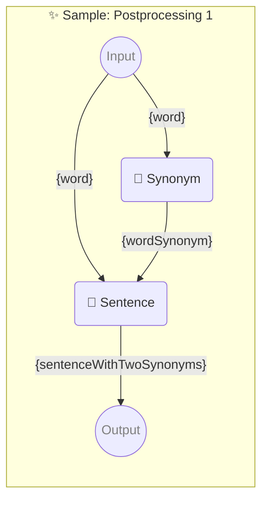

# ✨ Sample: Postprocessing 1

Show how to use two consecutive prompts with one parameter each.

-   PIPELINE URL https://promptbook.studio/samples/postprocessing-1.ptbk.md
-   INPUT  PARAMETER `{word}` Any single word
-   OUTPUT PARAMETER `{sentence}` Resulting sentence with two synonyms

<!--Graph-->
<!-- ⚠️ WARNING: This code has been generated so that any manual changes will be overwritten -->



<!--/Graph-->

### Sample 1

-   SAMPLE

```text
Happy
```

`-> {word}`

### Sample 2

-   SAMPLE

```text
Apple
```

`-> {word}`

## 💬 Synonym

Synonym for word

-   POSTPROCESSING `unwrapResult`

```text
Write synonym for "{word}"
```

`-> {wordSynonym}`

### Sample 1

-   SAMPLE

```text
Joyful
```

`-> {wordSynonym}`

### Sample 2

-   SAMPLE

```text
Fruit
```

`-> {wordSynonym}`

## 💬 Sentence

Sentence with word and wordSynonym

-   POSTPROCESSING `unwrapResult`
-   POSTPROCESSING `spaceTrim`

```text
Write sentence with "{word}" and "{wordSynonym}" in it
```

`-> {sentence}`

### Sample 1

-   SAMPLE

```text
I am very happy to see you and joyful to meet you.
```

`-> {sentence}`

### Sample 2

-   SAMPLE

```text
An apple or another fruit a day keeps the doctor away.
```

`-> {sentence}`
