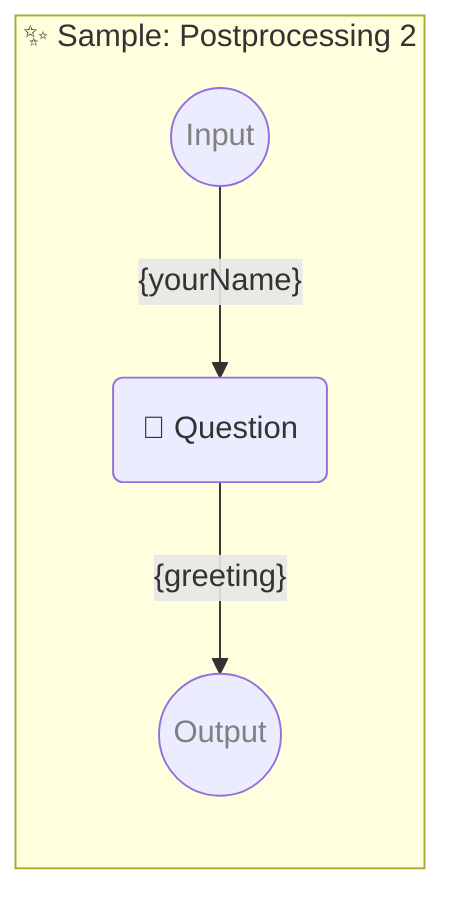

# ✨ Sample: Postprocessing 2

-   PIPELINE URL https://promptbook.studio/samples/postprocessing-2.ptbk.md
-   PROMPTBOOK VERSION 1.0.0
-   INPUT  PARAMETER {yourName} Name of the hero
-   OUTPUT PARAMETER `{greeting}`

<!--Graph-->
<!-- ⚠️ WARNING: This code has been generated so that any manual changes will be overwritten -->



<!--/Graph-->

## 💬 Question

-   POSTPROCESSING reverse
-   POSTPROCESSING removeDiacritics
-   POSTPROCESSING normalizeTo_SCREAMING_CASE

```markdown
Hello {yourName}!
```

`-> {greeting}`

### Sample 1

-   SAMPLE

```text
NHOJ OLLEH
```

`-> {greeting}`

### Sample 2

-   SAMPLE

```text
HSOJ IH
```

`-> {greeting}`
