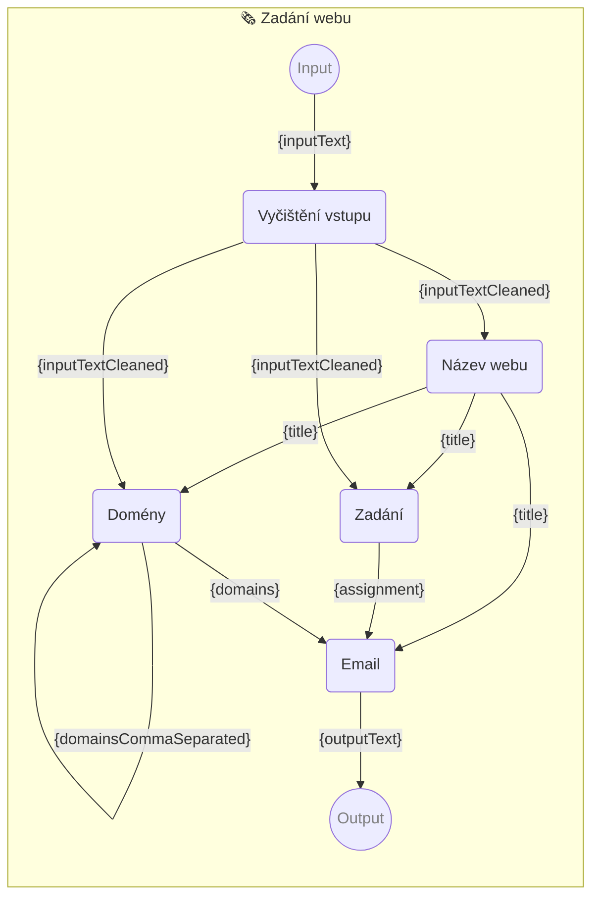

# 🗞 Zadání webu

Instrukce pro napsání úvodník do městského časopisu za pomocí [📖 Promptbook](https://github.com/webgptorg/promptbook).

-   PIPELINE URL https://webgpt.cz/promptbook-collection/ruka/web.ptbk.md
-   PROMPTBOOK VERSION 1.0.0
-   Input param `{inputText}` Vstupní text
-   Output param `{outputText}` Text emailu

<!--Graph-->
<!-- ⚠️ WARNING: This code has been generated so that any manual changes will be overwritten -->



<!--/Graph-->

## Vyčištění vstupu

-   MODEL VARIANT Chat
-   MODEL NAME `gpt-4-1106-preview`
-   POSTPROCESS `spaceTrim`

```
Vyčisti email pro další zpracování

## Pravidla

- Tvým úkolem je vyčistit text emailu
- Napiš pouze vyčištěný text, nic jiného
- Odstraň zbytečné informace typu podpis, citace, zdvořilostní fráze, atd.

## Text emailu

> {inputText}

```

`-> {inputTextCleaned}`

## Název webu

-   MODEL VARIANT Chat
-   MODEL NAME `gpt-4-1106-preview`
-   POSTPROCESS `spaceTrim`
-   EXPECT MAX 3 WORDS
-   EXPECT MAX 1 LINE
-   EXPECTED MAX 30 CHARACTERS

```
Jsi zkušený copywrighter a dostal jsi zakázku na vytvoření názvu pro nový web. Zákazník ti poslal zadání.

## Pravidla

- Tvým úkolem vymyslet jednoduchý a výstižný název pro web
- Napiš pouze jeden název, nic jiného
- Vymýšlej název, ne doménu

## Zadání

> {inputTextCleaned}

```

`-> {title}`

## Domény

-   MODEL VARIANT Chat
-   MODEL NAME `gpt-4-1106-preview`
-   POSTPROCESS `spaceTrim`
-   EXPECT MAX 1 LINE

```
Jsi zkušený copywrighter a webový designer  jsi dostal zakázku na vytvoření seznamu nejvhodnějších domén pro webovou stránku "{title}"

## Pravidla

- Tvým úkolem vymyslet seznam nejvhodnějších domén web "{title}"
- Napiš pouze jeden domény oddělené čárkou, nic jiného
- Neber do úvahy, zda je doména volná nebo ne, to bude zkontrolováno při dalším kroku

## Zadání webu

Tak to vypadá zadání webu, Řiď se primárně názvem webu "{title}", avšak do úvahy můžeš vzít i další prvky ze zadání od zákazníka:

> {inputTextCleaned}

```

`-> {domainsCommaSeparated}`

## Domény

-   SCRIPT TEMPLATE

```javascript
domainsCommaSeparated.split(',').join('\n');
```

`-> {domains}`

## Zadání

-   MODEL VARIANT Chat
-   MODEL NAME `gpt-4-1106-preview`
-   POSTPROCESS `spaceTrim`
-   EXPECT MIN 10 WORDS
-   EXPECT MIN 3 LINES

```
Jsi zkušený webový vývojář a dostal jsi zakázku na vytvoření nového webu "{title}". Zákazník ti poslal email.

## Pravidla

- Tvým úkolem je z emailu vytvořit zadání pro nový web
- Napiš pouze zadání pro web
- Zadání je strukturované a obsahuje všechny potřebné informace
- Zadání obsahuje číslovaný seznam všech požadavků


## Text emailu

> {inputTextCleaned}

```

`-> {assignment}`

## Email

<!-- TODO: [🧩] DRY via extending or imports -->

-   SIMPLE TEMPLATE

```
Dobrý den,

na Vaše zadání jsme se podívali a připravili ho pro našeho vývojáře.
Zde je zadání pro váš nový web **"{title}"**:

> {assignment}


Nejvhodnější domény pro web **"{title}"** jsou:

- {domains}


*PS: Jedná se o automaticky vygenerovanou odpověď, kterou si je potřeba překontrolovat.*

S pozdravem,
R.U.K.A.
```

`-> {outputText}`
