# 🌍 Create website content

Instructions for creating web page content.

-   PIPELINE URL https://promptbook.studio/webgpt/write-website-content.ptbk.md
-   INPUT  PARAM `{rawTitle}` Automatically suggested a site name or empty text
-   INPUT  PARAM `{rawAssigment}` Automatically generated site entry from image recognition
-   OUTPUT PARAM `{websiteContent}` Web content

```mermaid
%% 🔮 Tip: Open this on GitHub or in the VSCode website to see the Mermaid graph visually

flowchart LR
  subgraph "🌍 Create website content"

      direction TB

      input((Input)):::input
      templateSpecifyingTheAssigment("👤 Specifying the assigment")
      input--"{rawAssigment}"-->templateSpecifyingTheAssigment
      templateImprovingTheTitle("✨ Improving the title")
      input--"{rawTitle}"-->templateImprovingTheTitle
      templateSpecifyingTheAssigment--"{assigment}"-->templateImprovingTheTitle
      templateWebsiteTitleApproval("👤 Website title approval")
      templateImprovingTheTitle--"{enhancedTitle}"-->templateWebsiteTitleApproval
      templateCunningSubtitle("🐰 Cunning subtitle")
      templateWebsiteTitleApproval--"{title}"-->templateCunningSubtitle
      templateSpecifyingTheAssigment--"{assigment}"-->templateCunningSubtitle
      templateKeywordAnalysis("🚦 Keyword analysis")
      templateWebsiteTitleApproval--"{title}"-->templateKeywordAnalysis
      templateSpecifyingTheAssigment--"{assigment}"-->templateKeywordAnalysis
      templateCombineTheBeginning("🔗 Combine the beginning")
      templateWebsiteTitleApproval--"{title}"-->templateCombineTheBeginning
      templateCunningSubtitle--"{claim}"-->templateCombineTheBeginning
      templateWriteTheContent("🖋 Write the content")
      templateWebsiteTitleApproval--"{title}"-->templateWriteTheContent
      templateSpecifyingTheAssigment--"{assigment}"-->templateWriteTheContent
      templateKeywordAnalysis--"{keywords}"-->templateWriteTheContent
      templateCombineTheBeginning--"{contentBeginning}"-->templateWriteTheContent
      templateCombineTheContent("🔗 Combine the content")
      templateCombineTheBeginning--"{contentBeginning}"-->templateCombineTheContent
      templateWriteTheContent--"{contentBody}"-->templateCombineTheContent

      templateCombineTheContent--"{websiteContent}"-->output
      output((Output)):::output

      click templateSpecifyingTheAssigment href "#specifying-the-assigment" "👤 Specifying the assigment";
      click templateImprovingTheTitle href "#improving-the-title" "✨ Improving the title";
      click templateWebsiteTitleApproval href "#website-title-approval" "👤 Website title approval";
      click templateCunningSubtitle href "#cunning-subtitle" "🐰 Cunning subtitle";
      click templateKeywordAnalysis href "#keyword-analysis" "🚦 Keyword analysis";
      click templateCombineTheBeginning href "#combine-the-beginning" "🔗 Combine the beginning";
      click templateWriteTheContent href "#write-the-content" "🖋 Write the content";
      click templateCombineTheContent href "#combine-the-content" "🔗 Combine the content";

      classDef input color: grey;
      classDef output color: grey;

  end;
```

<!--Graph-->
<!-- ⚠️ WARNING: This code has been generated so that any manual changes will be overwritten -->



<!--/Graph-->

## 👤 Specifying the assigment

What is your web about?

-   DIALOG TEMPLATE

```
{rawAssigment}
```

`-> {assigment}` Website assignment and specification

## ✨ Improving the title

-   MODEL VARIANT Chat
-   MODEL NAME `gpt-4`
-   POSTPROCESSING `unwrapResult`

```
As an experienced marketing specialist, you have been entrusted with improving the name of your client's business.

A suggested name from a client:
"{rawTitle}"

Assignment from customer:

> {assigment}

## Instructions:

-   Write only one name suggestion
-   The name will be used on the website, business cards, visuals, etc.
```

`-> {enhancedTitle}` Enhanced title

## 👤 Website title approval

Is the title for your website okay?

-   DIALOG TEMPLATE

```
{enhancedTitle}
```

`-> {title}` Title for the website

## 🐰 Cunning subtitle

-   MODEL VARIANT Chat
-   MODEL NAME `gpt-4`
-   POSTPROCESSING `unwrapResult`

```
As an experienced copywriter, you have been entrusted with creating a claim for the "{title}" web page.

A website assignment from a customer:

> {assigment}

## Instructions:

-   Write only one name suggestion
-   Claim will be used on website, business cards, visuals, etc.
-   Claim should be punchy, funny, original
```

`-> {claim}` Claim for the web

## 🚦 Keyword analysis

-   MODEL VARIANT Chat
-   MODEL NAME `gpt-4`

```
As an experienced SEO specialist, you have been entrusted with creating keywords for the website "{title}".

Website assignment from the customer:

> {assigment}

## Instructions:

-   Write a list of keywords
-   Keywords are in basic form

## Example:

-   Ice cream
-   Olomouc
-   Quality
-   Family
-   Tradition
-   Italy
-   Craft

```

`-> {keywords}` Keywords

## 🔗 Combine the beginning

-   SIMPLE TEMPLATE

```

# {title}

> {claim}

```

`-> {contentBeginning}` Beginning of web content

## 🖋 Write the content

-   MODEL VARIANT Completion
-   MODEL NAME `gpt-3.5-turbo-instruct`

```
As an experienced copywriter and web designer, you have been entrusted with creating text for a new website {title}.

A website assignment from a customer:

> {assigment}

## Instructions:

-   Text formatting is in Markdown
-   Be concise and to the point
-   Use keywords, but they should be naturally in the text
-   This is the complete content of the page, so don't forget all the important information and elements the page should contain
-   Use headings, bullets, text formatting

## Keywords:

{keywords}

## Web Content:

{contentBeginning}
```

`-> {contentBody}` Middle of the web content

## 🔗 Combine the content

-   SIMPLE TEMPLATE

```markdown
{contentBeginning}

{contentBody}
```

`-> {websiteContent}`
