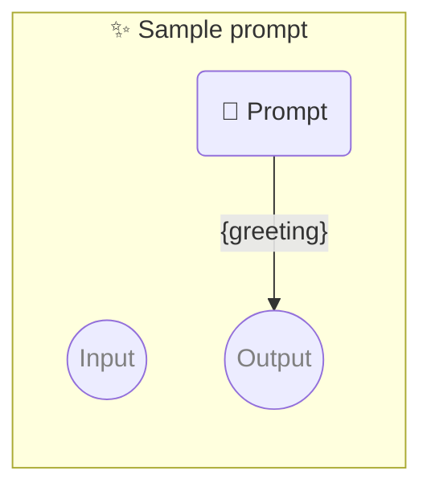

# ✨ Sample prompt

Show how to use a simple prompt with no parameters.

-   PROMPTBOOK VERSION 1.0.0
-   OUTPUT PARAMETER `{greeting}`

<!--Graph-->
<!-- ⚠️ WARNING: This section was auto-generated -->



<!--/Graph-->

## 💬 Prompt

```text
Hello
```

`-> {greeting}`

<!--
TODO: [🧠] Figure out less simmilar word for "single", "simple" and "sample"
-->
