# ✨ Sample prompt

Show how to use a simple prompt with no parameters.

-   PTBK VERSION 1.0.0

```mermaid
%% 🔮 Tip: Open this on GitHub or in the VSCode website to see the Mermaid graph visually

flowchart LR
  subgraph "✨ Sample prompt"

      direction TB

      input[<!--Input-->]:::hidden
      templatePrompt[💬 Prompt]

      classDef hidden visibility: hidden;

  end;
```

<!--Graph-->
<!-- ⚠️ WARNING: This section was auto-generated -->

<!--/Graph-->

## 💬 Prompt

```text
Hello
```

`-> {greeting}`

<!--
TODO: [🧠] Figure out less simmilar word for "single", "simple" and "sample"
-->
