# ✨ Sample prompt with URL

Show how to use a simple prompt with no parameters.

-   PIPELINE URL https://promptbook.studio/samples/simple.ptbk.md
-   PROMPTBOOK VERSION 1.0.0
-   OUTPUT PARAMETER `{greetingResponse}`

```mermaid
%% 🔮 Tip: Open this on GitHub or in the VSCode website to see the Mermaid graph visually

flowchart LR
  subgraph "✨ Sample prompt with URL"

      direction TB

      input((Input)):::input
      templatePrompt("💬 Prompt")

      templatePrompt--"{greeting}"-->output
      output((Output)):::output

      click templatePrompt href "#prompt" "💬 Prompt";

      classDef input color: grey;
      classDef output color: grey;

  end;
```

<!--Graph-->
<!-- ⚠️ WARNING: This section has been generated so that any manual changes will be overwritten -->



<!--/Graph-->

## 💬 Prompt

```text
Hello
```

`-> {greetingResponse}`

### Normal response

-   SAMPLE

```text
Hello, how are you?
```

`-> {greetingResponse}`

### Formal response

-   SAMPLE

```text
Dear Sir, how may I help you?
```

`-> {greetingResponse}`

### Informal response

-   SAMPLE

```text
Hey, what's up?
```

`-> {greetingResponse}`
