# ✨ Sample prompt with comments

Show how to use a simple prompt with no parameters and comments that should be ignored.

-   PROMPTBOOK URL https://promptbook.example.com/samples/comment.ptbk.md@v1
-   PROMPTBOOK VERSION 1.0.0
-   MODEL VARIANT Chat
-   MODEL NAME `gpt-3.5-turbo`
-   OUTPUT PARAMETER `{greeting}`

```mermaid
%% 🔮 Tip: Open this on GitHub or in the VSCode website to see the Mermaid graph visually

flowchart LR
  subgraph "✨ Sample prompt with comments"

      direction TB

      input((Input)):::input
      templatePrompt(💬 Prompt)

      templatePrompt--"{greeting}"-->output
      output((Output)):::output

      classDef input color: grey;
      classDef output color: grey;

  end;
```

<!--Graph-->
<!-- ⚠️ WARNING: This section was auto-generated -->



<!--/Graph-->

## 💬 Prompt

```text
Hello
```

<!-- With comment which should be removed + trimmed-->

`-> {greeting}`

<!--

## 💬 Commented Prompt

```text
Hello
```

`-> {greeting}`

-->
