# ✨ Sample prompt with comments

Show how to use a simple prompt with no parameters and comments that should be ignored.

-   PTBK URL https://ptbk.example.com/samples/comment.ptbk.md@v1
-   PTBK VERSION 1.0.0

```mermaid
%% 🔮 Tip: Open this on GitHub or in the VSCode website to see the Mermaid graph visually

flowchart LR
  subgraph "✨ Sample prompt with comments"

      direction TB

      input[Input]:::hidden
      templatePrompt[💬 Prompt]

      classDef hidden display: none;

  end;
```

<!--Graph-->
<!-- ⚠️ WARNING: This section was auto-generated -->

<!--/Graph-->

## 💬 Prompt

```text
Hello
```

<!-- With comment which should be removed + trimmed-->

`-> {greeting}`

<!--

## 💬 Commented Prompt

```text
Hello
```

`-> {greeting}`

-->
