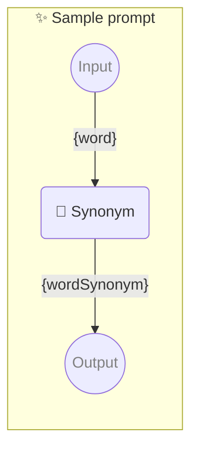

# ✨ Sample prompt

Show how to use a simple prompt with one parameter.

-   PIPELINE URL https://promptbook.studio/samples/single.ptbk.md
-   PROMPTBOOK VERSION 1.0.0
-   INPUT  PARAMETER `{word}` Any single word
-   OUTPUT PARAMETER `{wordSynonym}`

<!--Graph-->
<!-- ⚠️ WARNING: This section was auto-generated -->



<!--/Graph-->

## 💬 Synonym

Synonym for word

-   PERSONA Joe, a linguist
-   EXPECT MIN 1 WORD <!-- <- TODO: [🧠] Allow expectations to be relative to "EXPECT MIN countWords({word})" or simpler "EXPECT +-20% OF {word}" -->
-   EXPECT MAX 5 WORDS

```text
Write synonym for "{word}"
```

`-> {wordSynonym}`
