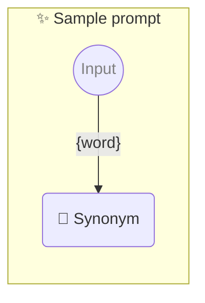

# ✨ Sample prompt

Show how to use a simple prompt with one parameter.

-   PROMPTBOOK URL https://promptbook.example.com/samples/single.ptbk.md@v1
-   PROMPTBOOK VERSION 1.0.0
-   INPUT  PARAMETER `{word}` Any single word

<!--Graph-->
<!-- ⚠️ WARNING: This section was auto-generated -->



<!--/Graph-->

## 💬 Synonym

Synonym for word

```text
Write synonym for "{word}"
```

`-> {wordSynonym}`

<!--
TODO: [🧠] Figure out less simmilar word for "single", "simple" and "sample"
-->
