# ✨ Sample prompt

Show how to use a simple prompt with one parameter.

-   PTBK URL https://ptbk.example.com/samples/single.ptbk.md@v1
-   PTBK VERSION 1.0.0
-   INPUT  PARAMETER `{word}` Any single word

```mermaid
%% 🔮 Tip: Open this on GitHub or in the VSCode website to see the Mermaid graph visually

flowchart LR
  subgraph "✨ Sample prompt"

      direction TB

      input[<!--Input-->]:::hidden
      templateSynonym[💬 Synonym]
      input--"{word}"-->templateSynonym

      classDef hidden visibility: hidden;

  end;
```

<!--Graph-->
<!-- ⚠️ WARNING: This section was auto-generated -->

<!--/Graph-->

## 💬 Synonym

Synonym for word

```text
Write synonym for "{word}"
```

`-> {wordSynonym}`

<!--
TODO: [🧠] Figure out less simmilar word for "single", "simple" and "sample"
-->
