# ✨ Sample prompt

Show how to use a simple prompt with one parameter.

-   PROMPTBOOK URL https://promptbook.example.com/samples/single.ptbk.md@v1
-   PROMPTBOOK VERSION 1.0.0
-   MODEL VARIANT Chat
-   MODEL NAME `gpt-3.5-turbo` <!-- <- TODO: [♐] Pick just the best model of required variant-->
-   INPUT  PARAMETER `{word}` Any single word
-   OUTPUT PARAMETER `{wordSynonym}`

```mermaid
%% 🔮 Tip: Open this on GitHub or in the VSCode website to see the Mermaid graph visually

flowchart LR
  subgraph "✨ Sample prompt"

      direction TB

      input((Input)):::input
      templateSynonym("💬 Synonym")
      input--"{word}"-->templateSynonym

      templateSynonym--"{wordSynonym}"-->output
      output((Output)):::output

      click templateSynonym href "#synonym" "💬 Synonym";

      classDef input color: grey;
      classDef output color: grey;

  end;
```

<!--Graph-->
<!-- ⚠️ WARNING: This section was auto-generated -->



<!--/Graph-->

## 💬 Synonym

Synonym for word

```text
Write synonym for "{word}"
```

`-> {wordSynonym}`

<!--
TODO: [🧠] Figure out less simmilar word for "single", "simple" and "sample"
-->
