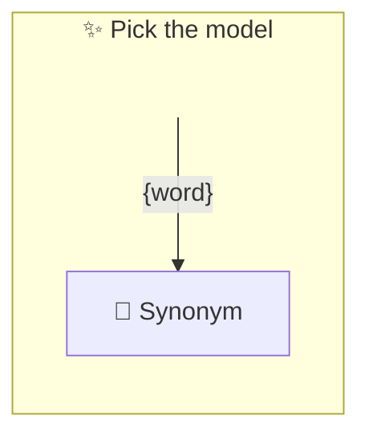

# ✨ Pick the model

Show how to pick exact model

-   PTBK URL https://ptbk.example.com/samples/single.ptbk.md@v1
-   PTBK VERSION 1.0.0
-   INPUT  PARAMETER `{word}` Any single word

<!--Graph-->
<!-- ⚠️ WARNING: This section was auto-generated -->

<!--/Graph-->

## 💬 Synonym

-   MODEL VARIANT CHAT
-   MODEL NAME `gpt-4-1106-preview`

Synonym for word

```text
Write poem with word "{word}"
```

`-> {poem}`

<!--
TODO: [🧠] Figure out less simmilar word for "single", "simple" and "sample"
-->
