# ✨ Pick the model

Show how to pick exact model

-   PIPELINE URL https://promptbook.studio/samples/picking-model.ptbk.md
-   PROMPTBOOK VERSION 1.0.0
-   INPUT  PARAMETER `{word}` Any single word
-   OUTPUT PARAMETER `{poem}`

```mermaid
%% 🔮 Tip: Open this on GitHub or in the VSCode website to see the Mermaid graph visually

flowchart LR
  subgraph "✨ Pick the model"

      direction TB

      input((Input)):::input
      templateSynonym("💬 Synonym")
      input--"{word}"-->templateSynonym

      templateSynonym--"{poem}"-->output
      output((Output)):::output

      click templateSynonym href "#synonym" "💬 Synonym";

      classDef input color: grey;
      classDef output color: grey;

  end;
```

<!--Graph-->
<!-- ⚠️ WARNING: This section has been generated so that any manual changes will be overwritten -->



<!--/Graph-->

## 💬 Synonym

-   PERSONA Jane, a poet
-   MODEL VARIANT Chat
-   MODEL NAME `gpt-4-1106-preview`

Synonym for word

```text
Write poem with word "{word}"
```

`-> {poem}`

### Simple poem

-   SAMPLE

```text
Roses are red, violets are blue, sugar is sweet, and so are you.
```

`-> {poem}`

### Complex poem

-   SAMPLE

```text
The sun is shining, the birds are singing, the flowers are blooming, and the world is smiling.
```

`-> {poem}`
