```mermaid
%% 🔮 Tip: Open this on GitHub or in the VSCode website to see the Mermaid graph visually

flowchart LR
  subgraph "✨ Sample of escaping"

      direction TB

      input((Input)):::input
      templatePrompt("💬 Prompt")

      templatePrompt--"{greeting}"-->output
      output((Output)):::output

      click templatePrompt href "#prompt" "💬 Prompt";

      classDef input color: grey;
      classDef output color: grey;

  end;
```

# ✨ Sample of escaping

Show how to put codeblocks in the prompt _(which is already in the codeblock)_

-   PROMPTBOOK URL https://promptbook.example.com/samples/escaping.ptbk.md@v1
-   PROMPTBOOK VERSION 1.0.0
-   MODEL VARIANT Chat
-   MODEL NAME `gpt-3.5-turbo`
-   OUTPUT PARAMETER `{greeting}`

<!--Graph-->
<!-- ⚠️ WARNING: This section was auto-generated -->



<!--/Graph-->

## 💬 Prompt

```
Rewrite the function

\`\`\`javascript
function greet() {
  return 'Hello';
}
\`\`\`

To return "Goodbye" instead.

```

`-> {greeting}`
