# ✨ Sample of escaping

Show how to put codeblocks in the prompt _(which is already in the codeblock)_

-   PTBK URL https://ptbk.example.com/samples/escaping.ptbk.md@v1
-   PTBK VERSION 1.0.0

```mermaid
%% 🔮 Tip: Open this on GitHub or in the VSCode website to see the Mermaid graph visually

flowchart LR
    subgraph "✨ Sample of escaping"

        direction TB

        input[Input]


        templatePrompt[💬 Prompt]





    end
```

<!--Graph-->
<!-- ⚠️ WARNING: This section was auto-generated -->

<!--/Graph-->

## 💬 Prompt

```
Rewrite the function

\`\`\`javascript
function greet() {
  return 'Hello';
}
\`\`\`

To return "Goodbye" instead.

```

`-> {greeting}`
